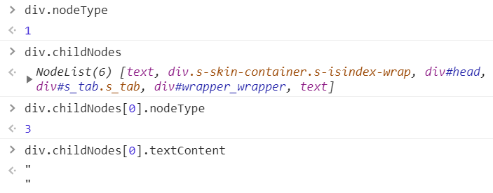
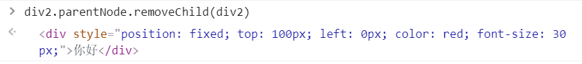
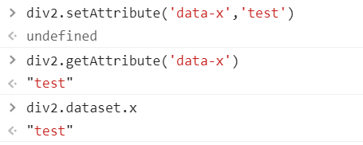
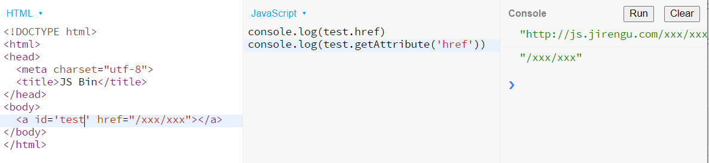
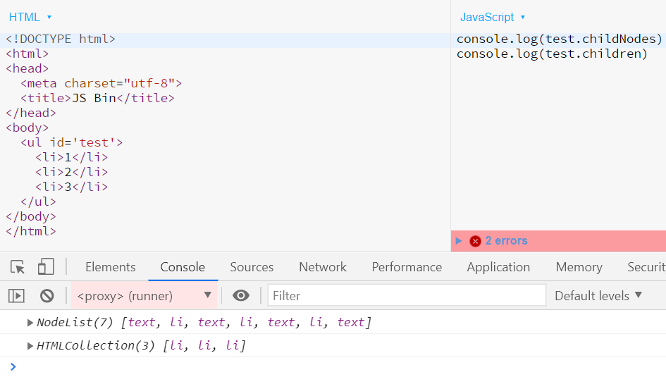
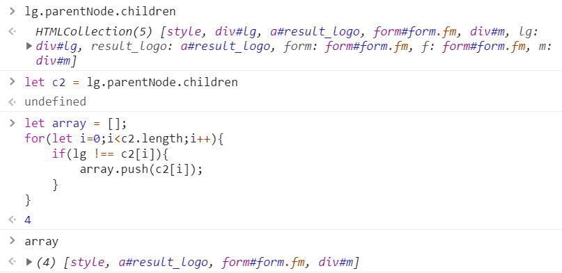

# DOM 编程（二）

## 获取到的元素是个啥

* 显然是一个对象，我们需要搞清它的原型

## 抓一只 div 对象来看看

### console.dir(div) 看原型链

* 自身属性：className、id、style 等等


#### 第一层原型 HTMLDivElement.prototype

* 里面是所有 div 共有的属性

#### 第二层原型 HTMLElement.prototype

* 里面是所有 HTML 标签共有的属性

#### 第三层原型 Element.prototype

* 里面是所有 XML、HTML 标签的共有属性

#### 第四层原型 Node.prototype

* 里面是所有节点共有的属性，节点包括 XML 标签文本注释、HTML 标签文本注释

#### 第五层原型 EventTarget.prototype

* 里面最重要的函数属性时 addEventListener

#### 最后一层原型就是 Object.prototype

## 节点

### 节点 Node 包括以下几种

#### x.nodeType 得到一个数字

* 1 表示元素 Element，也叫标签 Tag
* 3 表示文本 Text



## 节点的增删改查

### 增

#### 创建一个标签节点

```js
let div1 = document.createElement('div')

document.createElement('style')

document.createElement('script')

document.createElement('li')
```

### 创建一个文本节点

```js
text1 = document.createTextNode('你好')
```

### 标签里面插入文本

```js
div1.appendChild(text1)

div1.innerText = '你好'

div1.textContent = '你好'
```

* 注意：不能用 `div1.appendChild('你好')`

### 插入页面中

* 你创建的标签默认处于 JS 线程中
* 你必须把它插到 head 或者 body 里面，它才会生效
* `document.body.appendChild(div)`
* 或者`已在页面中的元素.appendChild(div)`

### appendChild

```js
// 页面中有 div#test1 和 div#test2

let div = document.createElement('div')
test1.appendChild(div)
test2.appendChild(div)

// 请问最终 div 出现在哪里？
//1. test1 里面
//2. test2 里面
//3. test1 里面和 test2 里面
```


### 答案：test2 里面

#### 一个元素不能出现在两个地方，除非复制一份

```js
let div2 = div1.cloneNode(true)
```


## 删

### 旧方法：`childNode.parentNode.removeChild(childNode)`



### 新方法：childNode.remove()

* 这两种方法只是从树里面删除了节点，节点还在内存中
* 要想彻底删除，还要再加一句 `chiledNode = null`
* 这样联系就断了，节点就没办法引用了，会被垃圾回收掉


## 改

## 改属性

### 写标准属性

```js
// 改 id
div.id = 'div1'
```

```js
// 改 class
div.className = 'red'
div.className += 'blue'
div.classList.add('green')
//改 style 
div.style = 'width:100px;coldor:blue;'
//改 style 的一部分
div.style.width = '200px'
// 大小写
div.style.backgroundColor = 'white'
// 改 data- 属性
div.dataset.x = 'frank'
```



### 读标准属性

```js
div.classList
a.href
```

----

```js
div.getAttribute('class')
a.getAttrtbute('href')
```

* 两种方法都可以，但值可能稍微有些不同



### 改事件处理函数

#### div.onclick 默认为 null

* 默认点击 div 不会有任何事情发生
* 但是如果你把 div.conlick 改为一个函数 fn
* 那么点击 div 的时候，浏览器就会调用这个函数
* 并且是这样调用的 fn.call(div,event)
* div 会被当做 this
* event 则包含了点击事件的所有信息，如坐标


### 改内容

#### 改文本内容

* `div.innerText = 'xxx'`
* `div.textContent = 'xxx'`
* 两者几乎没有区别

#### 改 HTML 内容

```js
div.innerHTML = '<strong>重要内容</strong>'
```

#### 改标签

```js
div.innerHTML = '' // 先清空
div.appendChild(div2) // 再加内容
```

#### 改爸爸

* `newParent.appendChild(div)`
* 这样就可以，直接从原来的地方消失


## 查

### 查爸爸

* `node.parentNode`
* `node.parentElement`

### 查爷爷

* `node.parentNode.parentNode`

### 查子代

* `node.childNodes`
* `node.children`



#### 查兄弟姐妹

```js
node.parentNode.childNodes // 还要排除自己和文本节点

node.parentNode.children // 还要排除自己
```



#### 查看老大

* `node.firstChild`

#### 查看老幺

* `node.lastChild`

#### 查看上一个哥哥/姐姐

* `node.previousSibling`
* `node.previousElementSibling` // 忽略文本节点

#### 查看下一个弟弟/妹妹

* `node.nextSibling`
* `node.nextElementSibling` // 忽略文本节点

#### 遍历一个 div 里面的所有元素

```js
travel = (node,fn) => {
    fn(node);
    if(node.children){
        for(let i=0; i<node.children.length; i++){
            travel(node.children[i],fn);
        }
    }
}
travel(div1,(node) => console.log(node));
```


