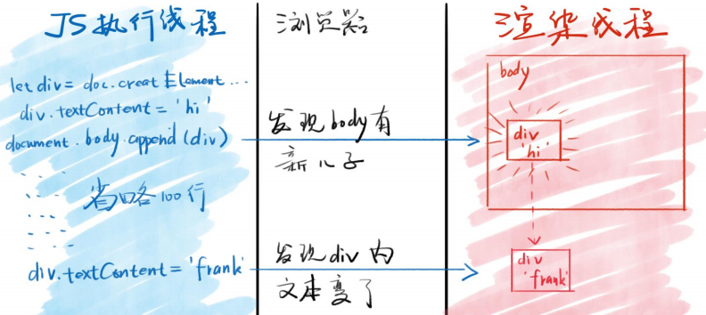

# DOM 操作是跨线程的

### 浏览器分为渲染引擎和 JS 引擎

## 跨线程操作

### 各线程各司其职

* JS 引擎不能操作页面，只能操作 JS
* 渲染引擎不能操作 JS，只能操作页面
* `document.body.appendChild(div1)`
* 这句 JS 是如何改变页面的？

### 跨线程通信

* 当浏览器发现 JS 在 body 里面加了个 div1 对象
* 浏览器就会通知渲染引擎在页面里也新增一个 div 元素
* 新增的 div 元素所有属性都照抄 div1 对象

## 图示跨线程操作

## 插入新标签的完整过程

### 在 div1 放入页面之前

* 对 div1 所有的操作都属于 JS 线程内的操作

### 把 div1 放入页面之时

* 浏览器会发现 JS 的意图
* 就会通知渲染线程在页面中渲染 div1 对应的元素

### 把 div1 放入页面之后

* 对 div1 的操作都**有可能**会触发重新渲染

* `div1.id = 'newId'` 可能会重新渲染，也可能不会
* `div1.title = 'new'` [可能会重新渲染](https://css-tricks.com/css-content/#article-header-id-4)，也可能不会
* 如果你连续对 div1 多次操作，[浏览器可能会合并成一次操作，也可能不会](http://js.jirengu.com/yefac/1/edit?html,css,js,output)

## 属性同步

### 标准属性

* 对 div1 的标准属性的修改，会被浏览器同步到页面中
* 比如`id、className、title`等

### data-* 属性

* 同上

### 非标准属性

* 对非标准属性的修改，则只会停留在 JS 线程中
* 不会同步到页面里
* 比如 x 属性，[示例代码](http://js.jirengu.com/meviw/2/edit?html,js,output)

### 启示

* 如果你有自定义属性，又想被同步到页面中，请使用 data- 作为前缀

## Property  VS  Attribute

### property 属性

* JS 线程中 div1 的所有属性，叫做 div1 的 property

### attribute 也是属性

* 渲染引擎中 div1 对应标签的属性，叫做 attribute

### 区别

* 大部分时候，同名的 property 和 attribute 值相等
* 但如果不是标准属性，那么它俩只会在一开始时相等
* 但注意 attribute 只支持字符串
* 而 property 支持字符串、布尔等类型

