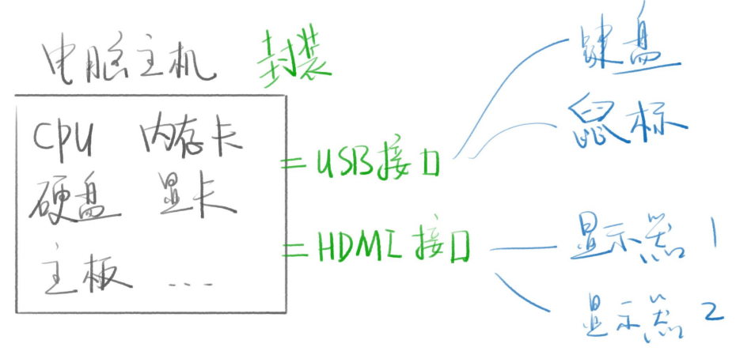
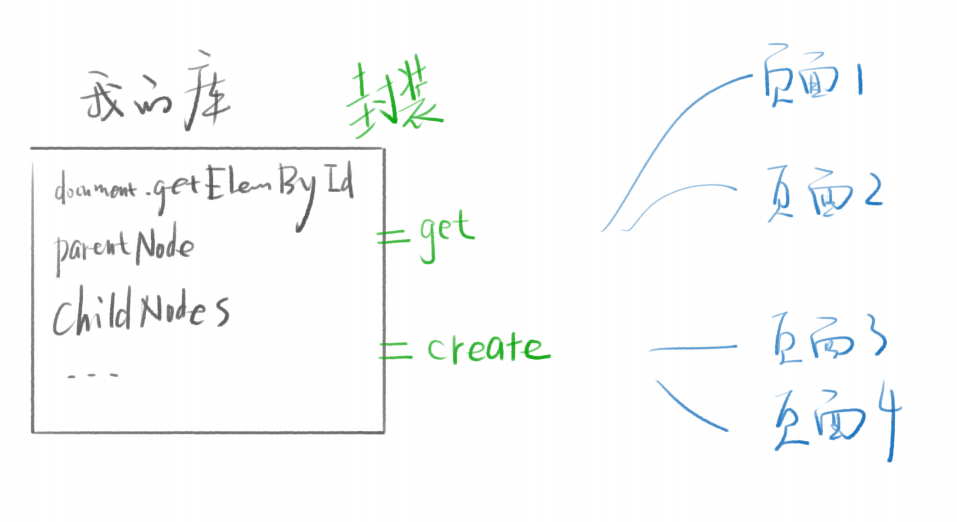

# 封装 DOM

## 什么叫封装

### 举例

* 电脑笔记本就是 CPU、内存、硬盘、主板、显卡的封装
* 用户只需要接触显示器、键盘、鼠标、触控板等设备
* 即可操作复杂的计算机

### 接口

* 被封装的东西需要暴露一些功能给外部
* 这些功能就是接口，如 USB 接口、HDMI 接口
* 设备只要支持这些接口，即可与被封装的东西通讯
* 比如键盘、鼠标支持 USB 接口
* 显示器支持 HDMI 接口






## 术语

### 库

* 我们把提供给其他人用的工具代码叫做库
* 比如 jQuery、Underscore

## API

* 库暴露出来的函数或属性叫做 API（应用编程接口）

### 框架

* 当你的库变得很大，并且需要学习才能看懂
* 那么这个库就叫框架，比如 Vue / React

### 注意

* 编程界的术语大部分都很随便，没有固定的解释
* 所以意会即可


## 对象风格

### 也叫命名空间风格

* `window.dom` 是我们提供的全局对象

### 增

* `dom.create('<div>hi</div>')` 用于创建节点
* `dom.after(node,node2)` 用于新增弟弟
* `dom.before(node,node2)` 用于新增哥哥
* `dom.append(parent,child)` 用于新增儿子
* `dom.wrap('<div></div>')` 用于新增爸爸

### 删

* `dom.remove(node)` 用于删除节点
* `dom.empty(parent)` 用于删除后代

### 改

* `dom.attr(node,'title',?)`  用于读写属性
* `dom.text(node,?)` 用于读写文本内容
* `dom.html(node,?)` 用于读写 HTML 内容
* `dom.style(node,{color:'red'})` 用于修改 style
* `dom.class.add(node,'blue')` 用于添加 class
* `dom.class.remove(node,'blue')` 用于删除 class
* `dom.on(node,'click',fn)` 用于添加事件监听
* `dom.off(node,'click',fn)` 用于删除事件监听

### 查

* `dom.find(`选择器`)` 用于获取标签或标签们
* `dom.parent(node)` 用于获取父元素
* `dom.children(node)` 用于获取子元素
* `dom.siblings(node)` 用于获取兄弟姐妹元素
* `dom.next(node)` 用于获取弟弟
* `dom.previous(node)` 用于获取哥哥
* `dom.each(nodes,fn)` 用于遍历所有节点
* `dom.index(nodes)` 用于获取排行老几

### 知识补充

**trim()** 方法会从一个字符串的两端删除空白字符


```js
window.dom = {
    find(selector,scope){
        return (scope || document).querySelectorAll(selector);
    },
    style(node,name,value){
        if(arguments.length === 3){
            node.style[name] = value;
        }else if(arguments.length === 2){
            if(typeof name === 'string'){
                return node.style[name];
            }else if(name instanceof Object){
                const object = name;
                for(let key in object){
                    node.style[key] = object[key];
                }
            }
        }
    },
    each(nodeList,fn){
        for(let i=0; i<nodeList.length; i++){
            fn.call(null,nodeList[i]);
        }
    }
}
```


