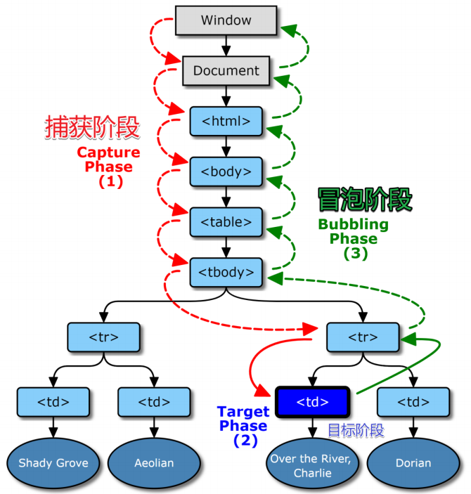
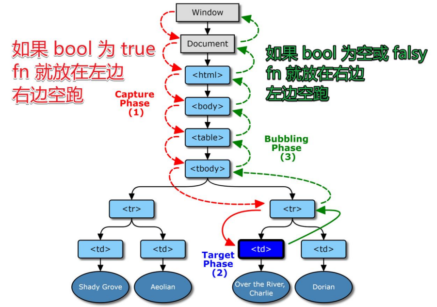
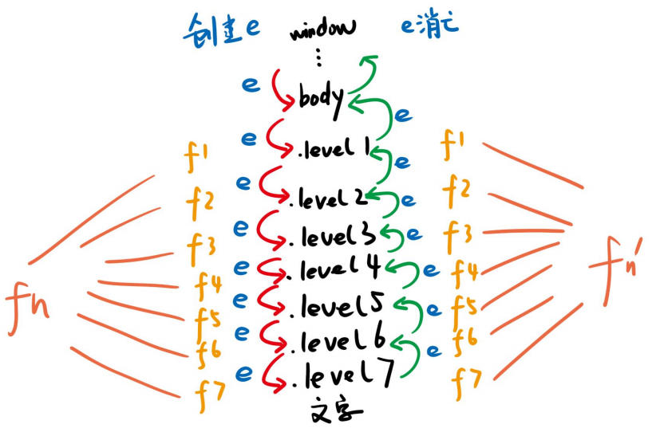
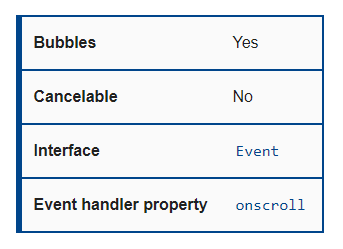

## DOM事件与事件委托

## 点击事件

```html
<div class=爷爷>
    <div class=爸爸>
        <div class=儿子>
            文字
        </div>
    </div>
</div>
```

* 即 .爷爷 > .爸爸 >.儿子
* 给三个 div 分别添加事件监听 fnYe / fnBa / fnEr

### 提问1：点击了谁

* 点击文字，算不算点击儿子？
* 点击文字，算不算点击爸爸？
* 点击文字，算不算点击爷爷？
* 答案：都算

### 提问2：调用顺序

* 点击文字，最先调用 fnYe / fnBa / fnEr 中的哪一个函数？
* 答案：都行
* IE5 认为先调 fnEr，网景认为先调 fnYe，然后掐上了
* 最后闹到了 W3C

### 和事老 W3C

#### 2002年，W3C发布标准

* 文档名为 DOM Level 2 Events Specification
* 规定浏览器应该同时支持两种调用顺序
* 首先按 爷爷 => 爸爸 => 儿子 顺序看有没有函数监听
* 然后按 儿子 => 爸爸 => 爷爷 顺序看看有没有事件监听
* 有监听函数就调用，并提供事件信息，没有就跳过
* 先进后出

#### 术语

* 从外向内找监听函数，叫事件捕获
* 从内向外找监听函数，叫事件冒泡

#### 疑问

* 那岂不是 fnYe / fnBa / fnEr 都调用两次？
* 非也！
* 开发者自己选择把 fnYe 放在捕获阶段还是放在冒泡阶段

## 什么是捕获和冒泡？

当一个事件发生在具有父元素的元素上时，现代浏览器运行两个不同的阶段，捕获阶段和冒泡阶段。

**在捕获阶段**：

- 浏览器检查元素的最外层祖先`<html>`，是否在捕获阶段中注册了一个`onclick`事件处理程序，如果是，则运行它。
- 然后，它移动到`<html>`中单击元素的下一个祖先元素，并执行相同的操作，然后是单击元素再下一个祖先元素，以此类推，知道到达实际点击的元素。

**在冒泡阶段**：

- 浏览器首先检查被点击元素，（在开头的例子中，就是文字），然后看是在冒泡阶段中有 onclick 事件，如果是，就运行
- 然后，寻找下一个 parentNode，（在开头的例子中，就是儿子 div），然后看是否在冒泡阶段中有 onclick 事件，如果是，就运行
- 然后再找下一个 parentNode，（在开头的例子中，就是爸爸 div)

#### 示意图



### addEventListener

#### 事件绑定 API

* IE5：`baba.attachEvent('onclick',fn)` // 冒泡
* 网景：`baba.addEventListener('click',fn)` // 捕获
* W3C：`baba.addEventListener('click',fn,bool)`

#### 如果 bool 不传或为 falsy

* 就让 fn 走冒泡，即当浏览器在冒泡阶段发现 baba 有 fn 监听函数，就会调用 fn，并提供事件信息

#### 如果 bool 为 true

* 就让 fn 走捕获，即当浏览器在捕获阶段发现 baba 有 fn 监听函数，就会调用 fn，并提供事件信息

#### 你可以选择把 fn 放在哪边



### 代码示例

http://js.jirengu.com/qiwus/1/edit?html,js,output

### 代码图解




### w3c事件模型

* 先捕获（先爸爸 => 儿子）再冒泡（再儿子 => 爸爸）
* 注意 e 对象被传被所有监听函数
* 事件结束后，e 对象就不存在了


### target  vs  currentTarget

####  区别

* `e.target`  用户操作的元素
* `e.currentTarget`  程序员监听的元素
* `this` 是 `e.currentTarget` ，不推荐使用，因为容易记混

#### 举例

* `div>span{文字}`  ，用户点击文字
* `e.target`  就是  span
* `e.currentTarget` 就是 div


### 一个特例

#### 背景

* 只有一个 div 被监听（不考虑父子同时被监听）
* fn 分别在捕获阶段和冒泡阶段监听 click 事件
* 用户点击的元素就是开发者监听的

#### 代码

* `div.addEventLisenter('click',f1)`
* `div.addEventLisenter('click',f2,true)`
* 请问，f1 先执行还是 f2 先执行？
* 如果把两行调换位置，哪个先执行？
* **谁先监听谁先执行**
* 这是一个特例

http://js.jirengu.com/qiwus/2/edit?html,js,console,output


### 取消冒泡

#### 捕获不可取消，但冒泡可以

* `e.stopPropagation()`  可中断冒泡，浏览器不再向上走
* 通俗来说：有人打我，我自己解决，别告诉我老子
* 一般用于封装某些独立的组件

http://js.jirengu.com/qiwus/3/edit?html,js,output


### 不可阻止默认动作

#### 有些事件不能阻止默认动作

* [scroll event](https://developer.mozilla.org/zh-CN/docs/Web/API/Document/scroll_event)
* Bubbles 的意思是该事件是否冒泡，所有冒泡都可取消
* Cancelable 的意思是开发者是否可以阻止默认事件
* Cancelable 与冒泡无关



http://js.jirengu.com/zidud/1/edit?html,js,output


## 如何阻止滚动

### scroll 事件不可阻止默认动作

* 阻止 scroll 默认动作没用，因先有滚动才有滚动事件
* 要阻止滚动，可阻止 wheel 和 touchstart 的默认动作
* 注意需要找准滚动条所在的元素
* 但是滚动条还能用，可用 css 让滚动条 width:0

### css 也行

* 使用 overflow:hidden 可以直接取消滚动条
* 但此时 JS 依然可以修改 scrollTop 

http://js.jirengu.com/zidud/2/edit?html,css,js,output


## 自定义事件

### 浏览器自带事件

* 一共 100 多种事件，[列表](https://developer.mozilla.org/zh-CN/docs/Web/Events)在MDN上

### 提问

* 开发者能不能再自带事件之外，自定义一个事件
* 可以，见[示例](http://js.jirengu.com/zevuj/1/edit?html,js,console,output)


## 事件委托

### 什么是事件委托

* 由于冒泡阶段，浏览器从用户点击的内容从下往上遍历至 window ，逐个触发事件处理函数，因此可以监听一个祖先节点（例如爸爸节点、爷爷节点）来同时处理多个子节点的事件

### 场景一

* 你要给 100 个按钮添加点击事件，咋办？
* 监听这100个按钮的祖先，等冒泡的时候判断 target 是不是这 100 个按钮中的一个

* http://js.jirengu.com/ruxex/2/edit?html,js,console,output

### 场景二

* 你要监听目前不存在的元素的点击事件，咋办？
* 监听祖先，等点击的时候看看是不是我想要监听的元素即可
* http://js.jirengu.com/pugus/1/edit?html,js,console,output

### 优点

* 省监听数（内存）
* 可以监听动态元素


### 封装事件委托

* 答案一：http://js.jirengu.com/pugus/2/edit?html,js,console,output
* 答案二：http://js.jirengu.com/pugus/3/edit?html,js,console,output


## 知识补充

#### 不完全元素选择 

`div[class^=level]`

http://js.jirengu.com/zosos/1/edit?html,css,output


#### 快捷输入

* `div>button{click $}*100`

http://js.jirengu.com/ruxex/1/edit?html,output


