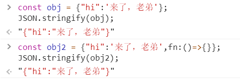

# AJAX 

* Async JavaScript And XML
* async  [ə'zɪŋk]  *adj.*异步的
* XML：可扩展标记语言

### 用 JS 发请求和收响应

* 这就是 AJAX 的全部内容


## 背景

### AJAX 是浏览器上的功能

* 浏览器可以发请求，收响应
* 浏览器在 window 上加了一个 XMLHttpRequest 函数
* 用这个构造函数（类）可以构造出一个对象
* JS 通过它实现发请求，收响应

### XML HttpRequest

* `XMLHttpRequest`（XHR）对象用于与服务器交互。通过 XMLHttpRequest 可以在不刷新页面的情况下请求特定 URL，获取数据。这允许网页在不影响用户操作的情况下，更新页面的局部内容。
* 尽管名称如此，`XMLHttpRequest` 可以用于获取任何类型的数据，而不仅仅是 XML。它甚至支持 [HTTP](https://developer.mozilla.org/en-US/docs/Web/HTTP) 以外的协议（包括 file:// 和 FTP），尽管可能受到更多出于安全等原因的限制。

### 准备一个服务器

* 使用 [server.js](http://js.jirengu.com/kugam/1/edit?js) 作为我们的服务器
* 下载或复制代码即可用 node server.js 8888 启动
* 添加 index.html / main.js 两个路由


## 加载 css

* 以前我们用 `<link rel="stylesheet" href="style.css">`
* 今天请用 AJAX 加载 CSS

### 四个步骤

* 创建 HttpRequest 对象（全称是 XMLHttpRequest）
* 调用对象的 open 方法
* 监听对象的 onload & onerror 事件
  * 专业前端会改用 onreadystatetechange 事件
  * 在事件处理函数里操作 CSS 文件内容
* 调用对象的 send 方法（发送请求）
  * 具体代码请打开 MDN 用 CRM 大法搞定

 ```js
getCSS.onclick = () => {
    const request = new XMLHttpRequest();
    request.open('get','/style.css');
    request.onload = ()=>{
        // 创建 style 标签
        const style = document.createElement('style');
        // 填写 style 内容
        style.innerHTML = request.response;
        // 插到 head 里面
        document.head.appendChild(style);
    }
    request.onerror = ()=>{
        console.log('失败了');
    }
    request.send();
}
 ```

### XMLHttpRequest.open()

* **XMLHttpRequest.open()** 方法初始化一个请求

#### 语法

```js
xhrReq.open(method, url);
```

* method：要使用的HTTP方法，比如「GET」、「POST」、「PUT」、「DELETE」、等。
* url：表示要向其发送请求的URL。

### XMLHttpRequest.send()

* 用于发送 HTTP 请求。
* 如果是异步请求（默认为异步请求），则此方法会在请求发送后立即返回；
* 如果是同步请求，则此方法直到响应到达后才会返回。

## 加载 JS

* 以前我们用 `<script src='2.js'></script>`
* 今天请用 AJAX 加载 JS

### 四个步骤

* 创建 HttpRequest 对象（全称是 XMLHttpRequest）
* 调用对象的 open 方法
* 监听对象的 onreadystatechange 事件
  * 在事件处理函数里操作 JS 文件内容
* 调用对象的 send 方法（发送请求）
  * 具体代码请打开 MDN 用 CRM 大法搞定

```js
getJS.onclick = ()=>{
    const request = new XMLHttpRequest();
    request.open('get','/2.js');
    request.onload = ()=>{
        //创建 script 标签
        const script = document.createElement('script');
        //填写 script 内容
        script.innerHTML = request.response;
        //插到 body 里
        document.body.appendChild(script);
    };
    request.onerror = ()=>{};
    request.send();
}
```


## 加载 HTML

- 以前我们不会加载 3.html

### 四个步骤

- 创建 HttpRequest 对象（全称是 XMLHttpRequest）
- 调用对象的 open 方法
- 监听对象的 onreadystatechange 事件
  - 在事件处理函数里操作 HTML 文件内容
- 调用对象的 send 方法（发送请求）
  - 具体代码请打开 MDN 用 CRM 大法搞定

```js
getHTML.onclick = ()=>{
    const request = new XMLHttpRequest();
    request.open('get','/3.html');
    request.onload = ()=>{
        const div = document.createElement('div');
        div.innerHTML = request.response;
        document.body.appendChild(div);
    };
    request.onerror = ()=>{};
    request.send();
}
```


## 加载 XML

- 以前我们不会加载 4.xml

### 四个步骤

- 创建 HttpRequest 对象（全称是 XMLHttpRequest）
- 调用对象的 open 方法
- 监听对象的 onreadystatechange 事件
  - 在事件处理函数里操作 responseXML
- 调用对象的 send 方法（发送请求）
  - 具体代码请打开 MDN 用 CRM 大法搞定

```js
getXML.onclick = ()=>{
    const request = new XMLHttpRequest();
    request.open('GET','/4.xml');
    request.onreadystatechange = () => {
        if(request.readyState === 4 && request.status >= 200 && request.status < 300) {
            const dom = request.responseXML;
            const text = dom.getElementsByTagName('warning')[0].textContent;
            console.log(text.trim());
        }
    }
    request.send();
}
```


### XMLHttpRequest.readyState

* **XMLHttpRequest.readyState** 属性返回一个 XMLHttpRequest  代理当前所处的状态。
* 一个 XHR 代理总是处于下列状态中的一个：

| 值   | 状态                                  | 描述                                                |
| ---- | ------------------------------------- | --------------------------------------------------- |
| `0`  | `UNSENT` (unsent)                     | 代理被创建，但尚未调用 open() 方法。                |
| `1`  | `OPENED` (opened)                     | `open()` 方法已经被调用。                           |
| `2`  | `HEADERS_RECEIVED` (headers_received) | `send()` 方法已经被调用，并且头部和状态已经可获得。 |
| `3`  | `LOADING` (loading)                   | 下载中； `responseText` 属性已经包含部分数据。      |
| `4`  | `DONE` (done)                         | 下载操作已完成。                                    |


### XMLHttpRequest.onreadystatechange

* 只要 `readyState` 属性发生变化，就会调用相应的处理函数。


## 总结 

### HTTP 是个筐，什么都能往里装

* 可以装 HTML、CSS、JS、XML……
* 记得设置正确的 Content-Type，这就是好习惯
* 只要你知道这么解析这些内容，就可以使用这些内容

### 解析方法

* 得到 CSS 之后生成 style 标签
* 得到 JS 之后生成 script 标签
* 得到 HTML 之后使用 innerHTML 和 DOM API
* 得到 XML 之后使用 responseXML 和 DOM API
* 不同类型的数据有不同类型的解析办法


## JSON

* JavaScript Object Notation
* JSON 是一门语言，跟 HTML、CSS、XML、JS 一样，是一门独立的语言
* JSON 不是编程语言，是标记语言
* 跟 HTML、XML、Markdown 一样，用来展示数据


## JSON 很简单

### [中文官网](http://json.org/json-zh.html)

* 一页纸就说明了 JSON 的所有语法
* 你会看铁轨图就会用 JSON

### 支持的数据类型

* **string**    只支持双引号，不支持单引号和无引号
* **number**    支持科学计数法
* **bool**    true 和 false
* **null**    没有 undefined
* **object**
* **array**
* 就这六种，注意跟 JS 的七种数据类型区别开来
* 不支持函数，不支持变量（所以也不支持引用）


## 加载 JSON

* 我们需要加载 5.json

### 四个步骤

* 创建 HttpRequest 对象（全称是 XMLHttpRequest）
* 调用对象的 open 方法

* 监听对象的 onreadystatechange 事件
  * 在事件处理函数里使用 JSON.parse
* 调用对象的 send 方法（发送请求）
  * 具体代码请打开 MDN 用 CRM 大法搞定


## window.JSON

### **JSON**对象包含两个方法: 

* 用于解析 [JavaScript Object Notation](http://json.org/)  ([JSON](https://developer.mozilla.org/en-US/docs/Glossary/JSON)) 的 `parse()` 方法
* 以及将对象/值转换为 JSON字符串的 `stringify()` 方法
* 除了这两个方法, JSON这个对象本身并没有其他作用，也不能被调用或者作为构造函数调用。

### JSON.parse

* 将符合 JSON 语法的字符串转换成 JS 对应类型的数据
* JSON 字符串 => JS 数据
* 由于 JSON 只有六种类型，所以转换成的数据也只有 6 种
* 如果不符合 JSON 语法，则直接抛出一个 Error 对象
* 一般用 try catch 捕获错误

```js
let object;
try {
    object = JSON.parse(`{'name':"韦小宝"}`);
}catch(error){
    console.log('出错了，错误详情是');
    console.log(error);
    object = {"name":"韦小宝"}
}
console.log(object);
```


### JSON.stringify

* 是 JSON.parse 的逆运算
* JS 数据 => JSON 字符串
* 由于 JS 的数据类型比 JSON 多，所以不一定能成功
* 如果失败，就抛出一个 Error 对象

```js
const obj = {"hi":'来了，老弟'};
JSON.stringify(obj);

const obj2 = {"hi":'来了，老弟',fn:()=>{}};
JSON.stringify(obj2);
```




