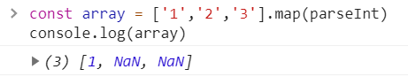

# 异步与Promise

* JS 异步编程模型


## 什么是异步？什么是同步？

### 如果能直接拿到结果

* 那就是同步
* 比如你在医院挂号，你拿到号才会离开窗口
* 同步任务可能消耗10毫秒，也可能需要3秒
* 总之不拿到结果，你是不会离开的

### 如果不能直接拿到结果

* 那就是异步
* 比如你在餐厅门口等位，你拿到号可以去逛街
* 什么时候才能真正吃饭呢？
* 你可以每10分钟去餐厅问一下（**轮询**）
* 你也可以扫码用微信接受通知（**回调**）


## 异步举例

### 以AJAX为例

* `request.send()`之后，并不能直接得到 `response`
* 必须等到`readyState`变为4后，浏览器回头调用`request.onreadystatechange`函数
* 我们才能得到 `request.response`
* 这跟餐厅给你发微信提醒的过程是类似的

### 回调 callback

* 你写给自己用的函数，不是回调
* 你写给别人用的函数，就是回调
* `request.onreadystatechange`就是我写给浏览器调用的
* 意思就是你（浏览器）回头调一下这个函数
* 在中文里，「回头」也有「将来」的意思，如「我回头请你吃饭」


## 回调举例

### 把函数1给另一个函数2

```
function f1(){}
function f2(fn){
	fn()
}
f2(f1)
```

### 分析

* 我调用 f1 没有？
  * 答：没有调用
* 我把 f1 传给 f2（别人）了没有？
  * 答：传了
* f2 调用 f1 了没有？
  * 答：f2 调用了 f1
* 那么，f1 是不是我写给 f2 调用的函数？
  * 答：是
* 所以，f1 是回调


### 抬杠1

```js
function f1(){}
function f2(fn){
    //fn()
}
f2(f1)
```

#### 如果 f2 没有调用 f1 呢？

* f2 有病啊！它不调用 f1 那它为什么要接受 fn 参数


### 抬杠2

```js
function f1(){}
function f2(fn){
    fn()
}
f2('字符串')
```

#### 如果我传给 f2 的参数不是函数呢？

* 你有病啊！用函数之前不看看函数的文档吗？
* 会报错：fn 不是一个函数
* 看到报错你不就知错了？


### 抬杠3

```js
function f1(x){
    console.log(x);
};
function f2(fn){
    fn('你好');
};
f2(f1);
```

#### f1 怎么会有一个 x 参数

* `fn('你好')` 中的 fn 就是 f1 对吧
* `fn('你好')` 中的 '你好' 会被赋值给参数 x 对吧
* 所以 x 就是 '你好' 啊！
* x 可以改成任意其他名字，x 表示第一个参数而已


## 异步和回调的关系

### 关联

* 异步任务需要在得到结果是通知 JS 来拿结果
* 怎么通知呢？
* 可以让 JS 留一个函数地址（电话号码）给浏览器
* 异步任务完成时浏览器调用该函数地址即可（拨打电话）
* 同时把结果作为参数传给该函数（电话里说可以来吃了）
* 这个函数是我写给浏览器调用的，所以是回调函数

### 区别

* 异步任务需要用到回调函数来通知结果
* 但回调函数不一定只用在异步任务里
* 回调可以用到同步任务里
* `array.forEach(n=>console.log(n))`就是同步回调


### Array.forEach()

* `forEach()` 方法对数组的每个元素执行一次给定的函数。

```js
let arr = [0,1,3,4,8];
let sum = 0;
arr.forEach((n)=>{sum = sum + n});
console.log(sum);
```


## 怎么知道一个函数是同步还是异步？

* 根据特征或文档判断

### 判断同步异步

#### 如果一个函数的返回值处于

* setTimeout
* AJAX（即XMLHttpRequest)
* AddEventListener
* 这三个东西内部，那么这个函数就是异步函数

#### 等下

* 我听说 AJAX 可以设置为同步的
* 答：傻X前端才会把AJAX设置为同步的，这样做会使请求期间页面卡住


## 摇骰子

```js
function 摇骰子(){
    setTimeout(()=>{
        return parseInt(Math.random()*6)+1
    },1000)
    // return undefined
}
```

### 分析

* 摇骰子() 没有写 return，那就是 return undefined
* 箭头函数里有 return，返回真正的结果
* 所以这是一个异步函数/异步任务
* 这两个 return 属于不同的函数

```js
const n = 摇骰子()
console.log(n) // undefined
```

### 怎么拿到异步结果？

* 答：回调，写个函数，然后把函数地址给它

```js
function f1(x){
    console.log(x);
}
摇骰子(f1)
```

* 然后我要求摇骰子函数得到结果后把结果作为参数传给 f1

```js
function 摇骰子(fn){
    setTimeout(()=>{
        fn(parseInt(Math.random()*6)+1)
    },1000)
}
```

### 简化为箭头函数

* 由于 f1 声明之后只用了一次，所以可以删掉 f1

```js
function f1(x){
    console.log(x);
}
摇骰子(f1)
// 改为
摇骰子(x=>{
    console.log(x);
})
//再简化为
摇骰子(console.log)
//如果参数个数不一致就不能这样简化
```


### 面试题

```js
const array = ['1','2','3'].map(parseInt)
console.log(array)
```



```js
const array = ['1','2','3'].map((item,index,array)=>{
    return parseInt(item,index,array);
    // parseInt('1',0,array) => 1
    // parseInt('2',1,array) => NaN
    // parseInt('3',2,array) => NaN
})
```

-

```js
// 正确写法
const array = ['1','2','3'].map((currentValue)=>{ return parseInt(currentValue)});
console.log(array);
```


### Array.prototype.map()

* `map()` 方法创建一个新数组，其结果是该数组中的每个元素是调用一次提供的函数后的返回值。

#### 语法

```js
var new_array = arr.map(function callback(currentValue[, index[, array]]) {
 // Return element for new_array 
}
```

#### 参数

#### callback

生成新数组元素的函数，使用三个参数：

- `currentValue`

  `callback` 数组中正在处理的当前元素。

- `index`可选

  `callback` 数组中正在处理的当前元素的索引。

- `array`可选

  `map` 方法调用的数组。

#### 返回值

* 一个由原数组每个元素执行回调函数的结果组成的新数组。


### parseInt

#### 语法

```js
parseInt(string, radix);
```

#### 参数

- `string`

  要被解析的值。如果参数不是一个字符串，则将其转换为字符串(使用  `ToString `抽象操作)。字符串开头的空白符将会被忽略。

- `radix` 可选

  从 `2` 到 `36`，表示字符串的基数。例如指定 16 表示被解析值是十六进制数。


### 总结

* 异步任务不能拿到结果
* 于是我们传一个回调给异步任务
* 异步任务完成时调用回调
* 调用的时候把结果作为参数


