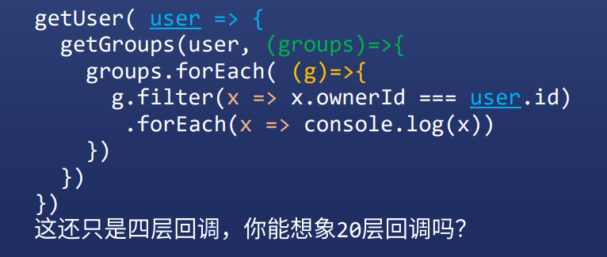
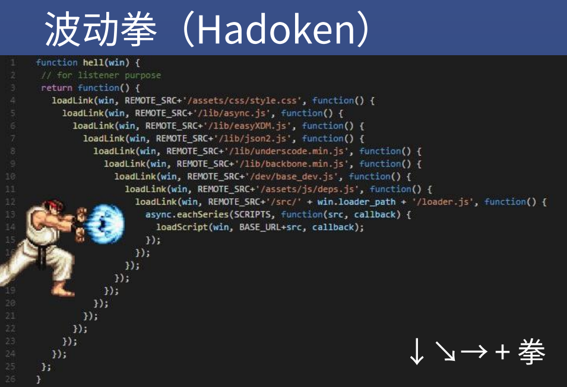
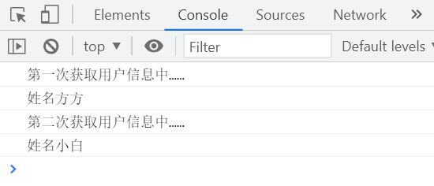
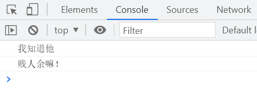
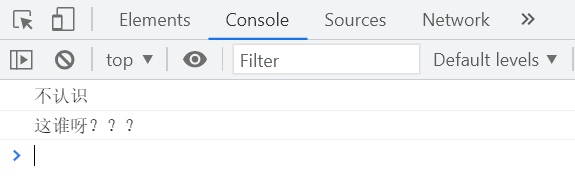
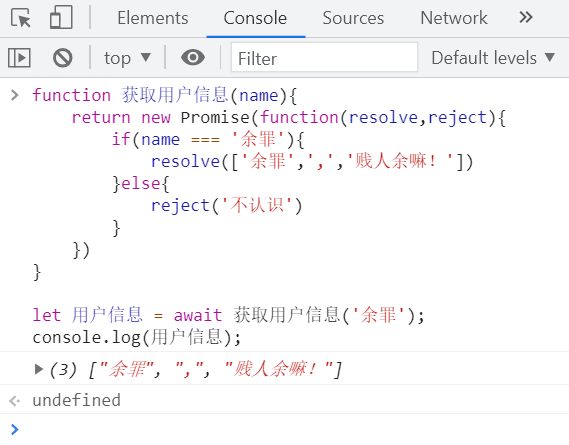
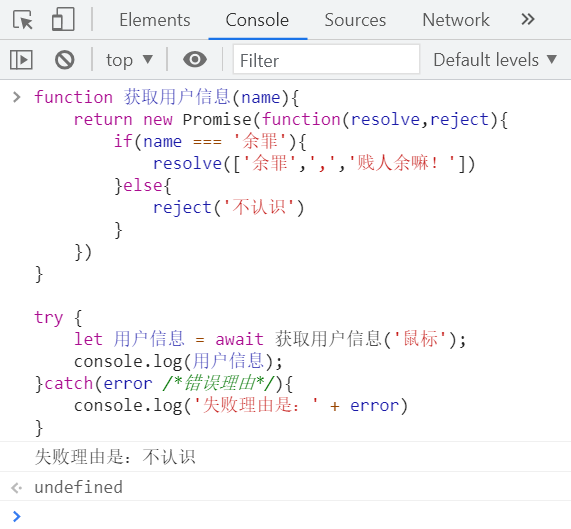

# 异步与 promise

## 如果异步任务有两个结果，成功或失败，怎么办？

## 两个结果

### 方法一：回调接受两个参数

```js
fs.readFile('./1.txt',(error,data)=>{
    if(error){
        console.log('失败');
        return
    }
    console.log(data.toString()) // 成功
})
```

### 方法二：搞两个回调

```js
ajax('get','/1.json',(data)=>{},(error)=>{})
// 前面函数是成功回调，后面函数是失败回调

ajax('get','/1,json',{
    success:()=>{},
    fail:()=>{}
})
// 接受一个对象，对象有两个 key 表示成功和失败
```


## 这些方法的不足

### 不管方法一还是方法二，都有问题

* 不规范，名称五花八门，有人用 success + error , 有人用 success + fail ，有人用 done + fail
* 容易出现回调地狱，代码变得看不懂
* 很难进行错误处理

### 回调地狱举例





 

## 怎么解决回调问题？

### 有什么办法能解决这三个问题？

* 规范回调的名字或顺序
* 拒绝回调地狱，让代码可读性更强
* 很方便地捕获错误

### 前端程序员开始翻书了

* 1976年，Daniel P. Friedman 和 David Wise
* 俩人提出 Promise 思想
* 后人基于此发明了 Future、Delay、Deferred等
* 前端结合 Promise 和 JS ，制订了 [Promise/A+ 规范](https://www.ituring.com.cn/article/66566)
* 该规范详细描述了 Promise 的原理和使用方法


## 以 AJAX 的封装为例，来解释 Promise 的用法

```js
ajax = (method,url,options)=>{
    const {success,fail} = options // 析构赋值
    // 相当于 const success = options.success
    // const fail = options.fail
    const request = new XMLHttpRequest()
    request.open(method,url)
    request.onreadystatechange = ()=>{
        if(request.readyState === 4){
            // 成功就调用 success，失败就调用 fail
            if(request.status < 400){
                success.call(null,request.response)
            }else if(request.statue >=400){
                fail.call(null,request,request.status)
            }
        }
    }
    request.send()
}

ajax('get','/xxx',{
    success(response){},fail:(request,status)=>{}
}) // 左边是 function 缩写，右边是箭头函数
```


## Promise 说这代码太傻了

* 我们改成 Promise 写法

```js
// 先改一下调用的姿势
ajax('get','/xxx',{
    success(response){},fail:(request,status)=>{}
})
// 上面用到了两个回调，还使用了 success 和 fail

// 改成 Promise 写法
ajax('get','/xxx')
	.then((response)=>{},(request)=>{})

// 虽然也是回调
// 但是不需要记 success 和 fail 了
// then 的第一个参数就是 success
// then 的第二个参数就是 fail

// 请问 ajax() 返回了个啥？
// 返回了一个含有 .then() 方法的对象呗
// 那么再请问如何得到这个含有 .then() 的对象呢？
// 那就要改造 ajax 的源码了

ajax = (method, url, options)=>{
	return new Promise((resolve, reject)=>{ // 改，很重要，要背熟
		const {success, fail} = options
		const request = new XMLHttpRequest()
		request.open(method, url)
		request.onreadystatechange = ()=>{
			if(request.readyState === 4){
				// resolve reject
				if(request.status < 400){
					resolve.call(null, request.response) // 改
				}else if(request.status >= 400){
					reject.call(null, request) // 改
				}
			}
		}
		request.send()
	})
}
```


## 小结

### 第一步

* `return new Promise((resolve,reject)=>{...})`
* 任务成功则调用 `resolve(result)`
* 任务失败则调用 `reject(error)`
* `resolve` 和 `reject` 会再去调用成功和失败函数

### 第二步

* 使用 `.then(success,fail)` 传入成功和失败函数


```js
function 获取用户信息(){
    return new Promise(function(resolve,reject){
        console.log('第一次获取用户信息中……')
        resolve('姓名方方')
    })
}

function 打印用户信息(用户信息){
    return new Promise(function(resolve,reject){
        console.log(用户信息)
        resolve()
    })
}

function 获取另一个用户信息(){
    return new Promise(function(resolve,reject){
        console.log('第二次获取用户信息中……')
        resolve('姓名小白')
    })
}

获取用户信息()
    .then(打印用户信息)
    .then(获取另一个用户信息)
    .then(打印用户信息)
```



---

```js
function 获取用户信息(name){
    return new Promise(function(resolve,reject){
        if(name === '余罪'){
            console.log('我知道他')
            resolve('贱人余嘛！')
        }else{
            console.log('不认识')
            reject()
        }
    })
}

获取用户信息('余罪')
.then(
    function(d){
        console.log(d)
    },
    function(){
        console.log('这谁呀？？？')
    }
)
```



---

```js
function 获取用户信息(name){
    return new Promise(function(resolve,reject){
        if(name === '余罪'){
            console.log('我知道他')
            resolve('贱人余嘛！')
        }else{
            console.log('不认识')
            reject()
        }
    })
}

获取用户信息('鼠标')
.then(
    function(d){
        console.log(d)
    },
    function(){
        console.log('这谁呀？？？')
    }
)
```



---

```js
function 获取用户信息(name){
    return new Promise(function(resolve,reject){
        if(name === '余罪'){
            resolve(['余罪',',','贱人余嘛！'])
        }else{
            reject('不认识')
        }
    })
}

let 用户信息 = await 获取用户信息('余罪');
console.log(用户信息);
```



---

```js
function 获取用户信息(name){
    return new Promise(function(resolve,reject){
        if(name === '余罪'){
            resolve(['余罪',',','贱人余嘛！'])
        }else{
            reject('不认识')
        }
    })
}

try {
    let 用户信息 = await 获取用户信息('鼠标');
    console.log(用户信息);
}catch(error /*错误理由*/){
    console.log('失败理由是：' + error)
}
```



----

## 我们封装的 ajax 的缺点

### post 无法上传数据

* `request.send(这里可以上传数据)`

### 不能设置请求头

* `request.setRequestHeader(key,value)`

### 怎么解决呢？

* 花时间把 ajax 写到完美（有时间可以做）
* 使用 jQuery.ajax（这个可以）
* 使用 axios（这个库比 jQuery 逼格高）


## jQuery.ajax

### 已经非常完美

* [jQuery.ajax 文档](https://www.jquery123.com/jQuery.ajax/)
* 看看参数说明，然后直接看代码示例

### 封装优点

* 支持更多形式的参数
* 支持 Promise
* 支持的功能超多

### 我们需要掌握 jQuery.ajax 吗？

* 不用，现在的专业前端都在用 axios


## axios

### 目前最新的 AJAX 库

* 显然它抄袭了 jQuery 的封装思路
* 通过这个[博客](https://juejin.cn/post/6844903569745788941)，我们可以快速了解 axios 的用法


## axios 高级用法

### JSON 自动处理

* axios 如果发现响应的 Content-Type 是 json
* 就会自动调用 JSON.parse
* 所以说正确设置 Content-Type 是好习惯

### 请求拦截器

* 你可以在所有请求里加些东西，比如查询参数

### 响应拦截器

* 你可以在所有响应里加些东西，甚至改内容

### 可以生成不同实例（对象）

* 不同的实例可以设置不同的配置，用于复杂场景


## 如何使用 axios ?

* 进入 bootcdn
* 搜索 axios
* 复制 script 标签


