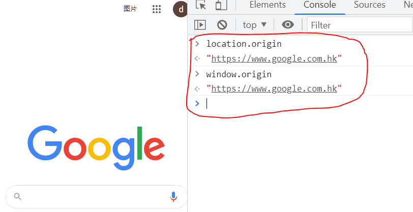
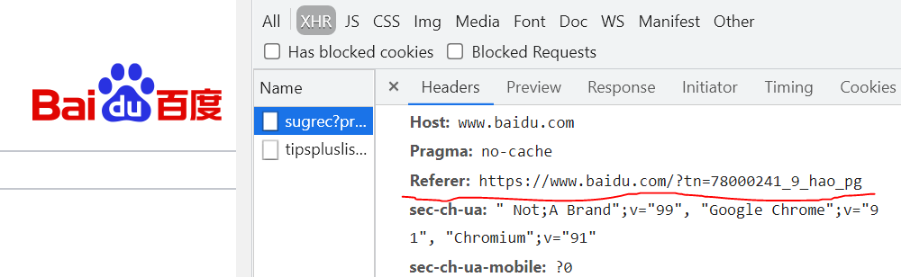

# 跨域

## 跨域关键知识

### 同源策略

* 浏览器故意设计的一个功能限制

### CORS 

* 突破浏览器限制的一个方法

### JSONP

* IE 时代的妥协


## 同源策略

* 什么是同源？

## 同源定义

### 源

* `window.origin` 或 `location.origin` 可以得到当前源
* 源 = 协议 + 域名 + 端口号



### 如果两个 url 的

* 协议
* 域名
* 端口号
* 完全一致，那么这两个 url 就是**同源**的

### 举例

* https://qq.com 、https://www.baidu.com 不同源
* https://baidu.com 、https://www.baidu.com 不同源
* 完全一致才算同源

### url

* Uniform Resource Locator
* 统一资源定位符
* 俗称**网址**

## 同源策略定义

### 浏览器规定

* 如果 JS 运行在源 A 里，那么就只能获取源 A 的数据
* 不能获取源 B 的数据，即不允许跨域

### 举例（省略 http 协议）

* 假设 frank.com/index.html 引用了 cdn.com/1.js
* 那么就说「1.js 运行在源 frank.com里」
* 注意这跟 cdn.com 没有关系，虽然 1.js 从它那下载
* 但是 1.js 只能获取 frank.com 的数据
* 不能获取 1.frank.com 或者 qq.com 的数据

### 这是浏览器的功能！

* 浏览器故意要这样设计的

## 浏览器这样做的目的是啥？

* 为了保护用户隐私！
* 怎么保护的？

## 如果没有同源策略

### 以 QQ 空间为例

* 源为 https://user.qzone.qq.com
* 假设，当前用户已经登录（用 Cookie）
  * Cookie：某些网站为了辨别用户身份而储存在用户本地终端上的数据（通常经过加密），类型为**小型文本文件**
* 假设，AJAX 请求 /friends.json 可获取用户好友列表
* 到目前为止都很正常

### 黑客来了

* 假装你的女神分享 https://qzone-qq.com 给你
* 实际上这是一个钓鱼网站
* 你点开这个网页，这个网页也请求你的好友列表
* https://user.qzone.qq.com/friends.json
* 请问，你的好友列表是不是就被黑客偷偷偷走了？
* 好像是哦……

## 问题的根源

### 无法区分发送者

* QQ空间页面里的 JS 和黑客网页里的 JS 
* 发的请求几乎没有区别，（referer 有区别）
* 如果后台开发者没有检查 referer ，那么就完全没区别
* 所以，没有同源策略，任何页面都能偷QQ空间的数据
* 甚至支付宝余额！



### 那检查 referer 不就好了？

* 安全原则：安全链条的强度取决于最弱的一环
* 万一这个网站的后端开发工程师是个傻 X 呢？
* 所以浏览器应该主动预防这种偷数据的行为
* 总之，浏览器为了用户隐私，设置了严格的同源策略

## 同源策略

* 不同源的页面之间，不准互相访问数据

## 你说了这么多，可有证据？

* 我们需要做两个网站来演示一下

## 步骤

### 创建目录

* qq-com 里面有一个 server.js，用来模拟QQ空间
* frank-com 里面有一个 server.js，用来模拟坏人网站

### qq-com

* /index.html 是首页
* /qq.js 是 JS 脚本文件
* /friends.json 是模拟的好友数据
* 端口监听为 8888，访问 http://127.0.0.1:8888

### frank-com

* /index.html 是首页
* /frank.js 是 JS 脚本文件
* 端口监听为 9999，访问 http://127.0.0.1:9999


## hosts

### 设置本地域名映射

* 让 qq.com 映射到 127.0.0.1
* 就可以访问 http://qq.com:8888/index.html了
* 让 frank.com 映射到 127.0.0.1
* 就可以访问 http://frank.com:9999/index.html了

### 如何设置 hosts

* 需要用管理员权限操作
* windows10

```js
// 用记事本管理员运行打开hosts
// 在原有的内容下面添加
127.0.0.1 qq.com
127.0.0.1 frank.com
```


## 跨域 AJAX

### 正常使用 AJAX

* 在 qq.com:8888 里运行的 JS 可以访问 /friends.json

### 黑客偷数据

* 在 frank.com:9999 里运行的 JS 不能访问
* 浏览器需要 CORS

### 提问

* 黑客的请求发成功了没有？
  * 答：成功了，因为 qq.com 后台有 log
* 黑客拿到响应没有？
  * 答：没有，因为浏览器不给它数据

### 就没有浏览器不限制跨域么

* 如果不限制，就是浏览器 bug 了，快向浏览器反馈

### 为什么 a.qq.com 访问 qq.com 也算跨域？

* 因为历史上，出现过不同公司共用域名，a.qq.com 和 qq.com 不一定是同一个网站，浏览器谨慎起见，认为这是不同的源

### 为什么不同端口也算跨域？

* 原因同上，一个端口一个公司。记住安全链条的强度取决于最弱的一环，任何安全相关的问题都要谨慎对待

### 为什么两个网站的 IP 是一样的，也算跨域？

* 原因同上，IP 可以共用

### 为什么可以跨域使用 CSS、JS 和图片等？

* 同源策略限制的是数据访问，我们引用 CSS、JS 和 图片的时候，其实并不知道其内容，我们只是在引用。不信我问你，你能知道 CSS 的第一个字符是什么吗？


## 怎么跨域？

## 解法一：CORS

* Cross-origin resource sharing	跨域资源共享

### 问题根源

* 浏览器默认不同源之间不能互相访问数据
* 但是 qq.com 和 frank.com 都是我们的网站
* 我们就是想要这两个网站互相访问，浏览器为什么阻止

### 好吧，用 CORS

* 浏览器说，如果要共享数据，需要提前声明！

* 哦，那怎么声明呢？

* 浏览器说，qq.com 在响应头里写 frank.com 可以访问

* 哦，具体语法呢？

  ```node.js
  response.setHeader('Access-Control-Allow-Origin','http://foo.example')
  ```

* 浏览器说：都在文档里，去看[MDN文档](https://developer.mozilla.org/zh-CN/docs/Web/HTTP/CORS#%E7%AE%80%E5%8D%95%E8%AF%B7%E6%B1%82)

### CORS 就这么简单？！

* 是的，就一句话的事情
* 想想看，是否完美解决了问题
* 注意：CORS 分为简单请求和复杂请求，具体看文档

### IE说：你猜我支持不支持

* 那还用猜？
* IE 6 7 8 9 都不支持
* 那如果要兼容 IE，怎么办？


## JSONP

### 定义

* JSONP 和 JSON 半毛钱关系都没有
* 由于前段水平低下，错误地将其称为 JSONP

### 我们现在面临地问题是什么？

* 程序员常常面临奇葩需求
* 没有 CORS，怎么跨域
* 记不记得我们可以随意引用 JS
* 虽然我们不能访问 qq.com:8888/friends.json
* 但是我们能引用 qq.com:8888/friends.js 啊！
* 这有什么用？JS 又不是数据
* 我们让 JS 包含数据不就好了……

### 步骤

### frank.com 访问 qq.com

* qq.com 将数据写到 /friends.js

* frank.com 用 script 标签引用 /friends.js

* /friends.js 执行，执行什么呢？

* frank.com 事先定义好 window.xxx 函数

* /friends.js 执行 window.xxx({friends:[...]})

* 然后 frank.com 就通过 window.xxx 获取到数据了

* window.xxx 就是一个回调啊！

### 优化

### XXX 能不写死吗？

* window.xxx 能不能改其他名字？
* 其实名字不重要，只要 frank.com 定义的函数名和 qq.com/friends.js 执行的函数名是同一个即可！
* [点击查看源代码示例](https://github.com/clouddawn/kuayu-1)

 

## JSONP 是什么？

* 完美回答（优缺点）

* 我们在跨域的时候，由于当前浏览器不支持 CORS ，或者因为某些条件不支持 CORS ，我么必须使用另外一种方式来跨域。
* 于是我们就请求一个 JS 文件，这个 JS 文件会执行一个回调，回调里面就有我们的数据。
* 回调的名字是可以随机生成的一个随机数，我们把这个名字以 callback 的参数传给后台，后台会把这个函数再次返回给我们并执行。
* jsonp 的优点
  * 兼容 IE
  * 可以跨域

* jsonp 的缺点
  * 由于它是 script 标签，所以它读不到 ajax 那么精确的状态，它不知道状态码是什么，也不知道整个响应的头是什么，只知道成功和失败
  * 由于它是 script 标签，它只能发 get 请求，不支持 post


