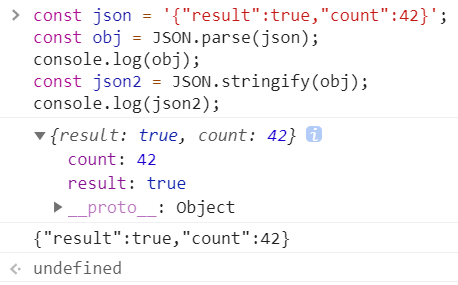

# 动态服务器

## 静态服务器 VS 动态服务器

* 也叫：静态网页 VS 动态网页

## 判断依据

### 是否请求了数据库？

* 没有请求数据库，就是静态服务器
* 请求了数据库，就是动态服务器


## /db/users.json

### 结构：一个数据

```json
[{"id":1,"name":"frank","password":"xxx"},
 {"id":2,"name":"jack","password":"zzz"}]
```

### 读取 users 数据

* 先 `fs.readFileSync('./db/users.json').toString()`
* 然后` JSON.parse` 一下（反序列化），得到数组

### 存储 users 数据

* 先 `JSON.stringify`一下（序列化），得到字符串
* 然后 `fs.writeFileSync('./db/users/json',data)`


## 目标 1

### 实现用户注册功能

* 用户提交用户名和密码
* `users.json` 里就新增了一行数据

### 思路

* 前端写一个 form，让用户填写 name 和 password
* 前端监听 submit 事件
* 前端发送 post 请求，数据位于请求体
* 后端接收到 post 请求
* 后端获取请求体中的 name 和 password
* 后端存储数据


### jQuery 知识补充 

### .on()

```js
.on( events [, selector ] [, data ], handler(eventObject) )
```

* **描述:** *在选定的元素上绑定一个或多个事件处理函数。*

* **events**

  类型: [String](https://www.jquery123.com/Types/#String)

  一个或多个空格分隔的事件类型和可选的命名空间，或仅仅是命名空间，比如"click"。

* **selector**

  类型: [String](https://www.jquery123.com/Types/#String)

  一个选择器字符串，用于过滤出被选中的元素中能触发事件的后代元素。如果选择器是 `null` 或者忽略了该选择器，那么被选中的元素总是能触发事件。

* **handler(eventObject)**

  类型: [Function](https://www.jquery123.com/Types/#Function)()

  事件被触发时，执行的函数。


### event.preventDefault()

* **描述:** *如果调用这个方法，默认事件行为将不再触发。*
* 这个方法不接受任何参数。
* 例如，在执行这个方法后，如果点击一个链接（a标签），浏览器不会跳转到新的 URL 去了。我们可以用 `event.isDefaultPrevented()` 来确定这个方法是否(在那个事件对象上)被调用过了。


### .find( selector )

* **描述:** 通过一个选择器，jQuery对象，或元素过滤，得到当前匹配的元素集合中每个元素的后代。


### .val()

**描述:** 获取匹配的元素集合中第一个元素的当前值。


## 目标 2

### 实现用户登录功能

* 首页 home.html，已登录用户可看到自己的用户名
* 登录页 sign-in.html，供提交用户名和密码
* 输入的用户名密码如果是匹配的，就自动跳转首页

### sign-in.html 思路

* 前端写一个 form，让用户填写 name 和 password
* 前端监听 submit 事件
* 前端发送 post 请求，数据位于请求体
* 后端接受 post 请求
* 后端获取请求体中的 name 和 password
* 后端读取数据，看是否有匹配的 name 和 password
* 如果匹配，后端应标记用户已登录，可是怎么标记呢？


## 目标 2 受阻，目标太大了

* 目标应该尽量小


## 目标 3

* 标记用户已登录


## Cookie

### 定义

* Cookie 是服务器下发给浏览器的一段字符串
* 浏览器必须保存这个 Cookie（除非用户删除）
* 之后发起相同二级域名请求（任何请求）时，浏览器必须附上 Coolie

### 以公园门票作为对比

* 假如你是公园检票员，你怎么知道谁能进谁不能进？
* 有票能进，没票不能进
* Cookie 就是门票
* 有 Cookie 就是登录了，没 Cookie 就没登录
* 那后端给浏览器下发一个 Cookie 不就完事了嘛！


## Set-Cookie 响应头

* 语法看[MDN文档](https://developer.mozilla.org/zh-CN/docs/Web/HTTP/Headers/Set-Cookie)


## home.html 怎么知道登录的是谁呢？

* 把 logined 改成 user_id


## 目标 4

### 显示用户名

* home.html 渲染前获取 user 信息
* 如果有 user，则将 {{user.name}}替换成 user.name
* 如果无 user，则显示登录按钮


## 有一个大 bug

* 用户可以篡改 user_id 啊！
* 开发者工具或者 JS 都能改


## 目标 5：防篡改 user_id

### 思路一：加密

* 将 user_id 加密发送给前端，后端读取 user_id 时解密，此法可行，但是有安全漏洞
* 漏洞：加密后的内容可无限期使用
* 解决办法：JWT

### 思路二：把信息隐藏在服务器

* 把用户信息放在服务器的 x 里，再给信息一个随机 id
* 把随机 id 发给浏览器
* 后端下次读取到 id 时，通过 x[id] 获取用户信息
* 想想为什么用户无法篡改 id（因为 id 很长，而且随机）
* x 是什么？是文件。不能用内存，因为断电内存就清空
* 这个 x 又被叫做 session（会话）


## Cookie / Session 总结

### 服务器可以给浏览器下发 Cookie

* 通过 Response Header
* 具体语法见 MDN

### 浏览器上的 Cookie 可以被篡改

* 用开发者工具就能改
* 弱智后端下发的 Cookie 用 JS 也能篡改

### 服务器下发不可篡改的 Cookie

* Cookie 可包含加密后的信息（还得解密,麻烦）
* Coolie 也可只包含一个 id （随机数）
* 用 session[id] 可以在后端拿到对应的信息

### 这个 id 无法被篡改

* 但可以被复制，问题不大


## JSON.parse()

* 反序列化

* `JSON.parse()`方法用来解析 JSON 字符串，构造由字符串描述的 JavaScript 值或对象

## JSON.stringify()

* 序列化

* `JSON.stringigy()`方法将一个 JavaScript 对象或值转换为 JSON 字符串

```js
const json = '{"result":true,"count":42}';
const obj = JSON.parse(json);
console.log('obj:'+obj);
const json2 = JSON.stringify(obj);
console.log('json2:'+json2);
```




