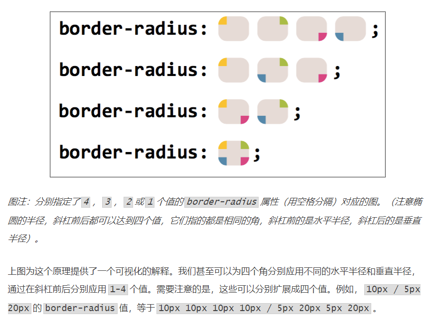
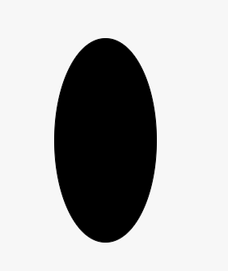
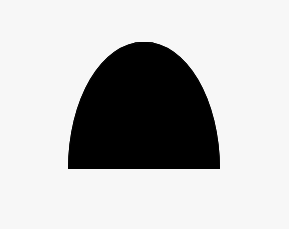
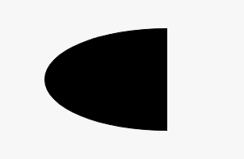
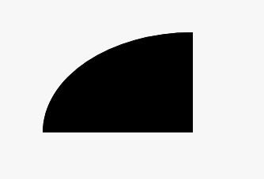

# 如何用CSS画一个椭圆？

## border-radius的简写

* 应用多组值，用空格分隔

* 如果我们提供四个值，分别应用于对应的角，从左上角开始，顺时针旋转

* 如果我们提供少于四个值，它们以CSS方式相乘，三个值的情况表示第二个值和第四个值相等，两个值的情况表示第一个值和第三个值相等

  

注：图片来自https://www.w3cplus.com/css3/css-secrets/flexible-ellipses.html


## 示例一：椭圆



```css
  width: 100px;
  height: 200px;
  border-radius: 50%;
  background: black;
```


## 示例二：半椭圆




```CSS
  width: 120px;
  height: 100px;
  border-radius: 50% 50% 0 0 / 100% 100% 0 0;
  background: black;
```

--------------------------



```css
  width: 120px;
  height: 100px;
  border-radius: 100% 0 0 100% / 50% 0 0 50%;
  background: black;
```


## 示例三：四分之一椭圆



```css
  width: 150px;
  height: 100px;
  border-radius: 100% 0 0 0 / 100% 0 0 0;
  background: black;
```


