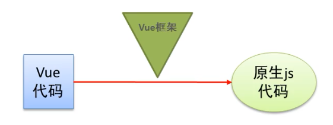
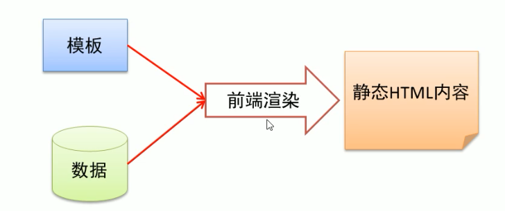
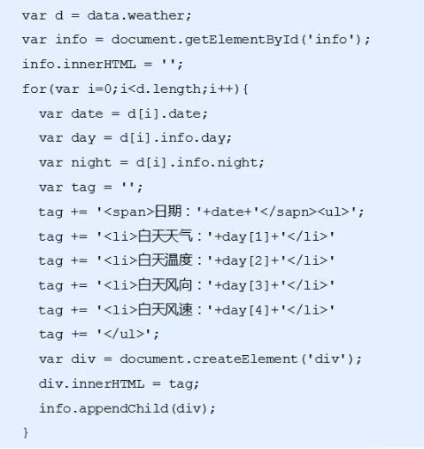
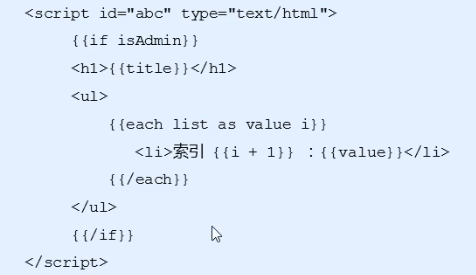

# Vue 基础(一)

### Vue：渐进式 JavaScript 框架

* 声明渲染
* 组件系统 
* 客户端路由 
* 集中式状态管理 
* 项目构建

### 官网：https://cn.vuejs.org/v2/guide/

* 易用：熟悉 HTML、CSS、JavaScript 知识后，可快速上手 Vue
* 灵活：在一个库和一套完整框架之间自如伸缩
* 高效：20kb 运行大小，超快虚拟 DOM

### 小细节

* 是 Vue.js 而不是 Vue、vue.js、VueJS
* 中文官网 https://v3.cn.vuejs.org 而不是 https://vue3js.cn


## Vue 基本使用

### 传统开发模式对比

#### 原生 JS

```js
    <div id="msg"></div>
    <script>
        const msg = 'Hello World';
        const div = document.getElementById('msg');
        div.innerHTML = msg;
    </script>
```

#### jQuery

```js
    <div id="msg"></div>
    <script src="https://cdn.bootcdn.net/ajax/libs/jquery/3.6.0/jquery.min.js"></script>
    <script>
        const msg = 'Hello World';
        $('#msg').html(msg);
    </script>
```

#### Vue.js

```html
    <div id="app">
        <div>{{msg}}</div>//插值表达式
    </div>
    <script src="https://cdn.bootcdn.net/ajax/libs/vue/2.6.12/vue.min.js"></script>
    <script>
        new Vue({
            el:'#app',
            data:{
                msg:'Hello World'
            }
        })
    </script>
```

### Vue 的基本使用步骤

* 需要提供标签用于填充数据
* 引入 vue.js 库文件
* 使用 vue 的语法做功能
* 把 vue 提供的数据填充到标签里面

### 实例参数分析

* **el**：元素的挂载位置（值可以是 CSS 选择器或者 DOM 元素）
* **data**：模型数据（值是一个对象）

### 插值表达式用法

* 将数据填充到 HTML 标签中
* 插值表达式支持基本的计算操作

### Vue 代码运行原理分析

* 概述编译过程的概念（Vue语法--->原生语法）




## Vue 模板语法

### 模板语法概述

### 如何理解前端渲染？

* 把数据填充到 HTML 标签中



### 前端渲染方式

* 原生 js 拼接字符串
* 使用前端模板引擎
* 使用 Vue 特有的模板语法

### 原生 js 拼接字符串

* 基本上就是将数据以字符串的方式拼接到 HTML 标签中，前端代码风格大体上如下图所示。
* 缺点：不同开发人员的代码风格差别很大，随着业务的复杂，后期维护会逐渐变得困难。



### 使用前端模板引擎

* 下图代码是基于模板引擎 art-template 的一段代码，与拼接字符串相比，代码明显规范了很多，它拥有自己的一套模板语法规则。
* 优点：大家都遵循同样的规则写代码，代码可读性明显提高了，方便后期的维护。
* 缺点：没有专门提供事件机制。



### 模板语法概览

* 差值表达式
* 指令
* 事件绑定
* 属性绑定
* 样式绑定
* 分支循环结构


