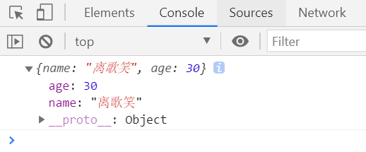
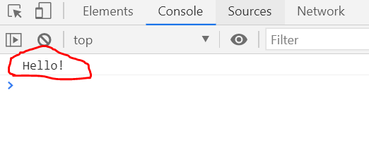
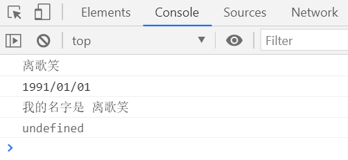
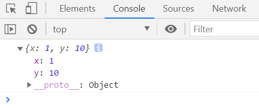
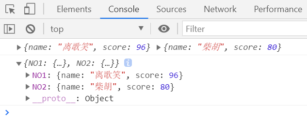
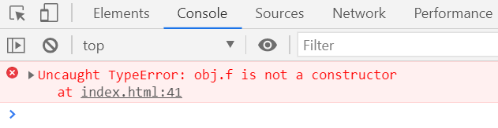

# ES6属性的简洁表示法

### ES6 允许在大括号里面，直接写入变量和函数，作为对象的属性和方法

```js
    const name = '离歌笑';
    const age = 30;
    const person = {name,age};
    console.log(person);
    //等同于
    // const person = {
    //     name:name,
    //     age:age
    // }
    // console.log(person);
```



#### 上面代码中，变量`name`、`age`直接写在大括号里面。这时属性名就是变量名，属性值就是变量值。

```js
      function person(name, age) {
        return { name, age };
      }
      console.log(person('离歌笑',30));
      // 等同于
    //   function person(name, age) {
    //     return { 
    //         name:name, 
    //         age:age
    //     };
    //   }
    //   console.log(person('离歌笑',30));
```


### 除了属性简写，方法也可以简写

```js
      const  greeting = {
        sayHello() {
          return "Hello!";
        },
      };
      console.log(greeting.sayHello());
      // 等同于
    //   const  greeting = {
    //     sayHello:function() {
    //       return "Hello!";
    //     },
    //   };
    //   console.log(greeting.sayHello());
```




### 综合示例

```js
      let birth = "1991/01/01";

      const Person = {
        name: "离歌笑",

        //等同于birth: birth
        birth,

        // 等同于hello: function ()...
        hello() {
          console.log("我的名字是", this.name);
        },
      };
      console.log(Person.name);
      console.log(Person.birth);
      console.log(Person.hello());
```



### 这种写法用于函数的返回值，非常方便。

```js
      function getPoint() {
        const x = 1;
        const y = 10;
        return { x, y };
      }
      console.log(getPoint());
```



### 简洁写法在打印对象时也很有用。

```js
      let NO1 = {
        name: "离歌笑",
        score: 96
      };

      let NO2 = {
        name: "柴胡",
        score: 80
      };
      console.log(NO1, NO2);
      console.log({ NO1, NO2 });
```



**上面代码中，`console.log`直接输出`NO1`和`NO2`两个对象时，就是两组键值对，可能会混淆。把它们放在大括号里面输出，就变成了对象的简洁表示法，每组键值对前面会打印对象名，这样就比较清晰了。**

### 注意，简写的对象方法不能用作构造函数，会报错。

```js
      const obj = {
        f() {
          this.foo = "bar";
        },
      };
      new obj.f(); 
```




