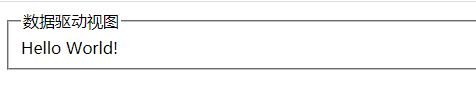
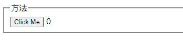
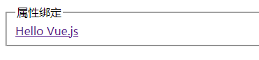
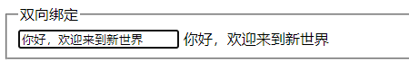
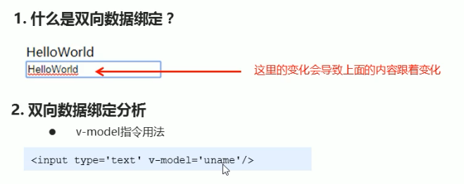
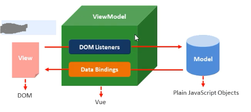

# Vue 基础（二）

## 数据到视图的映射

```html
<!DOCTYPE html>
<html lang="en">
  <head>
    <script src="https://unpkg.com/vue@next"></script>
  </head>
  <body>
    <div id="app">
      <fieldset>
        <legend>数据驱动视图</legend>
        {{ message }}
      </fieldset>
    </div>
    <script>
      const App = {
        data() {
          return {
            message: "Hello World!",
          };
        },
      };
      Vue.createApp(App).mount("#app");
    </script>
  </body>
</html>
```



## 修改数据

```html
<!DOCTYPE html>
<html lang="en">
  <head>
    <script src="https://unpkg.com/vue@next"></script>
  </head>
  <body>
    <div id="app">
      <fieldset>
        <legend>⽅法</legend>
        <button @click="add">Click Me</button>
        {{ counter }}
      </fieldset>
    </div>
    <script>
      const App = {
        data() {
          return {
            counter: 0,
          };
        },
        methods: {
          add() {
            this.counter++;
          },
        },
      };
      Vue.createApp(App).mount("#app");
    </script>
  </body>
</html>

```



## 属性绑定

```html
<!DOCTYPE html>
<html lang="en">
  <head>
    <script src="https://unpkg.com/vue@next"></script>
  </head>
  <body>
    <div id="app">
      <fieldset>
        <legend>属性绑定</legend>
        <a v-bind:href="url" :title="title">{{title}}</a>
      </fieldset>
    </div>
    <script>
      const App = {
        data() {
          return {
            title: "Hello Vue.js",
            url: "https://v3.vuejs.org/",
          };
        },
      };
      Vue.createApp(App).mount("#app");
    </script>
  </body>
</html>
```



## 双向绑定

```html
<!DOCTYPE html>
<html lang="en">
  <head>
    <script src="https://unpkg.com/vue@next"></script>
  </head>
  <body>
    <div id="app">
      <fieldset>
        <legend>双向绑定</legend>
        <input type="text" v-model="search" />
        {{ search }}
      </fieldset>
    </div>
    <script>
      const App = {
        data() {
          return {
            search: "Vue",
          };
        },
      };
      Vue.createApp(App).mount("#app");
    </script>
  </body>
</html>
```



## 指令

### 什么是指令？

* 指令的本质就是自定义属性
* 指令的格式：以 v- 开始（比如：v-cloak）

### v-cloak 指令用法

* 插值表达式存在的问题：“闪动”
* 如何解决该问题：使用 v-cloak 指令
* 解决该问题的原理：先隐藏，替换好值之后再显示最终的值

```html
    <style>
      [v-cloak]{
        display: none;
      }
    </style>
    <div id="app">
      <div v-cloak>{{msg}}</div>
  </div>
  <script>
      new Vue({
          el:'#app',
          data:{
              msg:'Hello World'
          }
      })
  </script>
  <!-- 
	v-cloak 指令的用法
	1.提供样式
		[v-cloak]{
			display:none;
		}
	2.在插值表达式所在的标签中添加 v-cloak 指令

原理：先通过样式隐藏内容，然后在内存中进行值的替换，替换好之后再显示最终的结果。
  -->
```

### 数据绑定指令

* v-text 填充纯文本
  * 相比插值表达式更加简洁

```html
    <div id="app">
      <div v-text='msg'></div>
  </div>
  <script>
      new Vue({
          el:'#app',
          data:{
              msg:'Hello World'
          }
      })
  </script>
```

* v-html 填充HTML片段
  * 存在安全问题
  * 网站内部数据可以使用，来自第三方的数据不可以用

```html
    <div id="app">
      <div v-html='msg'></div>
  </div>
  <script>
      new Vue({
          el:'#app',
          data:{
              msg:'<h1>蛟龙入海</h1>'
          }
      })
  </script>
```

* v-pre 填充原始信息
  * 显示原始信息，跳过编译过程（分析编译过程）

```html
    <div id="app">
      <div v-pre>{{msg}}</div>
  </div>
  <script>
      new Vue({
          el:'#app',
          data:{
              msg:'<h1>蛟龙入海</h1>'
          }
      })
  </script>
```

### 数据响应式

* 如何理解响应式
  * html5 中的响应式（屏幕尺寸的变化导致样式的变化）
  * 数据的响应式（数据的变化导致页面内容的变化）
* 什么是数据绑定
  * 数据绑定：将数据填充到标签中
* v-once 只编译一次
  * 显示内容之后不再具有响应式功能
  * 如果显示的信息后续不需要再修改，可以使用 v-once，这样可以提高性能

### 双向数据绑定



#### 3.MVVM设计思想

* M（model）
* V（view）
* VM（View-Model）



### 事件绑定

#### Vue 如何处理事件？

* v-on 指令用法

```html
<input type='button' v-on:click='num++'>
```

* v-on 简写形式

```html
<input type='button' @click='num++'>
```

#### 事件函数的调用方式

* 直接绑定函数名称

```html
<button @click='say'>Hello</button>
```

* 调用函数 

```html
<button @click='say()'>Say hi</button>
```

-

```html
<div id="app">
    <div>{{msg}}</div>
    <div>{{num}}</div>
    <button @click="handle">handle</button>
    <button @click="handle()">handle()</button>
    <div>
        <input type="text" v-model='msg'>
    </div>
</div>
<script>
    var vm = new Vue({
        el: '#app',
        data: {
            num: 0,
            msg: '蛟龙入海'
        },
        methods:{
            handle:function(){
                //这里的 this 是 Vue 的实例对象
                this.num++;
                console.log(this === vm);//true
            }
        }
    })
</script>
```

### 事件函数参数传递

* 普通参数和事件对象

```html
<button @click='say("hi",$event)'>Say hi</button>
```

* 如果事件直接绑定函数名称，那么默认会传递事件对象作为事件函数的第一个参数
* 如果事件绑定函数调用，那么事件对象必须作为最后一个参数显式传递，并且事件对象的名称必须是$event

```html
<div id="app">
    <div>{{msg}}</div>
    <div>{{num}}</div>
    <button @click="handle1">handle</button>
    <button @click="handle2(123,456,$event)">handle()</button>
    <div>
        <input type="text" v-model='msg'>
    </div>
</div>
<script>
    var vm = new Vue({
        el: '#app',
        data: {
            num: 0,
            msg: '蛟龙入海'
        },
        methods:{
            handle1:function (event){
                this.num++;
                console.log(event.target.innerHTML);
            },
            handle2:function(p,q,event){
                this.num++;
                console.log(p,q);
                console.log(event.target.innerHTML);
            }
        }
    })
</script>
```

### 事件修饰符

* .stop 阻止冒泡

```html
<a @click.stop="handle">跳转</a>
```

* .prevent 阻止默认行为

```html
<a @click.prevent="handle">跳转</a>
```

-

```html
<div id="app">
    <div>{{num}}</div>
    <div @click="handle0">
        <button @click.stop="handle1">handle</button>
    </div>
    <a href="https://www.baidu.com" @click.prevent>百度</a>
</div>
<script>
    var vm = new Vue({
        el: '#app',
        data: {
            num: 0,
        },
        methods:{
            handle0:function (){
                this.num++;
            },
            handle1:function (event){
                //传统方式,阻止冒泡
                //event.stopPropagation();
            },
            handle2:function (event){
                //传统方式,阻止默认行为
                //event.preventDefault();
            }
        }
    })
</script>
```

### 按键修饰符

* .enter 回车键

```html
<input @keyup,enter='submit'>
```

* .delete 删除键

```html
<input @keyup.delete='handle'>
```

-

```html
<div id="app">
    <form action="">
        <div>
            用户名：
            <input type="text" @keyup.delete="clearContent" v-model="uname">
        </div>
        <div>
            密码：
            <input type="text" @keyup.enter="handleSubmit" v-model="pwd">
        </div>
        <div>
            <input type="button" @click="handleSubmit" value="提交">
        </div>
    </form>
</div>
<script>
    var vm = new Vue({
        el: '#app',
        data: {
            uname:'',
            pwd:''
        },
        methods:{
            clearContent: function (){
                this.uname='';
            },
            handleSubmit: function (){
                console.log(this.uname,this.pwd);
            }
        }
    })
</script>
```


