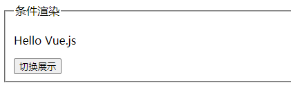
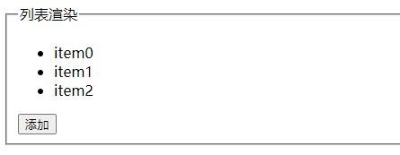
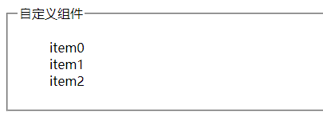

# Vue  起手式

## 如何使用 Vue 实例

### 方法一：从HTML得到视图

* 也就是文档里说的“完整版Vue”
* 从 CDN 引入 vue.js 或 vue.min.js 即可做到
* 也可以通过 import 引用 vue.js 或者 vue.min.js
* 详情看[文档这一节](https://cn.vuejs.org/v2/guide/installation.html#CDN)，把 alias 去掉即可

### 方法二：用 JS 构建视图

* 还是看上面的文档链接，使用 vue.runtime.js
* 这种方法很不方便，但实际上是对的

### 方法三：使用 vue-loader

* 可以把 .vue 文件翻译成 h 构建方法
* 但这样做 HTML 就只有一个 div#app，SEO 不友好

## Vue 实例的作用

### Vue 实例就如同 jQuery 实例

* 封装了对 DOM 的所有操作
* 封装了对 data 的所有操作

### 操作 DOM

* 无非就是监听事件、改变 DOM

### 操作 data

* 无非就是增删改查

### 没有封装 ajax

* 请用 axios 的 ajax 功能

## SEO 友好

### SEO

* 搜索引擎优化
* 你可以认为搜索引擎就是不停地 curl
* 搜索引擎根据 curl 结果猜测页面内容
* 如果你的页面都是用 JS 创建 div 的，那么 curl 就很瞎

### 那怎么办

* 很简单，给 curl 一点内容
* 把 title、description、keyword、h1、a 写好即可
* 原则：让 curl 能得到页面的信息，SEO 就能正常工作
* 怎么让网页到第一名？浏览的人足够多即可
* 百度花钱就能上第一名
* Google 能够获取 JS 创建的内容

## 深入理解两种 Vue 的区别

|              | Vue完整版                          | Vue非完整版                         | 评价                               |
| ------------ | ---------------------------------- | ----------------------------------- | ---------------------------------- |
| 特点         | 有 compiler                        | 没有 compiler                       | compiler 占40%体积                 |
| 视图         | 写在HTML里，或者写在 template 选项 | 写在 render 函数里，用 h 来创建标签 | h 是尤雨溪写好给 render 的         |
| cdn 引入     | vue.js                             | vue.runtime.js                      | 文件名不同，生产环境后缀为 .min.js |
| webpack 引入 | 需要配置 alias                     | 默认使用此版                        | 尤雨溪配置的                       |
| @vue/cli     | 需要额外配置                       | 默认使用此版                        | 尤雨溪、蒋豪群配置的               |

#### 最佳实践

* 总是使用非完整版，然后配合 vue-loader 和 vue 文件

#### 思路

* 保证用户体验，用户下载的 JS 文件体积更小，但只支持 h 函数
* 保证开发体验，开发者可直接在 vue 文件里写 HTML 标签，而不写 h 函数
* 脏活让 loader 做，vue-loader 把 vue 文件里的 HTML 转为 h 函数
* 真 TM 聪明，这就是工程师干的事

## 引用错了会怎样

#### vue.js 错用成了 vue.runtime.js

* 无法将 HTML 编译成视图

### vue.runtime.js 错用成 vue.js

* 代码体积变大，因为 vue.js 有编译 HTML 的功能

## 使用 codesandbox.io 写 Vue 代码

* 网页链接：[codesandbox](https://codesandbox.io/) 

* 首页进入，选择Create Sandbox
* 选择 Vue 项目
* 进入文件界面
* 导出code：File --> Export to Zip

##  Vue的单文件组件

### template

- HTML内容写入template中

```html
<template>
  <div class="red">
    {{ n }}
    <button @click="add">+1</button>
  </div>
</template>
```

###  script

- 视图外的其他操作写入script中，注意这里因为使用了vue-loader，data的格式变化为函数return

```html
<script>
  export default {
    data() {
      return {
        n: 0,
      };
    },
    methods: {
      add() {
        this.n += 1;
      },
    },
  };
</script>
```

### main.js中引入

- vue-load将vue页面转换成了一个对象，直接使用即可，记住要render

```js
import Demo from "./components/Demo.vue";

new Vue({
  el: "#app",
  render(h) {
    return h(Demo);
  },
});
```

### 条件渲染

```html
<!DOCTYPE html>
<html lang="en">
  <head>
    <script src="https://unpkg.com/vue@next"></script>
  </head>
  <body>
    <div id="app">
      <fieldset>
        <legend>条件渲染</legend>
        <p v-if="isShow">Hello Vue.js</p>
        <button @click="toggle">切换展示</button>
      </fieldset>
    </div>
    <script>
      const App = {
        data() {
          return {
            isShow: true,
          };
        },
        methods: {
          toggle() {
            this.isShow = !this.isShow;
          },
        },
      };
      Vue.createApp(App).mount("#app");
    </script>
  </body>
</html>
```



### 列表渲染

```html
<!DOCTYPE html>
<html lang="en">
  <head>
    <link rel="stylesheet" href="style.css" />
    <script src="https://unpkg.com/vue@next"></script>
  </head>
  <body>
    <div id="app">
      <fieldset>
        <legend>列表渲染</legend>
        <ul>
          <li v-for="value in items">{{value}}</li>
        </ul>
        <button @click="add">添加</button>
      </fieldset>
    </div>
    <script>
      const App = {
        data() {
          return {
            items: ["item0", "item1"],
          };
        },
        methods: {
          add() {
            this.items.push("item" + this.items.length);
          },
        },
      };
      Vue.createApp(App).mount("#app");
    </script>
  </body>
</html>
```



### 自定义组件

```html
<!DOCTYPE html>
<html lang="en">
  <head>
    <link rel="stylesheet" href="style.css" />
    <script src="https://unpkg.com/vue@next"></script>
  </head>
  <body>
    <div id="app">
      <fieldset>
        <legend>⾃定义组件</legend>
        <ul>
          <todo-item
            v-for="todo in
     items"
            :todo="todo"
            :key="todo.id"
          ></todo-item>
        </ul>
      </fieldset>
    </div>
    <script>
      const App = {
        data() {
          return {
            items: [
              { id: 0, text: "item0" },
              { id: 1, text: "item1" },
              { id: 2, text: "item2" },
            ],
          };
        },
      };
      const app = Vue.createApp(App);
      app.component("todo-item", {
        props: ["todo"],
        template: "<div>{{todo.text}}</div>",
      });
      app.mount("#app");
    </script>
  </body>
</html>
```




### app应用实例，vm根组件实例

```html
<!DOCTYPE html>
<html lang="en">
  <head>
    <link rel="stylesheet" href="style.css" />
    <script src="https://unpkg.com/vue@next"></script>
  </head>
  <body>
    <div id="app">
      <fieldset>
        <legend>组件实例</legend>
        {{ message }}
        <button @click="change">Click</button>
      </fieldset>
    </div>
    <script>
      const App = {
        data() {
          return {
            message: "Hello Vue!!",
          };
        },
        methods: {
          change() {
            console.log(this);
            this.message += "!";
          },
        },
      };
      const app = Vue.createApp(App);
      console.log(app);
      const vm = app.mount("#app");
      console.log(vm);
    </script>
  </body>
</html>
```


