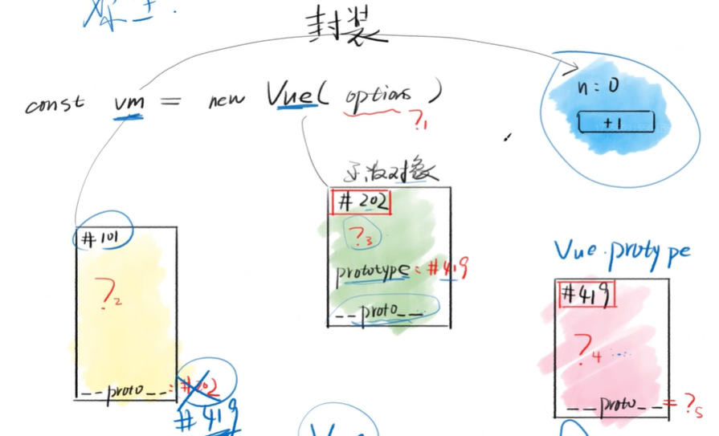
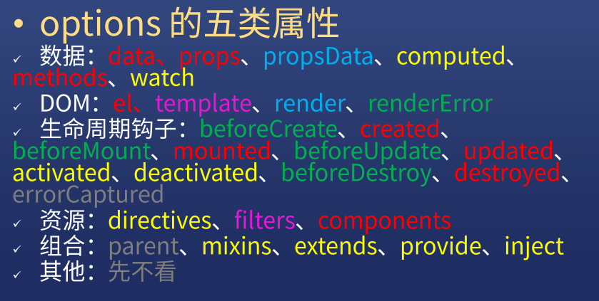
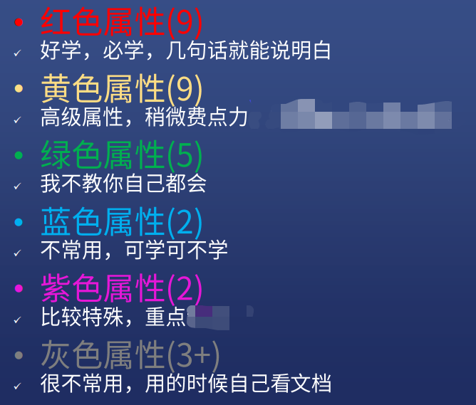
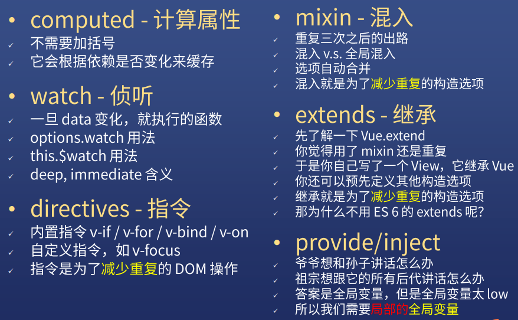

# Vue 构造选项

* `对象.__proto__===其构造函数.prototype`

* 把 Vue 的实例命名为 vm 是尤雨溪的习惯，我们沿用
* vm 对象封装了对视图的所有操作，包括数据读写、事件绑定、DOM更新
* vm 的构造函数是 Vue，按照 ES6 的说法，vm 所属的类是 Vue
* options 是 new Vue 的参数，一般称之为选项或构造选项

## options 里面有什么

### 文档

* 英文文档里搜 options，中文文档里搜选项
* 即可得到所有相关文档

### options 的五类属性

**数据**：data、props、propsData、computed、methods、watch

**DOM**：el、template、render、renderError

**生命周期钩子**：beforeCreate、created、beforeMount、mounted、beforeUpdate、updated、activated、deactivated、beforeDestroy、destroyed、errorCaptured

**资源**：dirctcives、filters、components

**组合**：parent、mixins、extends、provide、inject

**其他**：先不看

## 入门属性

#### el - 挂载点

* 可以用 $mount 代替

#### data - 内部数据

* 支持对象和函数，优先用函数

#### methods - 方法

* 事件处理函数或者是普通函数

#### components

* Vue 组件，注意大小写

#### 四个钩子

* created ---- 实例出现在内存中
* mounted ---- 实例出现在页面中
* updated ---- 实例更新了
* destroyed ---- 实例从页面和内存中消亡了

#### props - 外部数据

* 也叫属性
* `message="n"`传入字符串
* `:message="n"`传入`this.n`数据
* `:fn="add"`传入`this.add`函数

## 进阶属性

