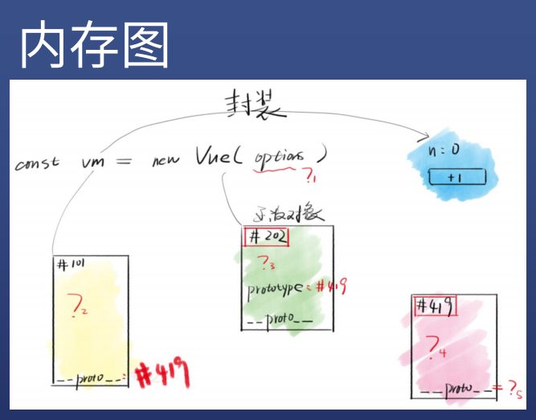
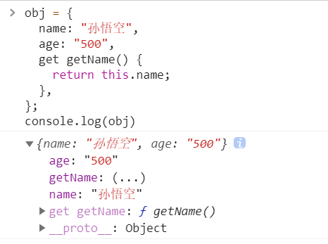
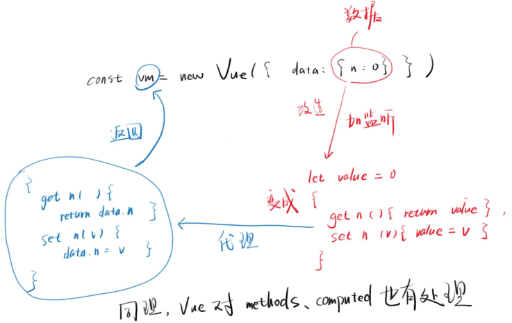

# Vue 数据响应式



## Getter 和 Setter

### Getter

* getter 用于获取属性值，不加括号的函数
* ES6 在对象里面的函数前加关键字"get"，可不加括号直接调 getter 函数

```js
obj = {
  name: "孙悟空",
  age: "500",
  get getName() {
    return this.name;
  },
};

console.log("我叫" + obj.getName + "，今年" + obj.age + '岁。');
//"我叫孙悟空，今年500岁。"
```

### Setter

* setter 用于修改属性值
* ES6 在对象里面的函数前加关键字“set”，可在等号右边传入参数

```js
obj = {
  name: "孙悟空",
  age: "500",
  set setAge(age) {
    this.age = age;
  },
};

obj.setAge = 800;
console.log("我叫" + obj.name + "，今年" + obj.age + '岁。');
```

### (...)



* 打印 obj 可得到一个虚拟属性，`getName:(...)`
* `(...)`表示：该属性实际并不存在，而是有一个 get 和 set 函数模拟对该属性进行操作

### Object.defineProperty

* 对象外定义虚拟属性的 get 和 set 用 Object.defineProperty

```js
let obj1 = {};
let _xxx = 0;

Object.defineProperty(obj1, "xxx", {
  get() {
    return _xxx;
  },
  set(x) {
    _xxx = x;
  },
});

console.log("The xxx is: " + obj1.xxx + ".");
obj1.xxx = 20;
console.log("The xxx is: " + obj1.xxx + ".");
console.log(obj1);
```

* 对象外定义虚拟属性的值

```js
Object.defineProperty(obj1, "xxx", {
  value: 1
});
```

* 对象外限定虚拟属性的值

```js
let _xxx = 0;

Object.defineProperty(obj1, "xxx", {
  get() {
    return _xxx;
  },
  set(x) {
    if(x<0)return;
    _xxx = x;
  },
});

obj1.xxx = 20;
```

### proxy

* 使用代理的方法只暴露中介对象，不用设置 _xxx 这个显示属性，让其他人无法修改

```js
let data3 = proxy({data:{n:0}}); // 匿名对象，无法直接修改

function proxy({data}){
  let obj = {};
  Object.defineProperty(obj, "n", {
    get() {
      return data.n;
    },
    set(x) {
      if(x<0)return;
      data.n = x;
    },
  });
  return obj;
}
```

* 但是用户如果直接将某个事先声明的对象传入 data 中，可以通过修改这个对象修改属性值，如：

```js
let mydata = {n:0};
let data3 = proxy({data: mydata}); // 已声明的对象，可修改
```

* 思路：可以先将对象的对应属性删去，用虚拟属性替代，即可监控，限制修改 => 偷梁换柱

```js
let mydata = {n:0};
let data3 = proxy({data: mydata}); // 已声明的对象，可修改

function proxy({data}){
  let value = data.n; // value 记录初始值，闭包
  Object.defineProperty(data, "n", { // 这里将n覆盖成虚拟属性了
    // 放置get/set监控属性
    get() {
      return value;
    },
    set(x) {
      if(x<0)return;
      value = x;
    },
  });
}
```

### Vue 的代理和监听

* `const vm = new Vue({data:mydata})`本质上就是设置对象 vm 进行代理，用虚拟属性替代了 mydata 的原始属性，加上了 get/set 进行监听，使得对 mydata 的对应属性进行修改后，Vue 知道其修改了并重新调用 render(data) 渲染页面。



* 如果 data 有多个属性 n、m、k，那么就会有 get n / get m / get k 等。

### 小结

#### Object.defineProperty

* 可以给对象添加属性 value
* 可以给对象添加 getter / setter
* getter / setter 用于对属性的读写进行监控

#### 啥是代理（设计模式）

* 对 myData 对象的属性读写，全权由另一个对象 vm 负责
* 那么 vm 就是 myData 的代理（类比房东租房）
* 比如 myData.n 不用，偏要用 vm.n 来操作 myData.n

#### vm = new Vue({data:myData})

* 一、会让 vm 成为 myData 的代理（proxy）
* 二、会对 myData 的所有属性进行监控
* 为什么要监控，为了防止 myData 的属性变了， vm 不知道
* vm 知道了又如何？知道属性变了就可以调用 render(data) 呀！
* UI = render(data)

## 数据响应式

### 什么是响应式

* 我打你一拳，你会喊疼，那你就是响应式的
* 若一个物体能对外界的刺激做出反应，它就是响应式的

### Vue 的 data 是响应式

* `const vm = new Vue({data:{n:0}})`

* 我如果修改 vm.n ，那么 UI 中的 n 就会响应我
* Vue 2 通过 `Object.defineProperty` 来实现数据响应式

### 响应式网页是啥

* 如果我改变窗口大小，网页内容会做成响应，那就是响应式网页
* 比如：https://www.smashingmagazine.com/
* 但是要注意，用户没事不会拖动网页大小的

### Vue 有 bug

#### `Object.defineProperty` 的问题

* `Object.defineProperty(obj,'n',{...})`
* 必须要有一个 'n' ，才能监视 & 代理 obj.n 对吧！
* 如果前端开发者比较水，没有给 n 怎么办？
* [示例一](https://codesandbox.io/s/wizardly-dawn-c8544?file=/src/main.js)：Vue 会给出一个警告
* [示例二](https://codesandbox.io/s/youthful-mendel-kc262)：Vue 只会检查第一层属性
* 此时如果点击 set b ，请问视图中会显示 1 吗？
* 答案是：不会
* 为什么：因为 Vue 没法监听一开始不存在的 obj.b

### 解决办法

* 一、把 key 都声明好，后面不再加属性
* 二、使用 `Vue.set` 或者 `this.$set`

### Vue.set 和 this.$set

#### 作用

* 新增 key
* 自动创建代理和监听（如果没有创建过）
* 触发 UI 更新（但并不会立刻更新）

#### 举例

* `this.$set(this.object,'m',100)`
* `Vue.set(this.object,'m',100)`

### data 中有数组怎么办？

#### 你没法提前声明所有 key

* [示例1](https://codesandbox.io/s/proud-worker-xwyoo)：数组的长度可以一直增加，下标就是 key
* 你没有办法提前把数组的 key 都声明出来，因为你不知道到底有多少个 key
* Vue 也不能检测对你新增了下标
* 难道每次改数组都要用 `Vue.set` 或者 `this.$set`

### 尤雨溪的做法

* 篡改数组的 API，见文档中[变更方法](https://cn.vuejs.org/v2/guide/list.html#%E5%8F%98%E6%9B%B4%E6%96%B9%E6%B3%95)章节

* 这 7 个 API 都会被 Vue 篡改，调用后会更新 UI

## 总结

### 对象中新增的 key

* Vue 没有办法事先监听和代理
* 要使用 set 来新增 key ，创建监听和代理，更新 UI
* 最好提前把属性都写出来，不要新增 key
* 但数组做不到**不新增 key **

### 数组中新增的 key

* 也可用 set 来新增 key，更新 UI
  * this.$set 作用于数组时，并不会自动添加监听和代理，原因未知，只能问尤雨溪了
* 不过尤雨溪篡改了 7 个 API 方便你对数组进行增删
* 这 7 个 API 会自动处理监听和代理，并更新 UI
* 结论：数组新增 key 最好通过 7 个 API


