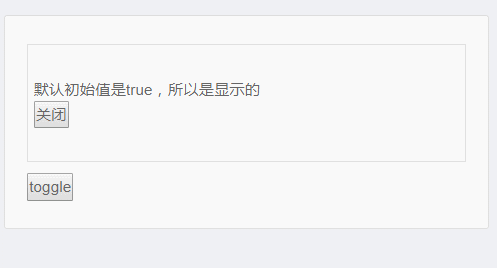

# 模板、指令与修饰符

## Vue 模板语法

### 模板 template 三种写法

### 一、Vue 完整版，写在 HTML 里

```html
<div id=xxx>
    {{n}}
    <button @click="add">+1</button>
</div>
```

```js
// 用 JS 挂载到对应 id dom 元素上
new Vue({
    el: '#xxx',
    data:{n:0}, // data 可以改成函数
    methods:{add(){}}
})
```

### 二、Vue 完整版，写在选项里

```html
<div id=app></div>
```

```js
// 写在 JS vue 实例的 template 里，挂载至对应 id 的 dom 元素上
new Vue({
    template: `
        <div>
            {{n}}
            <button @click="add">+1</button>
        </div>`,
    data:{n:0}, // data 可以改成函数
    methods:{add(){ this.n += 1 }}
}).$mount('#app')
// 注意一个细节： div#app 会被替代 
```

### 三、Vue 非完整版，配合 xxx.vue 文件

```html
<template>
    <div>
        {{n}}
        <button @click="add">
            +1
        </button>
    </div>
</template>
```

```html
<script>
export default {
    data(){ return {n:0} },
    // data 必须为函数
    methods:{add(){ this.n += 1 }}
}
</script>
<style>这里写 CSS </style>
```

### 然后在另外一个地方写如下代码

```js
import Xxx from './xxx.vue';
// Xxx 是一个 options 对象
new Vue({
    render: h => h(Xxx)
}).$mount('#app')
```

* 其他 vue 文件写好 template，js import，再指定挂载点 render
* 注意 template 里面是 XML，而不是 HTML

* 二者区别
  * XML 必须写"/"闭合标签，且有自闭合标签 `<div/>`
  * HTML 不强制写“/”，且没有内容的自闭合标签写写成 `<div></div>`
  * 如果要在 template 中使用组件，要在 components 中表明 `components:{Xxx}`

## 模板里有哪些语法

* 我们把 HTML 模板叫做 template

### 展示内容

#### 表达式

* `{{object.a}}` 表达式
* `{{n+1}}` 可以写任何运算
* `{{fn(n)}}` 可以调用函数
* 如果值为 undefined 或 null 就不显示
* 另一种写法为 `<div v-text='表达式'></div>`

#### HTML 内容

* 假设 `data.x` 值为 `<strong>hi</strong>`
* `<div v-html='x'></div>` 即可显示粗体的 hi

#### 我就想展示 {{n}}

* `<dib v-pre>{{n}}</div>`
* `v-pre` 不会对模板进行编译

### 绑定属性

#### 绑定 src

* ``

#### v-bind: 简写为：

* ``

#### 绑定对象

```html
<div>
    :style="{
    	border:'1px solid red',
    	height:100
    }"
    //注意这里可以把 '100px' 写成 100
</div>
```

### 绑定事件

#### `v-on:事件名`

```html
<button v-on:click="add">+1</button>
```

* 点击之后，Vue 会运行 add()

```html
<button v-on:click="xxx(1)">xxx</button>
```

* 点击之后，Vue 会运行 xxx(1)

```html
<button v-on:click="n+=1">xxx</button>
```

* 点击之后，Vue 会运行 n+=1
* 即发现函数就加括号调用之，否则就直接运行代码
* 这就导致一个问题，如果 xxx(1) 返回一个函数咋办
* 没办法，Vue不会再执行返回的函数，所以要避免在 Vue 中使用这种用法

#### 缩写

```html
<button @click="add">+1</button>
```

### 条件判断

#### if...else

```html
<div v-if="x>0">
    x大于0
</div>
<div v-else-if="x===0">
    x为0
</div>
<div v-else>
    x小于0
</div>
```

### 循环

#### for(value,key) in 对象或数组

```html
<ul>
    <li v-for="(u,index) in users" :key="index">
    	索引：{{index}} 值:{{u.name}}
    </li>
</ul>

<ul>
    <li v-for="(value,name) in obj" :key="name">
    	属性名:{{name}}，属性值:{{name}}
    </li>
</ul>
```

### 显示、隐藏

#### v-show

```html
<div v-show="n%2===0">
    n 是偶数
</div>
```

* 近似等于

```html
<div :style="{display: n%2 === 0 ? 'block': 'none'}">
   n 是偶数 
</div>
```

* 但是要注意，看得见的元素 display 不只有 block
* 如 table 的 display 为 table
* 如 li 的 display 为 list-item

### v-once

* 只渲染元素和组件一次
* 随后的重新渲染，元素/组件及其所有的子节点将被视为静态内容并跳过
* 这可用于优化更新性能

```html
<!-- 单个元素 -->
<span v-once>This will never change: {{msg}}</span>
<!-- 有子元素 -->
<div v-once>
  <h1>comment</h1>
  <p>{{msg}}</p>
</div>
<!-- 组件 -->
<my-component v-once :comment="msg"></my-component>
<!-- `v-for` 指令-->
<ul>
  <li v-for="i in list" v-once>{{i}}</li>
</ul>
```

### v-cloak 

* 这个指令保持在元素上直到关联实例结束编译。
* 和 css 规则如`[v-cloak]{display:none}` 一起用时，这个指令可以隐藏未编译的 Mustache 标签直到实例准备完毕。

css

```css
[v-cloak] {
  display: none;
}
```

html

```html
<div v-cloak>
  {{ message }}
</div>
```

* 不会显示，直到编译结束

### 总结

#### Vue 模板主要特点有

* 使用 XML 语法（不是 HTML)
* 使用 {{}} 插入表达式
* 使用 v-html、v-on、v-bind 等指令操作 DOM
* 使用 v-if、v-for 等指令实现条件判断和循环


## 指令 Directive

* 同义词：命令、指示

### 什么是指令

```html
<div v-text='x'></div>
<div v-html='x'></div>
```

* 以 v- 开头的东西就是指令

### 语法

* `v-指令名：参数=值`，如`v-on:click=add`
* 如果值里没有特殊字符，则可以不加引号
* 有些指令没有参数和值，如 `v-pre`
* 有些指令没有值，如 `v-on:click.prevent`

## 修饰符

### 有哪些指令支持修饰符

* `@click.stop="add"` 表示阻止事件传播 / 冒泡
* `@click.prebent="add"` 表示阻止默认动作
* `@click.stop.prevent="add"` 同时表示两种意思

### 一共有多少修饰符呢？

* `v-on` 支持的有 **`.{keycode | keyAlias}  .stop .prevent`** `.cpature .self .once .passive .native`
  * 快捷键相关 `.ctrl .alt .shift .meta .exact`
  * 鼠标相关 `.left .right .middle`

* `v-bind`支持的有 `.prop .camel`**`.sync`**
* `v-model`支持的有**`.lazy .number .trim`**

### .sync 修饰符

#### 场景描述

* 爸爸给儿子钱，儿子要花钱怎么办，[示例](https://codesandbox.io/s/laughing-banach-6d4nn)
* 答：儿子打电话（触发事件）向爸爸要钱
* Vue 规则：组件不能修改 props 外部数据
* Vue 规则：`this.$emit`可以触发事件，并传参

* Vue 规则：`$event`可以获取`$emit`的参数

#### 由于这种场景很常见

* 所以尤雨溪发明了 .sync ，[示例](https://codesandbox.io/s/small-leftpad-zzvpp)
* `:money.sync="total"`等价于`:money="total" v-on:uadate:money="total=$event"`

### 深入理解 Vue 修饰符 sync

* .sync 是一个编译时的语法糖，它会被扩展为一个自动更新父组件属性的 v-on 监听器。

* 示例代码如下：

```html
<comp :foo.sync="bar"></comp>
```

* 会被扩展为：

```html
<comp :foo="bar" @update:foo="val => bar = val"></comp>
```

* 当子组件需要更新 foo 的值时，它需要显式地触发一个更新事件：

```js
this.$emit('update:foo', newValue)
```

#### 弹窗关闭实例

```html
<template>
    <div class="details">
        <myComponent :show.sync='valueChild' style="padding: 30px 20px 30px 5px;border:1px solid #ddd;margin-bottom: 10px;"></myComponent>
        <button @click="changeValue">toggle</button>
    </div>
</template>
<script>
import Vue from 'vue'
Vue.component('myComponent', {
      template: `<div v-if="show">
                    <p>默认初始值是{{show}}，所以是显示的</p>
                    <button @click.stop="closeDiv">关闭</button>
                 </div>`,
      props:['show'],
      methods: {
        closeDiv() {
          this.$emit('update:show', false); //触发 input 事件，并传入新值
        }
      }
})
export default{
    data(){
        return{
            valueChild:true,
        }
    },
    methods:{
        changeValue(){
            this.valueChild = !this.valueChild
        }
    }
}
</script>
```




