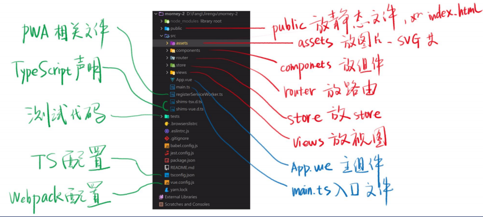

# vue 项目

## 目录说明



## Vue Router

Vue Router 是 Vue.js 官方的路由管理器。它和 Vue.js 的核心深度集成，让构建单页面应用变得易如反掌。包含的功能有：

* 嵌套的路由/视图表
* 模块化的、基于组件的路由配置
* 路由参数、查询、通配符
* 基于 Vue.js 过渡系统的视图过渡效果
* 细粒度的导航控制
* 带有自动激活的 CSS class 的链接
* HTML5 历史模式或 hash 模式，在 IE9 中自动降级
* 自定义的滚动条行为

### API 参考

#### `<router-link>`

* `<router-link>` 组件支持用户在具有路由功能的应用中（点击）导航。
* 通过 `to` 属性指定目标地址，默认渲染成带有正确链接的 `<a>` 标签，可以通过配置 `tag` 属性生成别的标签。
* 另外，当目标路由成功激活时，链接元素自动设置一个表示激活的 CSS 类名。
* `<router-link>` 比起写死的 `<a href="...">` 会好一些，理由如下：
  * 无论是 HTML5 history 模式，还是 hash 模式，它的表现行为一致，所以，当你要切换路由模式，或者在 IE9 降级使用 hash 模式，无须作任何变动。
  * 在 HTML5 history 模式下，`router-link` 会守卫点击事件，让浏览器不再重新加载页面。
  * 当你在 HTML5 history 模式下使用 `base` 选项之后，所有的 `to` 属性都不需要写（基路径）了。 

## TypeScript 好处

* 类型提示：更智能的提示
* 编译时报错：还没运行代码就知道自己写错了
* 类型检查：无法写出错误的属性


## 写 Vue 组件的三种方式（单文件组件）

* 用 JS 对象

```js
export default { data, props, methods, created, ... }
```

* 用 TS 类  `<script lang="ts">`

```ts
@Component
export default class XXX extends Vue {
    xxx: string = 'hi';
    @Prop(Number) xxx: number | undefined;
}
```

* 用 JS 类

```js
export default class XXX extends Vue {
    xxx = 'hi';
}
```


```ts
    @Prop(Number) xxx: number | undefined;
    // Prop 告诉 Vue.xxx 不是 data 是 prop
    // Number 告诉 Vue xxx 运行时是个 Number
    // xxx 属性名
    // number | undefined 告诉 TS xxx 的编译时类型
```


