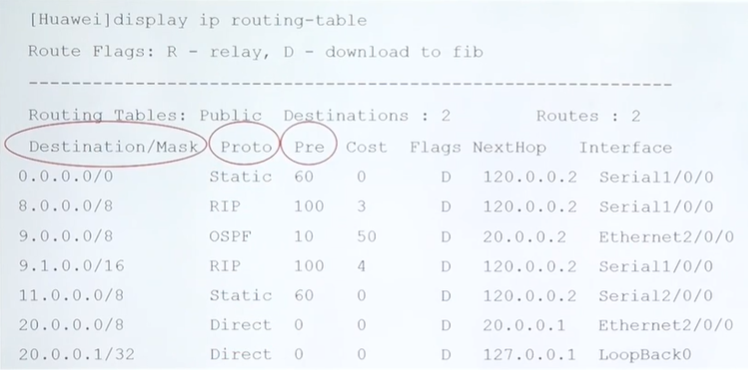
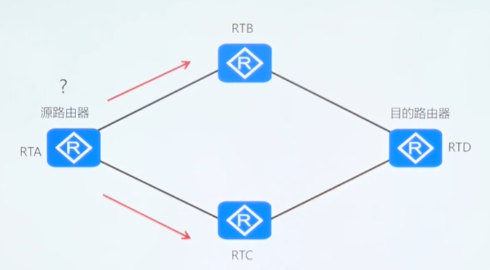
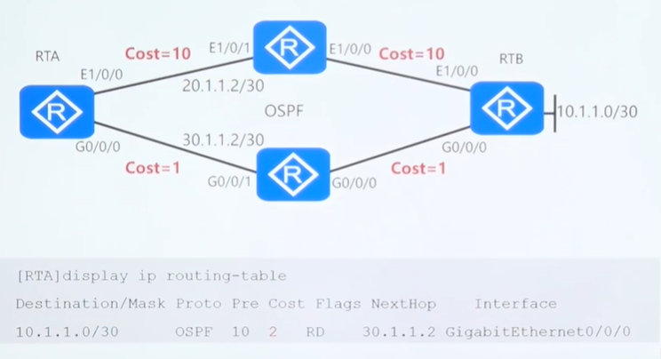
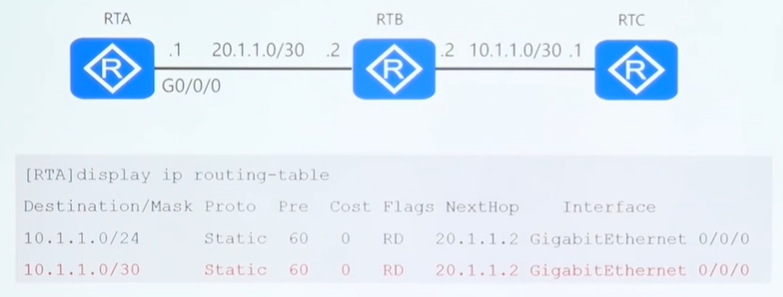

## 路由

### 什么是路由？

- 通常所说的路由都指的是**路由信息**
  - 路由信息就是去往目的地的一条信息，它指明了去往目的地的方向
- 另外，路由也可表示寻径，是指路由器在收到 IP包 后，去查找自己的路由信息进行转发的过程。

### 什么是路由表？

- 存放路由信息的地方叫路由表
- IP包的转发是根据路由表来实现的
- 路由条目必须包含下面五项内容（五元组）
  - 前缀
  - 掩码
  - 下一跳 / 出接口
  - 管理距离（AD）或叫优先集
  - 度量
- 路由器转发 IP包 的原则
  - 有路由匹配就转发，没有就丢弃
  - 匹配多条时遵循最长匹配原则
  - 路由表的三种生成途径
    - 直连自动生成
    - 静态路由协议
    - 动态路由协议

### 什么是路由协议？

- 路由协议是用于路由器之间帮助路由器构建路由表的网络协议
  - 小型网络可能只需要**直连**和**静态路由**就能构成完整的路由表

- 大型网络则必须使用**动态路由协议**让路由器之间相互学习路由信息，从而构建完整的路由表

### 静态和动态路由比较

- 静态路由：
  - 网络管理员手动地将静态路由输入到路由表中
  - 网络拓扑改变需要手动更新路由
  - 路由行为可以精确控制
- 动态路由：
  - 网络路由协议在拓扑或业务改变时自动调整动态路由
  - 路由器通过动态的交换路由更新来学习和维护到远程目的地的路由
  - 路由器通过共享路由表信息来发现新的网络

### 什么时候使用静态路由？

- Use static routes:
  - 在只需要简单路由的小网络中
  - 在 hub and spoke 网络拓扑中
  - 当你想快速创建一个临时路由时

- Do not use static routes:
  - 在大型网络中
  - 网络需要扩展

### IP 通信是双向的

- 从**源**访问**目的**经过的每一个网络节点都必须有去往目的网络的路由
- 从**目的**响应**源**经过的每一个网络节点都必须有去往源网络的路由
- **去向**与**回程**是两条完全不同且不相关的路由

### IP 路由表

- 路由表中包含了路由器可以到达的目的网络。
- 目的网络在路由表中不存在的数据包会被丢弃。

### 路由选路

- 路由器负责为数据包选择一条最优路径，并进行转发

### 路由优先级

### 路由度量

### 最长匹配原则

- 路由表中如果有多个匹配目的网络的路由条目，则路由器会选择掩码最长的条目