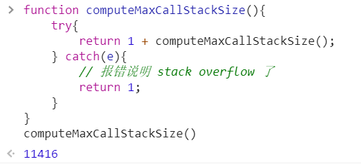

# JS 函数（二）

## 调用栈

* JS 引擎在调用一个函数前
* 需要把函数所在的环境 push 到一个数组里
* 这个数组叫做调用栈
* 等函数执行完了，就会把环境弹（pop）出来
* 然后 return 到之前的环境，继续执行后续代码


## 递归函数

### 阶乘

```js
function f(n){
    return n !== 1 ? n * f(n-1) : 1
}
```


### 递归函数的调用栈

#### 递归函数的调用栈很长

* 阶乘（6）的调用栈


#### 调用栈最长有多少

```js
function computeMaxCallStackSize(){
    try{
        return 1 + computeMaxCallStackSize();
    } catch(e){
        // 报错说明 stack overflow 了
        return 1;
    }
}
computeMaxCallStackSize()
```



### 爆栈

* 如果调用栈中压入的帧过多，程序就会崩溃


## 函数提升

### 什么是函数提升

```js
function fn(){}
```

* 不管你把具名函数声明在哪里，它都会跑到第一行


### 什么不是函数提升

```js
let fn = function(){}
```

* 这是赋值，右边的匿名函数声明不会提升


## arguments 和 this

* 每个函数都有，除了箭头函数

```js
function fn(){
    console.log(arguments);
    console.log(this);
}
```

### 如何传 arguments

* 调用 fn 即可传 arguments
* fn(1,2,3) 那么 arguments 就是 [1,2,3] 伪数组

### 如何传 this

* `fn.call(xxx,1,2,3)`
* 而且 xxx 会被自动转化为对象


* 如何不给任何的条件，this 默认指向 window
* 如果不想 xxx 转化为对象，可以在代码中加一句 `use strict`


### this 是隐藏参数，arguments 是普通参数


## 假设没有 this

```js
let person = {
    name:'frank',
    sayHi(){
        console.log('你好，我叫' + preson.name);
    }
}
person.sayHi();
```

### 分析

* 我们可以用直接保存了对象的地址的变量获取 'name' 
* 我们把这种办法简称为引用


### 需要一种办法拿到对象

#### 这样才能获取对象的 name 属性


### 一种土办法，用参数

#### 对象

```js
let person = {
    name:'frank',
    sayHi(p){
        console.log('你好，我叫'+p.name);
    }
}
person.sayHi(person);
```

#### 类

```js
class Person {
    constructor(name){
        this.name = name;
    }
    sayHi(p){
        console.log('你好，我叫'+p.name)
    }
}
```

### 谁会用这种办法

#### Python


### JS 没有模仿 Python 的思路

#### 走了另一条路


### person.sayHi() 会隐式地把 person 作为 this 传给  sayHi

#### 方便 sayHi 获取 person 对应的对象


## 两种调用

### 小白调用法

* `person.sayHi()`
* 会自动把 person 传到函数里，作为 this

### 大师调用法

* `person.sayHi.call(person)`

* 需要自己手动把 person 传到函数里，作为 this


## 例一

```js
function add(x,y){
    return x+y;
}
add.call(undefined,1,2)
```

### 没有用到 this 

### 为什么要多写一个 undefined

* 因为第一个参数要作为 this
* 但是代码里没有用 this
* 所以只能用 undefined 占位
* 其实用 null 也可以


## 例二

```js
Array.prototype.forEach2 = function(fn){
    for(let i=0; i<this.length; i++){
        fn(this[i],i,this)
    }
}
```

### this 是什么

* 由于大家使用 forEach2 的时候总是会用 arr.forEach2
* 所以 arr 就被自动传给 forEach2 了

### this 一定是数组吗

* 不一定，比如
* `Array.prototype.forEach2.call({0:'a',1:'b'})`


## 绑定 this

### 使用 .bind 可以让 this 不被改变

```js
function f1(p1,p2){
    console.log(this,p1,p2)
}
let f2 = f1.bind({name:'frank'})
// f2 就是 f1 绑定了 this 之后的新函数
f2()
// 等价于 f1.call({name:'frank'})
```

### .bind 还可以绑定其他参数

```js
let f3 = f1.bind({name:'frank'},'hi')
f3()
// 等价于 f1.call({name:'frank'},hi)
```


## 箭头函数

### 里面的 this 就是外面的 this

```js
console.log(this)  // window
let fn = () => console.log(this)
fn() // window
```

### 就算你加 call 都没有

```js
fn.call({name:'frank'})  // window
```


