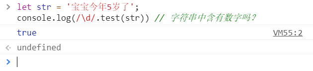
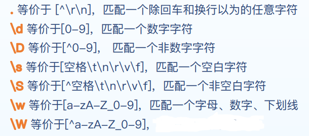
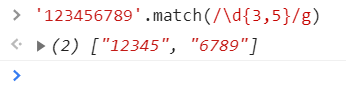
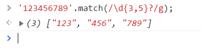
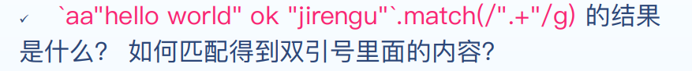
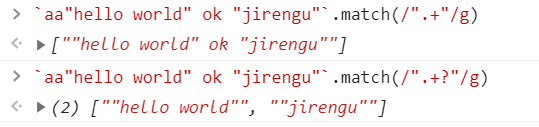

# 正则表达式

## 正则表达式到底是什么东西？

* 在编写处理字符串的程序或网页时，经常会有查找符合某些复杂规则的字符串的需要。
* 正则表达式就是用于描述这些规则的工具。
* 换句话说，正则表达式就是记录文本规则的代码。

## 作用

* 用来匹配符合某种规则的字符串

### 案例

* 检索字符串中符合某种规则多个子字符串
* 判断用户的输入是否符合某种规则
* 替换字符串中符合某种规则的文本
* 用户的输入是不是合法的手机号
* 用户的输入是不是合法的邮箱
* 用户的输入是不是合法的用户名

```js
let str = '宝宝今年5岁了';
console.log(/\d/.test(str)) // 字符串中含有数字吗？
```



## 创建

### 字面量方式创建

* 简单、直观，最常用

```js
let reg = /\+86\d{11}/g
```

### 构造函数方式创建

* 麻烦，但正则规则可通过字符串拼接，有些场景不得不用

```js
let reg = new RegExp('+86\d{11}','g')
```

* 最后的 g 代表全局，还有几个修饰符
  * g : global，全局搜索，不添加的话搜索到第一个结果停止搜索
  * i : ignore case，忽略大小写，默认大小写敏感
  * m : multiple lines，多行搜索

## 简单用法

### 正则的方法

```js
let reg = /\+86\d{11}/
reg.test('+8617356691555')
```

### 字符串方法

```js
let str = 'hello1 jirengu, hello2 world'
str.search(/hello\d/)    //0
str.match(/hello\d/g)    //['hello1', 'hello2']
str.replace(/hello\d/g,  'hi') // 'hi jirengu, hi world'
str.split(/\s/)          //["hello", "jirengu,", "hello", "world"]
```

### 专用字符

### 具有特殊意义的字符

```js
( [ { \ ^ $ | ) ? * + .
```

* 如果要匹配这些字符，需要转义 \

## 字符匹配

### 字符匹配

```js
let reg = /jirengu/
reg.test('hello jirengu') // true
```

### 范围匹配

* [abcd] 匹配一个字符，是a b c d 中的任意一个
* [0-9] 匹配一个是 0 到 9 的数字
* [a-zA-Z] 匹配一个不限制大小写的字母
* [^abc] 表示一个不是字符 a 或 b 或 c 的字符

```js
let reg = /不要[89][89][67]/
reg.test('我们不要996') 	//true
reg.test('我们不要897') 	//true
reg.test('我们要965') 		//false
```

## 预定义匹配



## 量词

### 匹配 0 个到多个

* **？**前面的字符出现 0 次或者 1 次
* **+**  前面的字符出现 1 次或者多次
* *****  前面的字符出现 0 次或者多次
* **{n}**  前面的字符出现 n 次
* **{n,m}**  前面的字符出现 n 到 m 次
* **{n,}**  前面的字符出现至少 n 次

```js
let str1 = 'http://jirengu.com';
/https?:\/\/.+/.test(str1) // true
/https+:\/\/.+/.test(str1) // false
/https*:\/\/.+/.test(str1) // true
let str2 = 'https://jirengu.com';
/https?:\/\/.+/.test(str2) //true
/https+:\/\/.+/.test(str2) //true
/https*:\/\/.+/.test(str2) //true
let str3 = 'httpssssss://jirengu.com';
/https?:\/\/.+/.test(str3) //false
/https+:\/\/.+/.test(str3) //true
/https*:\/\/.+/.test(str3) //true
```

## 边界

### 以 ... 开头或者以 ... 结尾

* **/^xyz/**  以 xyz 开头
* **/abc$/**  以 abc 结尾
* **/\bagc\b/**  匹配是单词的 abc（左右两侧是字符串开头、结尾、中横线、空格）
* **/\Babc\B/**  匹配不是单词的 abc

```js
var str = 'hello1 world hello2 123456 ruoyu hello3'
str.match(/hello\d/g) // ["hello1", "hello2", "hello3"]
str.match(/^hello\d/g) // ["hello1"]
str.match(/hello\d$/g) // ["hello3"]

var str2 = 'hello1 whello9orld hello2 12-hello8-3456 jirengu ruoyu hello3'
str2.match(/\bhello\d\b/g) //["hello1", "hello2", "hello8", "hello3"]
//注意-也用于区分单词边界
str2.match(/\b\w+\b/g).length
// 单词数量
```

## 案例

### 匹配手机号

* 判断用户的输入是否符合手机号规则
* 规则：以1开头长度为11的数字

```js
let reg = /^1\d{10}$/
reg.test(' 13189890989') // false
reg.test('a13189890989b') // false
reg.test('13189890989') // true
reg.test('1318989098910') // false
```

* 验证是为了防止用户误操作，不是越严格越好

### 匹配邮箱

* 判断用户的输入是否符合邮箱规则
* 规则：字符串中间包含一个@，@后面包含个**.**

```js
let reg = /^[^@\s]+@[^@\s]+\.[^@\s]+$/
reg.test('hr@jirengu.com') // true
reg.test('admin@jirengu.中国') // true
reg.test('abc@cdd@jirengu.cn') // false
reg.test('abc@j rengu.com') // fasle
```

### 匹配用户名

#### 判断用户的输入是否是合法用户名

* 规则：合法用户名至少8位至多15位，包含大写、小写、数字、下划线至少两种。

```js
function validUsername(rawInput) {
//如果 不 满足 全部为字母数字下划线且长度为8~15 返回false
if(!/^\w{8,15}$/.test(rawInput)) return false
// 如果只包含一种 返回false
if(/(^[a-z]+$)|(^[A-Z]+$)|(^[0-9]+$)|(^\d+$)|(^_+$)/.test(rawInput))
return false
return true
}
```

* 写正则不是目的，解决问题才是目的

## 贪婪模式

### 问题1

* '123456789'.match(/\d{3,5}/g) 的结果是什么？是['123' , '456' , '789'] 还是 ['12345' , '6789'] ？



### 解答

* 默认是贪婪模式，即尽可能多的匹配。如果想使用非贪婪模式，可以在量词后加 ? 即可
* '123456789'.match(/\d{3,5}?/g);



### 问题2





## 分组

* 把一些字符作为一个整体

```js
//匹配 hungerrr ，而不是 hungerhungerhunger
/hunger{3}/
//把hunger作为一个整体，匹配 hungerhungerhunger
/(hunger){3}/
//匹配 “hello world” 和 “hi world”
/(hello)|(hi) world/
//$1代表正则里分组匹配的内容，输出 “hi8 world, hi6 jirengu”
"hello8 world, hello6 jirengu".replace(/hello(\d)/g, 'hi$1')
```

### 前瞻

| 表达式       | 含义                   |
| ------------ | ---------------------- |
| exp1(?=exp2) | 匹配后面是exp2的exp1   |
| exp1(?!exp2) | 匹配后面不是exp2的exp1 |

```js
/hello(?=Jirengu)/.test('helloJirengu') //true
/hello(?=Jirengu)/.test('helloWorld) //false
/hello(?!Jirengu)/.test('helloWorld') //true
```

## 汇总

### 正则的方法

* /\d/.test('a1b2c3')	 //true
* /\d/g.exec('a1b2c3')

### 字符串方法

* 'a1b2c3'.search(/\d/) // 1
* 'a1b2c3'.match(/\d/g) //['1', '2', '3']
* 'a1b2c3'.replace(/\d/g, 'x') //'axbxcx'
* 'a1a2c3'.replace(/a(\d)/g, 'A$1') //'A1A2c3'
* 'a1b2c3'.replace(/\d/g, function(matched, $1, index) { })
* '1 2 3'.split(/\s/) //['1', '2', '3']

## RegExp.prototype.exec

* 调用全局的 RegExp 对象的 exec( ) 时，它会在 RegExp 实例的 lastIndex 属性指定的字符处开始检索字符串 string
* 当 exec( ) 找到了与表达式相匹配的文本时，在匹配后，它将把 RegExp 实例的 lastIndex 属性设置为匹配文本的最后一个字符的下一个位置。
* 可以通过反复调用 exec( ) 方法来遍历字符串中的所有匹配文本。
* 当 exec( ) 再也找不到匹配的文本时，它将返回 null ，并把 lastIndex 属性重置为 0

```js
let reg = /\b\w+\b/g, temp
while(temp = reg.exec('hello world, hi jirengu')) {
	console.log(`${temp.index} : ${temp[0]}`)
}
```


## String.prototype.replace(reg,function)

* 第二个参数传入一个 function，会在每次匹配替换的时候调用，返回值为要替换的内容，回调函数一共有 3/4 个参数
* 第一个参数很简单，是匹配字符串
* 第二个参数是正则表达式分组内容，若没有分组则没有该参数
* 第三个参数是匹配项在字符串中的 index ，若没有分组该为第二个参数
* 第四个参数则是原字符串，若没有分组该为第三个参数

```js
//把字符串转换成驼峰形式
let str = 'border-top-color'
const strToCamel = str => str.replace(/-(\w)/g, (match, $1) =>
$1.toUpperCase())
console.log( strToCamel(str) )
```


## 入门

​		学习正则表达式最好的方法是从例子开始，理解例子之后再自己对例子进行修改，实验。

​		假设你在一篇英文小说里查找 hi ，你可以使用正则表达式 **hi** 。

​		这几乎是最简单的正则表达式了，它可以精确匹配这样的字符串：由两个字符组成，前一个字符是 h ，后一个是 i 。通常，处理正则表达式的工具会提供一个忽略大小写的选项，如果选中了这个选项，它可以匹配 hi , HI , hI , Hi 这四种情况中的任意一种。

​		不幸的是，很多单词里包含 hi 这两个连续的字符，比如 him , history , high 等等。用 **hi** 来查找的话，这里边的 hi 也会被找出来。如果要精确地查找 hi 这个单词的话，我们应该使用 **\bhi\b** 。

 		**\b** 是正则表达式规定的一个特殊代码，也叫**元字符**，代表着单词的开头或结尾，也就是单词的分界处。虽然通常英文的单词是由空格，标点符号或者换行来分隔的，但是 **\b** 并不匹配这些单词分隔字符中的任何一个，它**只匹配一个位置**。

​		假如你要找的是 hi 后面不远处跟着一个 Lucy，你应该用 **\bhi\b.*\bLucy\b** 。

​		这里，**.** 是一个元字符，匹配除了换行符意外的任意字符。***** 同样是元字符，不过它代表的不是字符，也不是位置，而是数量——他指定 ***** 前边的内容可以连续重复使用任意次以使这个表达式得到匹配。

​		因此，**.*** 连在一起就意味着任意数量的不包含换行的字符。现在  **\bhi\b.*\bLucy\b** 的意思就很明显了，先是一个单词 hi ，然后是任意个任意字符（但不能是换行），最后是 Lucy 这个单词。

​		如果同时使用其它元字符，我们就能构造出功能更强大的正则表达式。比如下面这个例子：**0\d\d-\d\d\d\d\d\d\d\d** 匹配这样的字符串：以 0 开头，然后是两个数字，然后是一个连字号 “**-**”，最后是8个数字（也就是中国的电话号码，当然，这个例子只能匹配区号为3位的情形）。

​		这里的 **\d** 是个新的元字符，匹配一位数字（0，或1，或2，或......)。**-** 不是元字符，只匹配它本身——连字符。也可以简写为：**0\d{2}-\d{8}** 。这里 **\d** 后面的 **{2}({8})** 的意思是前面 **\d** 必须连续重复匹配2次（8次）。 

## 元字符

​		现在你已经知道几个很有用的元字符了，如 **\b , . , * ,** 还有 **\d** 正则表达式里还有更多的元字符，比如 **\s** 匹配任意的空白符，包括空格，制表符(Tab)，换行符，中文全角空格等。**\w** 匹配字母或数字或下划线或汉字等。

​		下面来看看更多的例子：

​		**\ba\w*\b** 匹配以字母 **a** 开头的单词——先是某个单词开始处(**\b**)，然后是字母 **a** ，然后是任意数量的字母或数字(**\w***)，最后是单词结束处(**\b**)。

​		**\d+** 匹配1个或更多连续的数字。这里的 **+** 是和 ***** 类似的元字符，不同的是 ***** 匹配重复任意次（可能是0次），而 **+** 则匹配重复1次或更多次。

​		**\b\w{6}\b** 匹配刚好6个字符的单词。

**常用的元字符：**

| 代码 | 说明                         |
| ---- | ---------------------------- |
| .    | 匹配除换行符以外的任意字符   |
| \w   | 匹配字母或数字或下划线或汉字 |
| \s   | 匹配任意的空白符             |
| \d   | 匹配数字                     |
| \b   | 匹配单词的开始或结束         |
| ^    | 匹配字符串的开始             |
| $    | 匹配字符串的结束             |


参考文献：

[1] [正则表达式30分钟入门教程](https://deerchao.cn/tutorials/regex/regex.htm)

[2] https://xiedaimala.com/tasks/b5fd67df-360a-456f-b99a-33208d5632e6