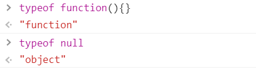

# TypeScript 基础（一）

## 运行

* 浏览器可以直接运行 JS ，但是浏览器不能直接运行 TS
* 要把 TS 标称 JS ，才能运行

```ts
var x:string = 'hi'
```

* 在 JS 的每个变量后面加上类型
* 类型 type
* 类 class

## JS 基本类型(数据的类型type)

* **简单类型**
  * null    undefined    string    bool    number    symbol    bigint

* **复杂类型**
  * object

* **typeof**    获取一个数据的类型
  * **注意** 
  * 

* 类型就是对数据的种类的区分

## JS 中的类

* 类是针对 object 搞出来的东西
* 类型是天然存在的，面向对象编程是人为发明的
  * 基于 class 关键字
  * 基于原型的

```js
class Person {
    属性1
    属性2
    属性3
    方法1
    方法2
    方法3
}

const p1 = new Person()
const p2 = new Person()
p1.属性1
p1.方法1()
```

------

```js
function Person(){
    var temp = {}
    temp.属性1
    temp.属性2
    temp.属性3
    temp.方法1
    temp.方法2
    temp.方法3
    temp.__proto__ = 共有属性
    return temp
}
const p1 = Person()
p1.属性1
p1.方法1()
```

##  TS 支持的 JS 类型

```ts
const a:undefined = undefined
const b:null = null
const c:string = 'hi'
const d:boolean = true
const e:symbol = Symbol('hi')
const f:bigint = 123n

const obj:object = {}
//一般不用 object ，因为有个更精准的东西——类

const obj0:Object = {}
//object 是类型，Object 是类

const arr:Array<string> = ['1','2','3']
//数组里面只能是字符串

const arr0:Array<string|number> = ['1','2',3]
//数组里面可以是字符串或数字

// TS 中函数的声明方式

// 类型写在函数体
const add1 = (a:number,b:number):number => a + b

// 类型写在 ：后面
const add2:(a:number,b:number) => number = (a,b) => a + b

// type 缩写
type Add = (a:number, b:number) => number
const add3:Add = (a,b) => a + b

// 有属性，只能用 interface
interface AddWithProps {
    (a:number, b:number) : number
    xxx:String
}
// 声明的函数具有 xxx 属性

const add4:AddWithProps = (a,b) => a + b
add4.xxx = 'yyy'
```

---

```js
let a:any = 1 // 可以是任何类型
a = '1'

let b:unknown = JSON.parse('{"name":"frank"}') // 可以是任何类型，但是在用之前需要明确是什么类型
type B = {name:string}
(b as B).name  // 断言

let print1:() => void = function(){
    console.log(1)
}

// never
type Dir = 1|2|3|4|undefined
let dir:Dir

switch(dir){
    case 1:
        break;
    case 2:
        break;
    case 3:
        break;
    case 4:
        break;
    case undefined:
        break;
    default:
        console.log(dir);  // 此时 dir 的类型就是 never , 不应该存在的类型
        break;
}

type X = number & string // 此时 X 的类型就是 never

// 一旦代码中出现了 never 一个是某个地方出了问题
```

---

```js
// 元组

let array:Array<string>

let p:Array<number> = [100,200]
p = [1,2,3,4,5]

// 如何限制数组的长度？
// 使用元组，元组就是不可变更长度的数组

let p2:[number,number] = [100,200]

let p3:[number,string,boolean] = [100,'二哈',true]
```


