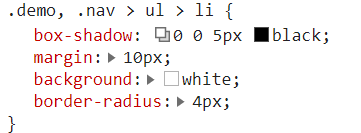

# SCSS 基础

## 变量和嵌套选择器

```scss
$border-width: 1px;
.nav {
  border: $border-width solid grey;
  > ul {
    background: white;
    > li {
      border: $border-width solid red;
    }
  }
}
```

## mixin

```scss
@mixin debug {
  border: 1px solid red;
}
.nav {
  @include debug;
  > ul {
    background: white;
    > li {
      @include debug;
    }
  }
}
```

---

```scss
// 传参
@mixin debug($border-color:red) {
  border: 1px solid $border-color;
}
.nav {
  @include debug;
  > ul {
    background: white;
    > li {
      @include debug(green);
    }
  }
}
```

* mixin 只是在写的时候代码比较少，渲染到页面上时代码并不少

## placeholder

```scss
%box {
  box-shadow: 0 0 5px black;
  margin: 10px;
  background: white;
  border-radius: 4px;
}
.nav {
  > ul {
    background: #aaa;
    > li {
      @extend %box;
    }
  }
}
.demo {
  height: 100px;
  @extend %box;
}
```




