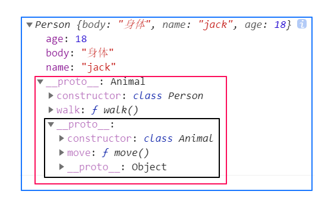
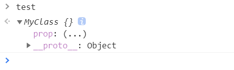
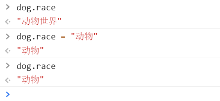
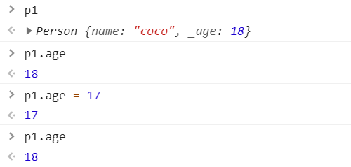
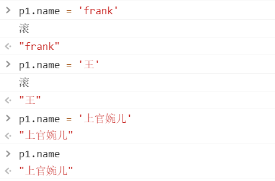

# Class 的基本语法

### 类的由来

JavaScript 语言中，生成实例对象的传统方法是通过构造函数。下面是一个例子。

```js
function Point(x, y) {
  this.x = x;
  this.y = y;
}

Point.prototype.toString = function () {
  return '(' + this.x + ', ' + this.y + ')';
};

var p = new Point(1, 2);
```

ES6 引入了 Class（类）这个概念，作为对象的模板。通过`class`关键字，可以定义类。

基本上，ES6 的`class`可以看作只是一个语法糖，它的绝大部分功能，ES5 都可以做到，新的`class`写法只是让对象原型的写法更加清晰、更像面向对象编程的语法而已。上面的代码用 ES6 的`class`改写，就是下面这样。

```js
class Point {
  constructor(x, y) {
    this.x = x;
    this.y = y;
  }

  toString() {
    return '(' + this.x + ', ' + this.y + ')';
  }
}
```

上面代码定义了一个“类”，可以看到里面有一个`constructor()`方法，这就是构造方法，而`this`关键字则代表实例对象。这种新的 Class 写法，本质上与开头的 ES5 的构造函数`Point`是一致的。

`Point`类除了构造方法，还定义了一个`toString()`方法。

**注意**，定义`toString()`方法的时候，前面不需要加上`function`这个关键字，直接把函数定义放进去了就可以了。

**另外**，方法与方法之间不需要逗号分隔，加了会报错。

ES6 的类，完全可以看作构造函数的另一种写法。

```js
class Point {
  // ...
}

typeof Point // "function"
Point === Point.prototype.constructor // true
```

上面代码表明，类的数据类型就是函数，类本身就指向构造函数。

使用的时候，也是直接对类使用`new`命令，跟构造函数的用法完全一致。

```js
class Bar {
  doStuff() {
    console.log('stuff');
  }
}

const b = new Bar();
b.doStuff() // "stuff"
```

构造函数的`prototype`属性，在 ES6 的“类”上面继续存在。事实上，类的所有方法都定义在类的`prototype`属性上面。

```js
class Point {
  constructor() {
    // ...
  }

  toString() {
    // ...
  }

  toValue() {
    // ...
  }
}

// 等同于

Point.prototype = {
  constructor() {},
  toString() {},
  toValue() {},
};
```

上面代码中，`constructor()`、`toString()`、`toValue()`这三个方法，其实都是定义在`Point.prototype`上面。

因此，在类的实例上面调用方法，其实就是调用原型上的方法。

```js
class B {}
const b = new B();

b.constructor === B.prototype.constructor // true
```

上面代码中，`b`是`B`类的实例，它的`constructor()`方法就是`B`类原型的`constructor()`方法。

由于类的方法都定义在`prototype`对象上面，所以类的新方法可以添加在`prototype`对象上面。`Object.assign()`方法可以很方便地一次向类添加多个方法。

```js
class Point {
  constructor(){
    // ...
  }
}

Object.assign(Point.prototype, {
  toString(){},
  toValue(){}
});
```

`prototype`对象的`constructor()`属性，直接指向“类”的本身，这与 ES5 的行为是一致的。

```js
Point.prototype.constructor === Point // true
```

另外，类的内部所有定义的方法，都是不可枚举的（non-enumerable）。

```js
class Point {
  constructor(x, y) {
    // ...
  }

  toString() {
    // ...
  }
}

Object.keys(Point.prototype)
// []
Object.getOwnPropertyNames(Point.prototype)
// ["constructor","toString"]
```

上面代码中，`toString()`方法是`Point`类内部定义的方法，它是不可枚举的。这一点与 ES5 的行为不一致。

```js
var Point = function (x, y) {
  // ...
};

Point.prototype.toString = function () {
  // ...
};

Object.keys(Point.prototype)
// ["toString"]
Object.getOwnPropertyNames(Point.prototype)
// ["constructor","toString"]
```

上面代码采用 ES5 的写法，`toString()`方法就是可枚举的。

### constructor 方法

`constructor()`方法是类的默认方法，通过`new`命令生成对象实例时，自动调用该方法。一个类必须有`constructor()`方法，如果没有显式定义，一个空的`constructor()`方法会被默认添加。

```js
class Point {
}

// 等同于
class Point {
  constructor() {}
}
```

上面代码中，定义了一个空的类`Point`，JavaScript 引擎会自动为它添加一个空的`constructor()`方法。

`constructor()`方法默认返回实例对象（即`this`），完全可以指定返回另外一个对象。

```js
class Foo {
  constructor() {
    return Object.create(null);
  }
}

new Foo() instanceof Foo
// false
```

上面代码中，`constructor()`函数返回一个全新的对象，结果导致实例对象不是`Foo`类的实例。

类必须使用`new`调用，否则会报错。这是它跟普通构造函数的一个主要区别，后者不用`new`也可以执行。

```js
class Foo {
  constructor() {
    return Object.create(null);
  }
}

Foo()
// TypeError: Class constructor Foo cannot be invoked without 'new'
```

### 类的实例

生成类的实例的写法，与 ES5 完全一样，也是使用`new`命令。

如果忘记加上`new`，像函数那样调用`Class`，将会报错。

```js
class Point {
  // ...
}

// 报错
var point = Point(2, 3);

// 正确
var point = new Point(2, 3);
```

与 ES5 一样，实例的属性除非显式定义在其本身（即定义在`this`对象上），否则都是定义在原型上（即定义在`class`上）。

```js
//定义类
class Point {

  constructor(x, y) {
    this.x = x;
    this.y = y;
  }

  toString() {
    return '(' + this.x + ', ' + this.y + ')';
  }

}

var point = new Point(2, 3);

point.toString() // (2, 3)

point.hasOwnProperty('x') // true
point.hasOwnProperty('y') // true
point.hasOwnProperty('toString') // false
point.__proto__.hasOwnProperty('toString') // true
```

上面代码中，`x`和`y`都是实例对象`point`自身的属性（因为定义在`this`对象上），所以`hasOwnProperty()`方法返回`true`，而`toString()`是原型对象的属性（因为定义在`Point`类上），所以`hasOwnProperty()`方法返回`false`。这些都与 ES5 的行为保持一致。

与 ES5 一样，类的所有实例共享一个原型对象。

```js
var p1 = new Point(2,3);
var p2 = new Point(3,2);

p1.__proto__ === p2.__proto__
//true
```

上面代码中，`p1`和`p2`都是`Point`的实例，它们的原型都是`Point.prototype`，所以`__proto__`属性是相等的。

这也意味着，可以通过实例的`__proto__`属性为“类”添加方法。

```js
var p1 = new Point(2,3);
var p2 = new Point(3,2);

p1.__proto__.printName = function () { return 'Oops' };

p1.printName() // "Oops"
p2.printName() // "Oops"

var p3 = new Point(4,2);
p3.printName() // "Oops"
```

上面代码在`p1`的原型上添加了一个`printName()`方法，由于`p1`的原型就是`p2`的原型，因此`p2`也可以调用这个方法。而且，此后新建的实例`p3`也可以调用这个方法。这意味着，使用实例的`__proto__`属性改写原型，必须相当谨慎，不推荐使用，因为这会改变“类”的原始定义，影响到所有实例。

------------------

```js
class Animal {
    constructor(){
        this.body = '身体'
    }
    move(){
        console.log('动一动')
    }
}

class Person extends Animal {
    constructor(name){
        super()
        this.name = name
        this.age = 18
    }
    walk(){
        console.log('走两步')
    }
}

let jack = new Person('jack')
```



### 取值函数（getter）和存值函数（setter）

与 ES5 一样，在“类”的内部可以使用`get`和`set`关键字，对某个属性设置存值函数和取值函数，拦截该属性的存取行为。

```js
class MyClass {
  constructor() {
    // ...
  }
  get prop() {
    return 'getter';
  }
  set prop(value) {
    console.log('setter: '+value);
  }
}

let test = new MyClass();

test.prop = 123;
// setter: 123

test.prop
// 'getter'
```



上面代码中，`prop`属性有对应的存值函数和取值函数，因此赋值和读取行为都被自定义了。

```js
class Animal{
    constructor(){
        this.body = '身体'
        this._race = '动物世界'
    }
    move(){
        console.log('我能动')
    }
    get race(){
        return this._race
    }
    set race(value){
        this._race = value
    } 
}
let dog = new Animal()
```



```js
class Person {
    constructor(name){
        this._name = name;
      	this._age = 18;
    }
    // 禁止修改年龄
    get age(){
        return this._age;
    }
    // 限制姓名长度
    get name(){
        return this._name;
    }
    set name(value){
        if(value.length > 4){
            console.log('滚')
        }else if(value.length < 2){
            console.log('滚')
        }else{
           this._name = value; 
        }
    }
}
let p1 = new Person('coco');
```






### 属性表达式

类的属性名，可以采用表达式。

```js
let methodName = 'getArea';

class Square {
  constructor(length) {
    // ...
  }

  [methodName]() {
    // ...
  }
}
```

上面代码中，`Square`类的方法名`getArea`，是从表达式得到的。

### Class 表达式

与函数一样，类也可以使用表达式的形式定义。

```js
const MyClass = class Me {
  getClassName() {
    return Me.name;
  }
};
```

上面代码使用表达式定义了一个类。需要注意的是，这个类的名字是`Me`，但是`Me`只在 Class 的内部可用，指代当前类。在 Class 外部，这个类只能用`MyClass`引用。

```js
let inst = new MyClass();
inst.getClassName() // Me
Me.name // ReferenceError: Me is not defined
```

上面代码表示，`Me`只在 Class 内部有定义。

如果类的内部没用到的话，可以省略`Me`，也就是可以写成下面的形式。

```js
const MyClass = class { /* ... */ };
```

采用 Class 表达式，可以写出立即执行的 Class。

```js
let person = new class {
  constructor(name) {
    this.name = name;
  }
  sayName() {
    console.log(this.name);
  }
}('张三');

person.sayName(); // "张三"
```

上面代码中，`person`是一个立即执行的类的实例。

### 注意点

**（1）严格模式**

类和模块的内部，默认就是严格模式，所以不需要使用`use strict`指定运行模式。只要你的代码写在类或模块之中，就只有严格模式可用。考虑到未来所有的代码，其实都是运行在模块之中，所以 ES6 实际上把整个语言升级到了严格模式。

**（2）不存在提升**

类不存在变量提升（hoist），这一点与 ES5 完全不同。

```js
new Foo(); // ReferenceError
class Foo {}
```

**（3）name 属性**

由于本质上，ES6 的类只是 ES5 的构造函数的一层包装，所以函数的许多特性都被`Class`继承，包括`name`属性。

```js
class Point {}
Point.name // "Point"
```

`name`属性总是返回紧跟在`class`关键字后面的类名。

**（4）this 的指向**

类的方法内部如果含有`this`，它默认指向类的实例。但是，必须非常小心，一旦单独使用该方法，很可能报错。

```js
class Logger {
  printName(name = 'there') {
    this.print(`Hello ${name}`);
  }
  print(text) {
    console.log(text);
  }
}
const logger = new Logger();
const { printName } = logger;
printName(); // TypeError: Cannot read property 'print' of undefined
```

上面代码中，`printName`方法中的`this`，默认指向`Logger`类的实例。但是，如果将这个方法提取出来单独使用，`this`会指向该方法运行时所在的环境（由于 class 内部是严格模式，所以 this 实际指向的是`undefined`），从而导致找不到`print`方法而报错。

一个比较简单的解决方法是，在构造方法中绑定`this`，这样就不会找不到`print`方法了。

```js
class Logger {
  constructor() {
    this.printName = this.printName.bind(this);
  }

  // ...
}
```

----------

### Function.prototype.bind()

* `bind()` 方法创建一个新的函数，在 `bind()` 被调用时，这个新函数的 `this` 被指定为 `bind()` 的第一个参数，而其余参数将作为新函数的参数，供调用时使用。

```js
const module = {
  x: 42,
  getX: function() {
    return this.x;
  }
};

const unboundGetX = module.getX;
console.log(unboundGetX()); // The function gets invoked at the global scope
// expected output: undefined

const boundGetX = unboundGetX.bind(module);
console.log(boundGetX());
// expected output: 42
```

------------

另一种解决方法是使用箭头函数。

```js
class Obj {
  constructor() {
    this.getThis = () => this;
  }
}

const myObj = new Obj();
myObj.getThis() === myObj // true
```

箭头函数内部的`this`总是指向定义时所在的对象。上面代码中，箭头函数位于构造函数内部，它的定义生效的时候，是在构造函数执行的时候。这时，箭头函数所在的运行环境，肯定是实例对象，所以`this`会总是指向实例对象。 

## 静态方法

类相当于实例的原型，所有在类中定义的方法，都会被实例继承。如果在一个方法前，加上`static`关键字，就表示该方法不会被实例继承，而是直接通过类来调用，这就称为“静态方法”。

```js
class Foo {
  static classMethod() {
    return 'hello';
  }
}

Foo.classMethod() // 'hello'

var foo = new Foo();
foo.classMethod()
// TypeError: foo.classMethod is not a function
```

上面代码中，`Foo`类的`classMethod`方法前有`static`关键字，表明该方法是一个静态方法，可以直接在`Foo`类上调用（`Foo.classMethod()`），而不是在`Foo`类的实例上调用。如果在实例上调用静态方法，会抛出一个错误，表示不存在该方法。

注意，如果静态方法包含`this`关键字，这个`this`指的是类，而不是实例。

```js
class Foo {
  static bar() {
    this.baz();
  }
  static baz() {
    console.log('hello');
  }
  baz() {
    console.log('world');
  }
}

Foo.bar() // hello
```

上面代码中，静态方法`bar`调用了`this.baz`，这里的`this`指的是`Foo`类，而不是`Foo`的实例，等同于调用`Foo.baz`。另外，从这个例子还可以看出，静态方法可以与非静态方法重名。

父类的静态方法，可以被子类继承。

```js
class Foo {
  static classMethod() {
    return 'hello';
  }
}

class Bar extends Foo {
}

Bar.classMethod() // 'hello'
```

上面代码中，父类`Foo`有一个静态方法，子类`Bar`可以调用这个方法。

静态方法也是可以从`super`对象上调用的。

```js
class Foo {
  static classMethod() {
    return 'hello';
  }
}

class Bar extends Foo {
  static barMethod() {
    return super.classMethod() + ', too';
  }
}

Bar.barMethod() // "hello, too"
```


## 实例属性的新写法

实例属性除了定义在`constructor()`方法里面的`this`上面，也可以定义在类的最顶层。

```js
class IncreasingCounter {
  constructor() {
    this._count = 0;
  }
  get value() {
    console.log('Getting the current value!');
    return this._count;
  }
  increment() {
    this._count++;
  }
}
```

上面代码中，实例属性`this._count`定义在`constructor()`方法里面。另一种写法是，这个属性也可以定义在类的最顶层，其他都不变。

```js
class IncreasingCounter {
  _count = 0;
  get value() {
    console.log('Getting the current value!');
    return this._count;
  }
  increment() {
    this._count++;
  }
}
```

上面代码中，实例属性`_count`与取值函数`value()`和`increment()`方法，处于同一个层级。这时，不需要在实例属性前面加上`this`。

这种新写法的好处是，所有实例对象自身的属性都定义在类的头部，看上去比较整齐，一眼就能看出这个类有哪些实例属性。

```js
class foo {
  bar = 'hello';
  baz = 'world';

  constructor() {
    // ...
  }
}
```

上面的代码，一眼就能看出，`foo`类有两个实例属性，一目了然。另外，写起来也比较简洁。

## 私有方法和私有属性

私有方法和私有属性，是只能在类的内部访问的方法和属性，外部不能访问。这是常见需求，有利于代码的封装，但 ES6 不提供，只能通过变通方法模拟实现。

一种做法是在命名上加以区别。

```js
class Widget {

  // 公有方法
  foo (baz) {
    this._bar(baz);
  }

  // 私有方法
  _bar(baz) {
    return this.snaf = baz;
  }

  // ...
}
```

上面代码中，`_bar()`方法前面的下划线，表示这是一个只限于内部使用的私有方法。但是，这种命名是不保险的，在类的外部，还是可以调用到这个方法。

另一种方法就是索性将私有方法移出类，因为类内部的所有方法都是对外可见的。

```js
class Widget {
  foo (baz) {
    bar.call(this, baz);
  }

  // ...
}

function bar(baz) {
  return this.snaf = baz;
}
```

上面代码中，`foo`是公开方法，内部调用了`bar.call(this, baz)`。这使得`bar()`实际上成为了当前类的私有方法。


