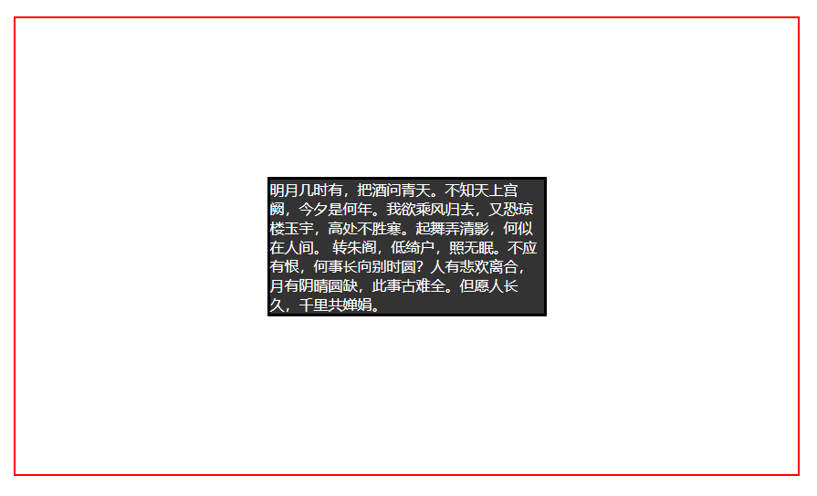
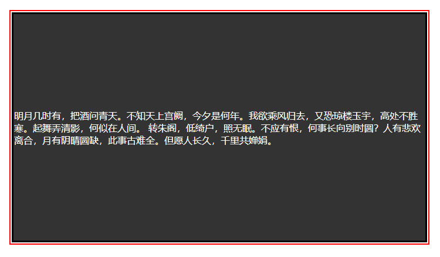

# CSS五种方式实现垂直居中

## 1. flex

```html
<!-- html -->
<div class="parent">
    <div class="child">
        明月几时有，把酒问青天。不知天上宫阙，今夕是何年。我欲乘风归去，又恐琼楼玉宇，高处不胜寒。起舞弄清影，何似在人间。
        转朱阁，低绮户，照无眠。不应有恨，何事长向别时圆？人有悲欢离合，月有阴晴圆缺，此事古难全。但愿人长久，千里共婵娟。
    </div>
</div>
```

```css
/* css */
.parent {
  border: 2px solid red;
  height: 500px;
  display: flex;
  justify-content: center;
  align-items: center;
}

.child {
  color: white;
  border: 3px solid black;
  width: 300px;
  background-color: #333;
}
```



## 2. absolute transform

```css
/* css */
.parent {
  border: 2px solid red;
  height: 400px;
  position: relative;
}

.child {
  color: white;
  border: 3px solid black;
  width: 300px;
  background-color: #333;
  position: absolute;
  top: 50%;
  left: 50%;
  transform: translate(-50%,-50%);
}
```

## 3. absolute margin

```css
/* css */
.parent {
  border: 2px solid red;
  height: 400px;
  position: relative;
}
.child {
  color: white;
  border: 3px solid black;
  width: 300px;
  height: 150px;
  background-color: #333;
  position: absolute;
  top: 50%;
  left: 50%;
  margin-left: -150px;
  margin-top: -75px;
}
```

## 4. absolute margin auto

```css
/* css */
.parent {
  border: 2px solid red;
  height: 400px;
  position: relative;
}
.child {
  color: white;
  border: 3px solid black;
  width: 300px;
  height: 150px;
  background-color: #333;
  position: absolute;
  margin: auto;
  top: 0;
  left: 0;
  bottom: 0;
  right: 0;
}
```

## 5. table

```html
<table class="parent">
    <tr>
        <td class="child">
            明月几时有，把酒问青天。不知天上宫阙，今夕是何年。我欲乘风归去，又恐琼楼玉宇，高处不胜寒。起舞弄清影，何似在人间。
            转朱阁，低绮户，照无眠。不应有恨，何事长向别时圆？人有悲欢离合，月有阴晴圆缺，此事古难全。但愿人长久，千里共婵娟。
        </td>
    </tr>
</table>
```

```css
/* css */
.parent {
  border: 2px solid red;
  height: 400px;
}
.child {
  color: white;
  border: 3px solid black;
  height: 150px;
  background-color: #333;
}
```




