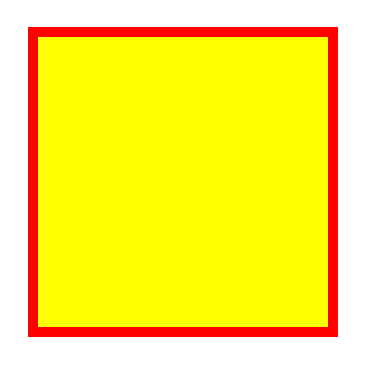
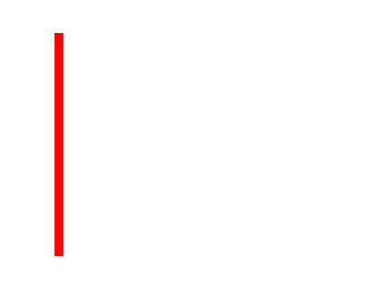
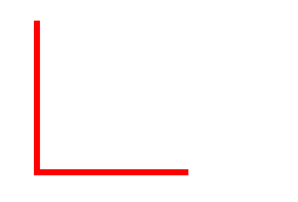

# canvas

HTML5 `<canvas>` 标签用于绘制图像，不过`<canvas>`元素本身并没有绘制能力，它仅仅是图形的容器，必须要使用脚本（js）来完成实际的绘图任务。

`getContext()` 方法可返回一个对象，该对象提供了用于在画布上绘画的方法和属性。

提供完整的 `getContext("2d")`对象的属性和方法，可用于在画布上绘制文本、线条、矩形、圆形等等。

```html
<!--  canvas三要素-->
<!--  id：作为唯一的标识-->
<!--  width：画布内容宽度的像素大小（与style的宽度和高度是有区别的）-->
<!--  height：画布内容高度的像素大小-->
<!--  -->
<!--  canvas 仅仅是个画布标签，要绘制内容，必须用js绘制-->

  <canvas id="canvas" width="600" height="600">
    这里的内容，正常的画布是不显示的，如果显示，则表示浏览器不支持canvas
  </canvas>
```

-

```js
// 找到画布对象
const canvas = document.querySelector("#canvas");
// 上下文对象（画笔）
const ctx = canvas.getContext("2d");
console.dir(ctx);
// 绘制路径
ctx.rect(50, 50, 300, 300);
// 填充
ctx.fillStyle = "yellow";
ctx.fill();
// 描边，渲染路径
ctx.lineWidth = 10;
ctx.strokeStyle = "red";
ctx.stroke();
```



## 颜色、样式和阴影

| 属性          | 描述                                     |
| ------------- | ---------------------------------------- |
| fillStyle     | 设置或返回用于填充绘画的颜色、渐变或模式 |
| strokeStyle   | 设置或返回用于笔触的颜色、渐变或模式     |
| shadowColor   | 设置或返回用于阴影的颜色                 |
| shadowBlur    | 设置或返回用于阴影的模糊级别             |
| shadowOffsetX | 设置或返回阴影与形状的水平距离           |
| shasowOffsetY | 设置或返回阴影与形状的垂直距离           |

## 路径

| 方法               | 描述                                                    |
| ------------------ | ------------------------------------------------------- |
| fill()             | 填充当前绘图（路径）                                    |
| stroke()           | 绘制已定义的路径                                        |
| beginPath()        | 起始一条路径，或重置当前路径                            |
| moveTo()           | 把路径移动到画布的指定点，不创建线条                    |
| closePath()        | 创建从当前点回到起始点的路径                            |
| lineTo()           | 添加一个新点，然后在画布中创建从该点到最后指定点的线条  |
| clip()             | 从原始画布剪切任意形状和尺寸的区域                      |
| quadraticCurveTo() | 创建二次贝塞尔曲线                                      |
| bezierCurveTo()    | 创建三次贝塞尔曲线                                      |
| arc()              | 创建弧、曲线（用于创建圆形或部分圆）                    |
| arcTo()            | 创建两切线之间的弧/曲线。                               |
| isPointInPath()    | 如果指定的点位于当前路径中，则返回 true，否则返回 false |


### 示例：绘制线段

```js
const canvas = document.querySelector("#canvas");
const ctx = canvas.getContext("2d");

// 设置绘制的起点
ctx.moveTo(50,50);
// 设置经过某个位置
ctx.lineTo(50,300);
// 绘制路径
ctx.lineWidth = 10;
ctx.strokeStyle = "red";
ctx.stroke();
```



```js
const canvas = document.querySelector("#canvas");
const ctx = canvas.getContext("2d");

// 设置绘制的起点
ctx.moveTo(50,50);
// 设置经过某个位置
ctx.lineTo(50,300);
ctx.lineTo(300,300)
// 绘制路径
ctx.lineWidth = 10;
ctx.strokeStyle = "red";
ctx.stroke();
```




