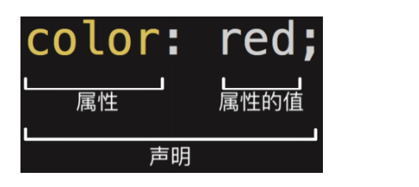

# CSS 初识

* CSS 表示层叠样式表（Cascading Style Sheet，简称：CSS）是为网页添加样式的代码。
* **CSS 是一种语言吗？**
  * MDN解释：CSS 不是真正的编程语言，甚至不是标记语言，它是一门样式表语言。
  * 维基百科解释：CSS 是一种计算机语言，但是不算是一种编程语言。

## CSS 的历史

* 早期的网页都是**通过HTML来编写**的，但是我们希望**HTML页面可以更加丰富:** 
  * 这个时候就增加了很多**具备特殊样式的元素**：比如 i、strong、del 等等； 
  * 后来也有不同的浏览器**实现各自的样式语言**，但是没有统一的规划； 
  * 1994年，哈肯·维姆·莱和伯特·波斯**合作设计CSS**，在1996年的时候发布了**CSS1**； 
  * 直到1997年初，W3C组织才专门**成立了CSS的工作组**，1998年5月发布了**CSS2**； 
  * 在2006~2009非常流行 **“DIV+CSS”布局**的方式来替代所有的html标签； 
  * 从CSS3开始，所有的CSS分成了**不同的模块（modules）**，每一个“modules”都有于CSS2中额外增加的功能，以及向后兼容。 
  * 直到2011年6月7日，**CSS 3 Color Module**终于发布为W3C Recommendation。 

* 总结：CSS的出现是**为了美化HTML**的，并且让**结构（HTML）与样式（CSS）分离**； 
  * 为HTML**添加各种各样的样式**，比如颜色、字体、大小、下划线等等； 
  * 对HTML**进行布局**，按照某种结构显示（CSS进行布局 – 浮动、flex、grid）；

## CSS 如何编写呢？

* **语法规则**



* **声明（Declaration）一个单独的 CSS 规则**，如 color: red; 用来指定添加的 CSS 样式。
  * 属性名（Property name）：要添加的 CSS 规则的名称；
  * 属性值（Property value）：要添加的 CSS 规则的值；

## 如何将 CSS 样式应用到元素上？

* 内联样式（inline style）
* 内部样式表（internal style sheet）、文档样式表（document style sheet）、内嵌样式表（embed style sheet）
* 外部样式表（external style sheet ）

### 内联样式（inline style）

* 也叫行内样式。
* 内联样式表存在于 HTML 元素的 style 属性之中。

```html
<h1 style="font-size: 30px; color: red">一将功成万骨枯</h1>
```

* CSS 样式之间用分号（;）隔开

### 内部样式表（internal style sheet）

* 将 CSS 放在 HTML 文件 `<head>` 元素里的 `style` 元素之中。

```html
<!doctype html>
<html lang="zh-CN">
<head>
  <meta charset="UTF-8">
  <title>Document</title>
  <style>
    h1 {
      font-size: 30px;
      color: red;
    }
  </style>
</head>
<body>
  <h1>一将功成万骨枯</h1>
</body>
</html>
```

### 外部样式表（external style sheet）

* 将 css 编写进一个独立的文件中，并且**通过`<link>`元素**引入进来。
* 也可以在 style 元素或者 css 文件中使用 @import 导入其他的 css 文件

```css
@import url(./other.css);
@import "./other.css"; 
/*两种方式都可以*/
```

## CSS 推荐文档

* [官方文档](https://www.w3.org/TR/?tag=css)
* [MDN](https://developer.mozilla.org/zh-CN/docs/Web/CSS/Reference#%E5%85%B3%E9%94%AE%E5%AD%97%E7%B4%A2%E5%BC%95 )
* [由于浏览器版本、CSS 版本等问题，查询某些 CSS 是否可用](https://caniuse.com/)


