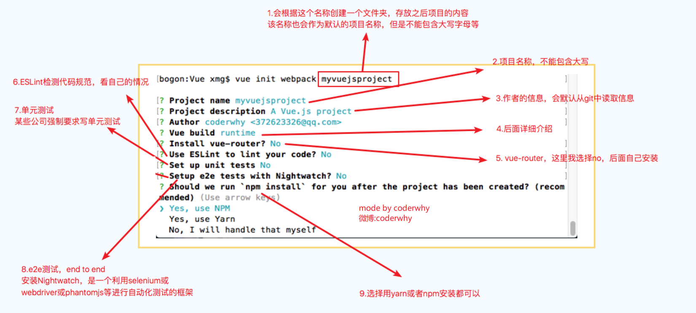
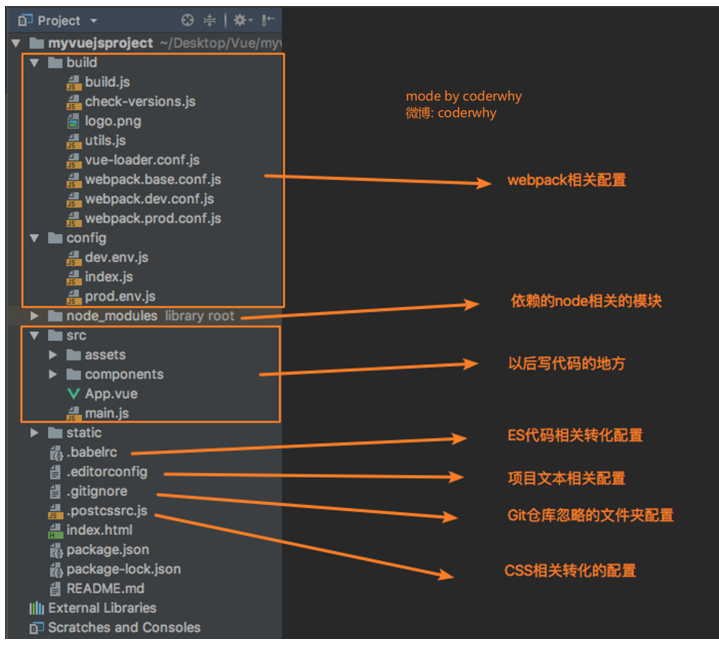
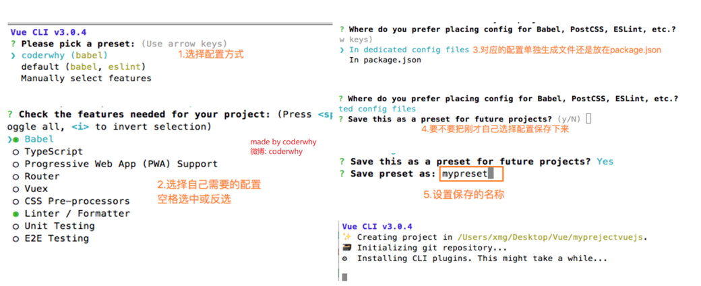

# vue cli

* 如果你只是简单写几个 Vue 的 Demo 程序, 那么你不需要Vue CLI。
* 如果你在开发大型项目, 那么你需要, 并且必然需要使用 Vue CLI。
  * 使用 Vue.js 开发大型应用时，我们需要考虑代码目录结构、项目结构和部署、热加载、代码单元测试等事情。
  * 如果每个项目都要手动完成这些工作，效率比较低，所以通常我们会使用一些脚手架工具来帮助完成这些事情。
* **CLI是什么意思?**
  * CLI是Command-Line Interface, 翻译为命令行界面, 俗称脚手架.
  * Vue CLI 是一个官方发布 vue.js 项目脚手架
  * 使用 vue-cli 可以快速搭建 Vue 开发环境以及对应的webpack 配置.

## vue/cli2

### 目录结构

### Runtime-Compiler 和 Runtime-only 的区别

* 如果在之后的开发中，你依然使用 template，就需要选择 Runtime-Compiler
* 如果你之后的开发中，使用的是 .vue 文件开发，那么可以选择 Runtime-only

## vue/cli3

### vue-cli 3 与 2 版本的区别

* vue-cli 3 是基于 webpack 4 打造，vue-cli 2 还是 webapck 3
* vue-cli 3 的设计原则是“0配置”，移除的配置文件根目录下的，build和config等目录
* vue-cli 3 提供了 vue ui 命令，提供了可视化配置，更加人性化
* 移除了static文件夹，新增了public文件夹，并且index.html移动到public中

### 目录结构

### 配置

