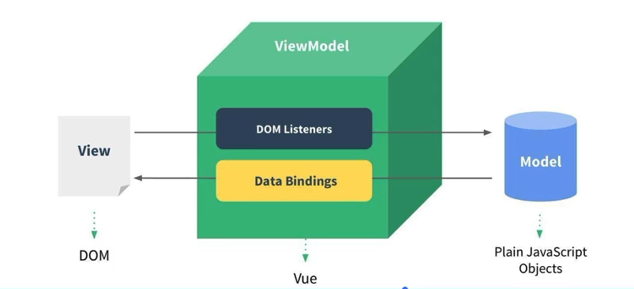
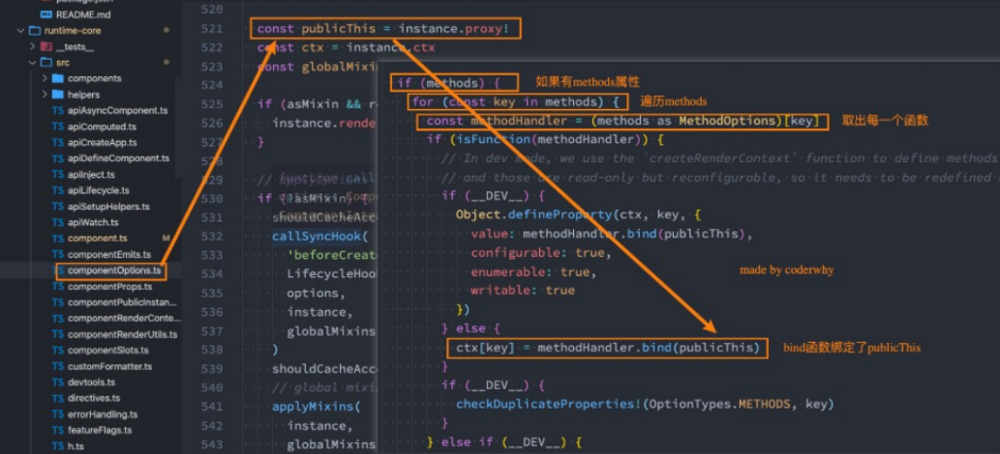

# Vue3_01

## 如何使用 Vue 呢?

### CDN 引入

#### 什么是 CDN 呢？

* CDN 称之为内容分发网络（Content Delivery Network 或 Content Distribution Network，缩写：CDN）
  * 是指一种透过互联网互相连接的电脑网络系统，利用最靠近每位用户的服务器，更快、更可靠地将音乐、图片、视频、应用程序及其他文件发送给用户，来提供高性能、可扩展性及低成本的网络内容传递给用户。

* 常用的 CDN 服务器可以大致分为两种：
  * 自己的 CDN 服务器：需要购买自己的 CDN 服务器，目前阿里、腾讯、亚马逊、Google等都可以购买 CDN 服务器。
  * 开源的 CDN 服务器：国际上使用比较多的是 unpkg、JSDelivr、cdnjs。

### Hello World 案例

```html
<div id="app"></div>

<script src="https://unpkg.com/vue@3"></script>
<script>
  const why = {
    template:'<h2>Hello World!</h2>'
  }
  const app = Vue.createApp(why);
  app.mount('#app');
</script>
```

### 计数器案例

* 原生

```html
<div id="showCount">0</div>
<button id="add">+1</button>
<button id="reduce">-1</button>
<script>
  let count = 0;
  const countAdd = document.getElementById("add");
  const countReduce = document.getElementById("reduce");
  const countShow = document.getElementById("showCount");

  countAdd.addEventListener("click", () => {
    count++;
    countShow.innerHTML = count + "";
  }, false);
  countReduce.addEventListener("click", () => {
    count--;
    countShow.innerHTML = count + "";
  });
</script>
```

* vue3

```html
<div id="app"></div>

<script src="https://unpkg.com/vue@3"></script>
<script>
  Vue.createApp({
    template: `
      <div>
        <h2>{{count}}</h2>
        <button @click="add">+1</button>
        <button @click="reduce">-1</button>
      </div>
    `,
    data(){
      return {
        count:0
      }
    },
    methods:{
      add(){
        this.count++;
      },
      reduce(){
        this.count--;
      }
    }
  }).mount('#app')
</script>
```

### 声明式和命令式

* 原生开发和 Vue 开发的模式和特点是完全不同的，这里涉及到两种不同的编程范式：
  * 命令式编程和声明式编程；
  * 命令式编程关注的是 “how to do”，声明式编程关注的是 “what to do”，有框架（机器）完成 “how” 的过程。

* 在原生的实现过程中，是如何操作的呢？
  * 每完成一个操作，都需要通过 JavaScript 编写一条代码，来给浏览器一个指令；
  * 这样编写代码的过程，称之为命令式编程；
  * 在原生 JavaScript 和 jQuery 开发的过程中，都是通过这种命令式的方式在编写代码；

* 在 Vue 的实现过程中，是如何操作的呢？
  * 在 createApp 传入的对象中声明需要的内容，模板 template、数据 data、方法 methods；
  * 这样编写代码的过程，称之为声明式编程；
  * 目前 Vue、React、Angular 都是声明式编程；

### MVVM 模型

* MVC 和 MVVM 都是一种软件的体系结构
  * MVC 是 Model - View - Controller 的简称，是在前期被使用非常广的框架的架构模式，比如 iOS、前端；
  * MVVM 是 Model - View - ViewModel 的简称，是目前非常流行的架构模式；
* 通常情况下，我们也经常称 Vue 是一个 MVVM 的框架。
  * Vue 官方有说明，Vue 虽然并没有完全遵守 MVVM 的模型，但是整个设计是受到它的启发的。



### template 属性

* 在使用 createApp 的时候，传入了一个对象，里面的属性分别代表什么含义呢？
* template 属性：表示的是 Vue 需要渲染的模板信息
  * 里面有很多 HTML 标签，这些标签会替换掉挂载到的元素（比如 id 为 app 的 div）的 innerHTML

### template 写法

* 方式一：使用 script 标签

```html
<script type="text/x-handlebars-template" id="v_template">
  <div>
    <h2>{{count}}</h2>
    <button @click="add">+1</button>
    <button @click="reduce">-1</button>
  </div>
</script>
<script>
  Vue.createApp({
    template: `#v_template`,
	...
  }).mount("#app");
</script>
```

* 方式二：使用 template

```html
<template id="v_template">
  <div>
    <h2>{{ count }}</h2>
    <button @click="add">+1</button>
    <button @click="reduce">-1</button>
  </div>
</template>
```

* 在 createApp 的对象中，传入的 template 需要以 # 开头：
  * 它将被用作 querySelector，并且使用匹配元素的 innerHTML 作为模板字符串

### data 属性

* data 属性是传入一个函数，并且该函数需要返回一个对象：
  * 在 Vue2.x 的时候，也可以传入一个对象（虽然官方推荐是一个函数）；
  * 在 Vue3.x 的时候，必须传入一个函数，否则就会直接在浏览器中报错；
* data 中返回的对象被 Vue 的响应式系统劫持，之后对给对象的修改或访问都会在劫持中处理
  * 所以我们在 template 中通过 {{count}} 访问 count ，可以从对象中获取到数据；
  * 所以我们修改 count 的值时，template 中的 {{count}} 也会发生改变；

### methods 属性

* methods 属性是一个对象，通常我们会在这个对象中定义很多的方法：
  * 这些方法会被绑定到 template 模板中；
  * 在这些方法中，可以使用 this 关键字来直接访问到 data 中返回的对象的属性；

## methods 方法绑定 this

### 为什么不能使用箭头函数？

* 我们在 methods 中要使用 data 返回对象中的数据：
  * 那么这个 this 是必须有值的，并且应该可以通过 this 获取到 data 返回对象中的数据。
* 那么我们这个 this 能不能是 window 呢？
  * 不可以是 window，因为 window 中我们无法获取到 data 返回对象中的数据；
  * 但是如果我们使用箭头函数，那么这个 this 就会是 window 了；
* 为什么是 window 呢？
  * 箭头函数会在自己的上层作用域中来查找 this；
  * 最终刚好找到的是 script 作用域中的 this，所以就是 window；

### this 到底指向什么？

* Vue 的源码中对 methods 中的所有函数进行了遍历，并且通过 bind 绑定了 this




