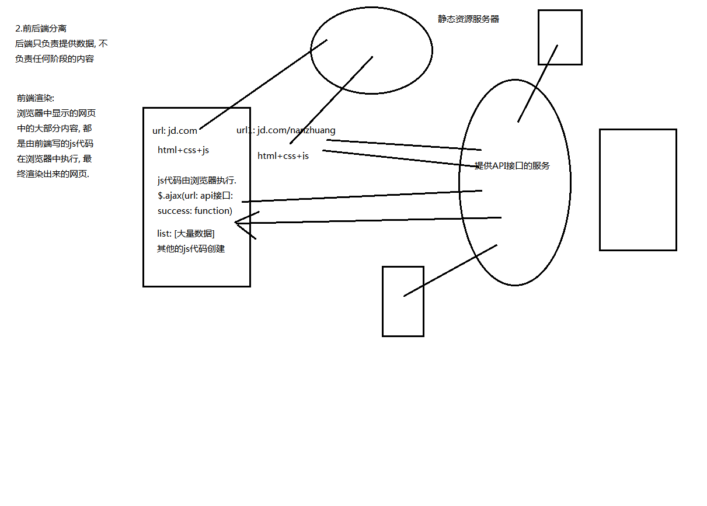

# vue-router 01

 ## 什么是路由？

* 路由是一个网络工程里面的术语。
* 路由（routing）就是通过互联的网络把信息从源地址传输到目的地址的活动。

### 路由器

* 在生活中,有没有听说过路由的概念呢? 当然了, 路由器嘛.
* 路由器是做什么的? 
* 路由器提供了两种机制: 路由和转送。
  * 路由是决定数据包从来源到目的地的路径。
  * 转送将输入端的数据转移到合适的输出端。

### 路由表

* 路由中有一个非常重要的概念叫路由表。
* 路由表本质上就是一个映射表, 决定了数据包的指向。

## 后端路由阶段

* 早期的网站开发整个HTML页面是由服务器来渲染的.
  * 服务器直接生产渲染好对应的HTML页面, 返回给客户端进行展示。
* 但是, 一个网站, 这么多页面服务器如何处理呢？
  * 一个页面有自己对应的网址, 也就是URL。
  * URL会发送到服务器, 服务器会通过正则对该URL进行匹配,，并且最后交给一个Controller进行处理。
  * Controller进行各种处理, 最终生成HTML或者数据, 返回给前端。
  * 这就完成了一个IO操作。
* 上面的这种操作, 就是后端路由。
  * 当我们页面中需要请求不同的路径内容时, 交给服务器来进行处理, 服务器渲染好整个页面, 并且将页面返回给客户端。
  * 这种情况下渲染好的页面, 不需要单独加载任何的js和css, 可以直接交给浏览器展示, 这样也有利于SEO的优化。
* 后端路由的缺点:
  * 一种情况是整个页面的模块都由后端人员来编写和维护。
  * 另一种情况是前端开发人员如果要开发页面, 需要通过PHP和Java等语言来编写页面代码。
  * 而且通常情况下HTML代码和数据以及对应的逻辑会混在一起, 编写和维护都是非常糟糕的事情。


## 前端路由阶段

### 前后端分离阶段：

* 随着Ajax的出现, 有了前后端分离的开发模式。
* 后端只提供API来返回数据, 前端通过Ajax获取数据, 并且可以通过JavaScript将数据渲染到页面中。
* 这样做最大的优点就是前后端责任的清晰, 后端专注于数据上, 前端专注于交互和可视化。
* 并且当移动端(iOS/Android)出现后, 后端不需要进行任何处理, 依然使用之前的一套API即可。



### 单页面富应用阶段:

* 其实SPA最主要的特点就是在前后端分离的基础上加了一层前端路由。
* 也就是前端来维护一套路由规则。


### 前端路由的核心是什么呢？

* 改变URL，但是页面不进行整体的刷新。
* 如何实现呢？

### URL 的 hash

* URL 的 hash 也就是锚点（#），本质上是改变 window.location 的 href 属性。
* 我们可以通过直接赋值 location.hash 来改变 href，但是页面不发生刷新。


### HTML5 的 history 模式：pushState

* history 接口是 HTML5 新增的，它有五种模式改变 URL 而不刷新页面。

#### history.pushState()

* 向当前浏览器会话的历史堆栈中添加一个状态（state）。

```js
history.pushState(state, title[, url])
```


#### history.replaceState()

* 修改当前历史记录实体

```js
history.replaceState(stateObj, title[, url]);
```


#### history.go()

```js
history.go(delta);
```

* 从会话历史记录中加载特定页面。你可以使用它在历史记录中前后移动，具体取决于`delta`参数的值。

* `delta` 可选

  * 相对于当前页面你要去往历史页面的位置。

  * 负值表示向后移动，正值表示向前移动。

  * 因此，例如：`history.go(2)` 向前移动两页，`history.go(-2)` 则向后移动两页。如果未向该函数传参或`delta`相等于 0，则该函数与调用`location.reload()`具有相同的效果，会刷新当前页面。


#### history.back()

* 等价于 `history.go(-1)`

#### history.forward()

* 等价于 `history.go(1)`


