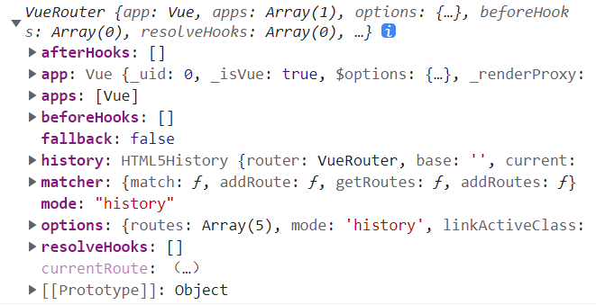

# vuerouter 03

## 路由代码跳转

* 有时候，页面的跳转可能需要执行对应的 js 代码

```vue
<template>
  <div id="app">
    <h1>我是网站的标题</h1>
    <button @click="linkAbout">about</button>
    <button @click="linkHello">hello</button>
    <router-view/>
    <p>我是网站的版权信息</p>
  </div>
</template>

<script>
export default {
  name: "App",
  data(){

  },
  methods:{
    linkAbout(){
      this.$router.push('/about');
    },
    linkHello(){
      this.$router.replace('/hello')
    }
  }
};
</script>
```

## 动态路由

* 在某些情况下，一个页面的path路径可能是不确定的，比如我们进入用户界面时，希望是如下的路径：
  * `/user/aaaa或/user/bbbb`
  * 除了有前面的 `/user` 之外，后面还跟上了用户的ID
  * 这种 path 和 Component 的匹配关系，我们称之为动态路由(也是路由传递数据的一种方式)

```js
// index.js
{
    path: "/user/:id",
    component: () => import("../components/User.vue")
}
```

.

```vue
<template>
  <div>
    我是{{ $route.params.id }}
  </div>
</template>
```

## 路由的懒加载

### 官方解释

* 当打包构建应用时，Javascript 包会变得非常大，影响页面加载。
* 如果我们能把不同路由对应的组件分割成不同的代码块，然后当路由被访问的时候才加载对应组件，这样就更加高效了

#### 官方在说什么呢?

* 首先, 我们知道路由中通常会定义很多不同的页面。
* 这些页面最后被打包在哪里呢? 一般情况下, 是放在一个js文件中.
* 但是, 页面这么多放在一个js文件中, 必然会造成这个文件非常的大。
* 如果我们一次性从服务器请求下来这个文件, 可能需要花费一定的时间, 甚至用户的电脑上还出现了短暂空白的情况。
* 如何避免这种情况呢? 使用路由懒加载就可以了.

#### 路由懒加载做了什么?

* 路由懒加载的主要作用就是将路由对应的组件打包成一个个的js代码块。
* 只有在这个路由被访问到的时候, 才加载对应的组件

### 路由懒加载的效果


### 懒加载的方式

#### 结合Vue的异步组件和Webpack的代码分析

```js
const Home = resolve => { require.ensure(['../components/Home.vue'], () => { resolve(require('../components/Home.vue')) })};
```

#### AMD写法

```js
const About = resolve => require(['../components/About.vue'], resolve);
```

#### ES6写法

在ES6中, 我们可以有更加简单的写法来组织Vue异步组件和Webpack的代码分割。

```js
const Home = () => import('../components/Home.vue')
```

## 嵌套路由

* 嵌套路由是一个很常见的功能
  * 比如在 user 页面中, 我们希望通过 /user/records和 /home/wallet 访问一些内容。
  * 一个路径映射一个组件, 访问这两个路径也会分别渲染两个组件

* 实现嵌套路由有两个步骤:
  * 创建对应的子组件, 并且在路由映射中配置对应的子路。
  * 在组件内部使用 `<router-view>` 标签.

```js
// router/index.js
  {
    path: "/user",
    component: () => import("../components/User.vue"),
    children: [
      {
        path: "records",
        component: () => import("../components/Records")
      },
      {
        path: "wallet",
        component: () => import("../components/Wallet")
      }
    ]
  }
```

user.vue

```vue
<template>
  <div>
    <router-link to="/user/records">记录</router-link>
    <router-link to="/user/wallet">钱包</router-link>
    <router-view></router-view>
  </div>
</template>
```

### 嵌套默认路径

```js
  {
    path: "/user",
    component: () => import("../components/User.vue"),
    children: [
      {
        path:'',
        redirect:'records'
      },
      {
        path: "records",
        component: () => import("../components/Records")
      },
      {
        path: "wallet",
        component: () => import("../components/Wallet")
      }
    ]
  }
```

### 传递参数的方式

* 传递参数主要有两种类型: params 和 query
* **params 的类型:**
  * 配置路由格式: /router/:id
  * 传递的方式: 在path后面跟上对应的值
  * 传递后形成的路径: /router/123, /router/abc
* **query的类型:**
  * 配置路由格式: /router, 也就是普通配置
  * 传递的方式: 对象中使用query的key作为传递方式
  * 传递后形成的路径: /router?id=123, /router?id=abc

* 如何使用它们呢? 也有两种方式: `<router-link>`的方式和JavaScript代码方式

### 方式一：`<router-link>`

```vue
<template>
  <div class="hello">
    <router-link :to="{
      path: '/profile/'+ id,
      query: {
        name: '嬴渠梁',
        title: '赳赳老秦，共赴国难'
      }
    }" tag="h1">profile
    </router-link>
  </div>
</template>

<script>
export default {
  name: "HelloWorld",
  data() {
    return {
      id: 987654321
    };
  }
};
</script>
```

### 方式二：js 代码

```js
  methods:{
    toProfile(){
      this.$router.push({
        path: '/profile/'+ this.id,
        query: {
          name: '嬴渠梁',
          title: '赳赳老秦，共赴国难'
        }
      })
    }
  }
```

### 获取参数

```vue
<template>
  <div>
    <h1>{{$route.params.id}}</h1>
    <div>{{$route.query.name}}</div>
    <div>{{$route.query.title}}</div>
  </div>
</template>
```

### $route和$router 的区别

* $router为VueRouter实例，想要导航到不同URL，则使用$router.push方法



* $route为当前router跳转对象里面可以获取name、path、query、params等


