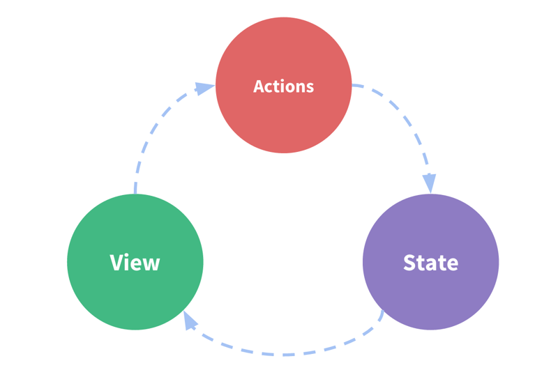

# vuex 基本介绍

## Vuex是做什么的?

* Vuex 是一个专为 Vue.js 应用程序开发的状态管理模式。
  * 它采用集中式存储管理应用的所有组件的状态，并以相应的规则保证状态以一种可预测的方式发生变化。
  * Vuex 也集成到 Vue 的官方调试工具 devtools extension，提供了诸如零配置的 time-travel 调试、状态快照导入导出等高级调试功能。
* 状态管理是什么？
  * 你可以简单的将其看成把需要多个组件共享的变量全部存储在一个对象里面。
  * 然后，将这个对象放在顶层的Vue实例中，让其他组件可以使用。
  * 那么，多个组件是不是就可以共享这个对象中的所有变量属性了呢？
* 为什么官方要专门出一个插件 Vuex 呢？难道我们不能自己封装一个对象来管理吗？
  * 可以，只是我们要先想想 Vuex 带给我们最大的便利是什么呢？是响应式。
  * 如果你自己封装实现一个对象能不能保证它里面所有的属性做到响应式呢？当然也可以，不过比较麻烦。
  * 不如直接用 Vuex。

## 管理什么状态呢?

* 但是，有什么状态时需要我们在多个组件间共享的呢？
  * 如果你做过大型项目，你一定遇到过多个状态，在多个界面间的共享问题。
  * 比如用户的登录状态、用户名称、头像、地理位置信息等等。
  * 比如商品的收藏、购物车中的物品等等。
  * 这些状态信息，我们都可以放在统一的地方，对它进行保存和管理，而且它们还是响应式的。

## 单界面的状态管理

* 要在单个组件中进行状态管理是一件非常简单的事情

  State：不用多说，就是我们的状态。（你姑且可以当做就是data中的属性）
  View：视图层，可以针对State的变化，显示不同的信息。（这个好理解吧？）
  Actions：这里的Actions主要是用户的各种操作：点击、输入等等，会导致状态的改变




* State：不用多说，就是我们的状态。（你姑且可以当做就是data中的属性）
* View：视图层，可以针对State的变化，显示不同的信息。
* Actions：这里的Actions主要是用户的各种操作：点击、输入等等，会导致状态的改变。

```html
<template>
  <div>
    <h2>当前计数：{{counter}}</h2>
    <button @click="counter++">+1</button>
    <button @click="counter--">-1</button>
  </div>
</template>

<script>
export default {
  name: "Counter",
  data(){
    return {
      counter:0
    }
  }
};
</script>
```

* 在这个案例中，我们有木有状态需要管理呢？没错，就是个数counter。
* counter需要某种方式被记录下来，也就是我们的State。
* counter目前的值需要被显示在界面中，也就是我们的View部分。
* 界面发生某些操作时（我们这里是用户的点击，也可以是用户的input），需要去更新状态，也就是我们的Actions
* 这不就是上面的流程图了吗？

## 多界面状态管理

* Vue已经帮我们做好了单个界面的状态管理，但是如果是多个界面呢？
  * 多个试图都依赖同一个状态（一个状态改了，多个界面都需要进行更新）
  * 不同界面的Actions都想修改同一个状态
* 也就是说对于某些状态(状态1/状态2/状态3)来说只属于我们某一个视图，但是也有一些状态(状态a/状态b/状态c)属于多个试图共同想要维护的
  * 状态1/状态2/状态3你放在自己的房间中，你自己管理自己用，没问题。
  * 但是状态a/状态b/状态c我们希望交给一个大管家来统一帮助我们管理！
  * 没错，Vuex就是为我们提供这个大管家的工具。
* 全局单例模式（大管家）
  * 我们现在要做的就是将共享的状态抽取出来，交给我们的大管家，统一进行管理。
  * 之后，你们每个试图，按照我规定好的规定，进行访问和修改等操作。
  * 这就是Vuex背后的基本思想。

## Vuex状态管理图例


```js
// store/index.js
import Vue from "vue";
import Vuex from "vuex";

Vue.use(Vuex);

export default new Vuex.Store({
  state:{
    count:0
  },
  mutations:{
    increment(state){
      state.count++;
    },
    decrement(state){
      state.count--;
    }
  }
})
```

.

```js
// main.js
import store from './store';
Vue.prototype.$store = store;
```

.

```html
<template>
  <div>
    <h2>当前计数：{{ $store.state.count }}</h2>
    <button @click="increment">+1</button>
    <button @click="decrement">-1</button>
  </div>
</template>

<script>
export default {
  name: "Counter",
  data() {
    return {
      counter: 0
    };
  },
  methods: {
    increment() {
      this.$store.commit("increment");
    },
    decrement() {
      this.$store.commit("decrement");
    }
  }
};
</script>
```

* 这就是使用Vuex最简单的方式了。
* 使用步骤：
  * 1.提取出一个公共的store对象，用于保存在多个组件中共享的状态
  * 2.将store对象放置在new Vue对象中，这样可以保证在所有的组件中都可以使用到
  * 3.在其他组件中使用store对象中保存的状态即可
    * 通过this.$store.state.属性的方式来访问状态
    * 通过this.$store.commit('mutation中方法')来修改状态
* 注意事项：
  * 我们通过提交mutation的方式，而非直接改变store.state.count。
  * 因为这样 Vuex 可以更明确的追踪状态的变化，所以不要直接改变 store.state.count 的值。


