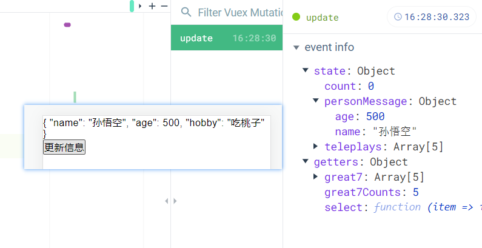

# Vuex 的 Mutatios 

## Mutation状态更新

* Vuex 的 store 状态的更新唯一方式：提交 Mutation
* Mutation 主要包括两部分：
  * 字符串的事件类型（type）
  * 一个回调函数（handler）, 该回调函数的第一个参数就是state。
* mutation的定义方式：

```js
  mutations: {
    increment(state) {
      state.count++;
    },
    decrement(state) {
      state.count--;
    }
  },
```

* 通过 mutatios 更新

```js
  methods: {
    increment() {
      this.$store.commit("increment");
    },
    decrement() {
      this.$store.commit("decrement");
    }
  }
```

## Mutation传递参数

* 在通过 mutation 更新数据的时候, 有可能我们希望携带一些额外的参数
  * 参数被称为是 mutation 的载荷 (Payload)

```js
  mutations: {
    increment(state) {
      state.count++;
    },
    decrement(state, num) {
      state.count -= num;
    }
  },
```

.

```js
  methods: {
    increment() {
      this.$store.commit("increment");
    },
    decrement() {
      this.$store.commit("decrement",5);
    }
  }
```

* 但是如果参数不是一个呢?
  * 比如我们有很多参数需要传递。
  * 这个时候, 我们通常会以对象的形式传递, 也就是payload是一个对象。
  * 这个时候可以再从对象中取出相关的信息。

## Mutation提交风格

* 上面的通过commit进行提交是一种普通的方式
* Vue还提供了另外一种风格, 它是一个包含type属性的对象

```js
  methods: {
    decrement() {
      this.$store.commit({
        type: "decrement",
        count1: 3,
        count2: 2,
      });
    }
  }
```

* Mutation 中的处理方式是将整个 commit 的对象作为 payload使用

```js
  mutations: {
    increment(state) {
      state.count++;
    },
    decrement(state, payload) {
      state.count = state.count - payload.count1 - payload.count2;
    }
  },
```

## Mutation响应规则

* Vuex 的 store 中的 state 是响应式的, 当 state 中的数据发生改变时, Vue 组件会自动更新。
* 这就要求我们必须遵守一些 Vuex 对应的规则:
  * 提前在 store 中初始化好所需的属性
  * 当给state中的对象添加新属性时, 使用下面的方式:
    * 方式一: 使用 Vue.set(obj, 'newProp', 123)
    * 方式二: 用新对象给旧对象重新赋值
* 我们来看一个例子:
  * 当我们点击更新信息时, 界面并没有发生对应改变
* 如何才能让它改变呢?
  * 查看下面代码的方式一和方式二
  * 都可以让 state 中的属性是响应式的

```js
  state: {
    personMessage:{
      name:'孙悟空',
      age:500,
    }
  },
  mutations: {
    increment(state) {
      state.count++;
    },
    decrement(state, payload) {
      state.count = state.count - payload.count1 - payload.count2;
    },
    update(state) {
      // state.personMessage.hobby = '吃桃子';
      // 方式一
      // Vue.set(state.personMessage,'hobby','吃桃子');
      // 方式二：给 personMessage 赋值一个新的对象
      state.personMessage = {...state.personMessage,'hobby':'吃桃子'}
    }
  },
```

## Mutation常量类型 – 概念

* 我们来考虑下面的问题:
  * 在mutation中, 我们定义了很多事件类型(也就是其中的方法名称)。
  * 当我们的项目增大时, Vuex管理的状态越来越多, 需要更新状态的情况越来越多, 那么意味着Mutation中的方法越来越多。
  * 方法过多, 使用者需要花费大量的经历去记住这些方法, 甚至是多个文件间来回切换, 查看方法名称, 甚至如果不是复制的时候, 可能还会出现写错的情况。
* 如何避免上述的问题呢?
  *  一种常见的方案是使用常量替代Mutation事件的类型。
    我们可以将这些常量放在一个单独的文件中, 方便管理以及让整个app所有的事件类型一目了然。
* 具体怎么做呢?
  * 我们可以创建一个文件: mutation-types.js, 并且在其中定义我们的常量。
  * 定义常量时, 我们可以使用ES2015中的风格, 使用一个常量来作为函数的名称。

```js
// mutation-type.js
export const INCREMENT = 'INCREMENT';
```

.

```js
// store/index.js
import * as types from "./mutation-type";
mutations: {
    [types.INCREMENT](state) {
      state.count++;
    },
}
```

.

```js
this.$store.commit(types.INCREMENT);
```

## Mutation同步函数

* 通常情况下, Vuex要求我们Mutation中的方法必须是同步方法.
  * 主要的原因是当我们使用devtools时, 可以devtools可以帮助我们捕捉mutation的快照.
  * 但是如果是异步操作, 那么devtools将不能很好的追踪这个操作什么时候会被完成.

```js
  mutations: {
    update(state) {
      setTimeout(()=>{
        state.personMessage = {...state.personMessage,'hobby':'吃桃子'}
      },0)
    }
```




