# JavaScript 运行原理

## JS 是一门什么样的语言？

* **JavaScript 是一门高级的编程语言**

* 从编程语言发展历史来说，可以划分为三个阶段：

  * 机器语言：1000100111011000，一些机器指令；
  * 汇编语言：mov、ax、bx、一些汇编指令;
  * 高级语言：C、C++、Java、JavaScript、Python；

* 但是计算机本身是不认识这些高级语言的，所以我们的代码最终还是需要被转换成机器指令：

  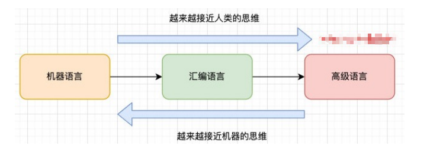

## 浏览器的工作原理

* JavaScript 代码，在浏览器中是如何被执行的？

  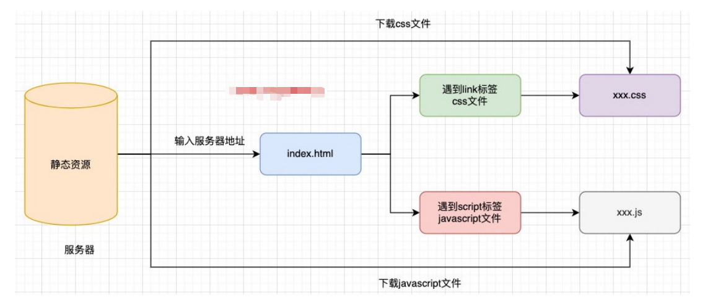

## 认识浏览器的内核

#### 不同的浏览器由不同的内核组成 

* **Gecko**：早期被Netscape和Mozilla Firefox浏览器浏览器使用； 

* **Trident**：微软开发，被IE4~IE11浏览器使用，但是Edge浏览器已经转向Blink； 

* **Webkit**：苹果基于KHTML开发、开源的，用于Safari，Google Chrome之前也在使用； 

* **Blink**：是Webkit的一个分支，Google开发，目前应用于Google Chrome、Edge、Opera等； 

* 等等... 

#### 事实上，我们经常说的浏览器内核指的是浏览器的排版引擎： 

* **排版引擎**（layout engine），也称为**浏览器引擎**（browser engine）、**页面渲染引擎**（rendering engine）或**样版引擎**。

## 浏览器渲染过程

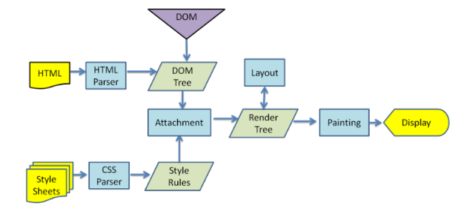

#### JavaScript 代码由谁来执行呢？

* JavaScript 引擎

## 认识 JavaScript 引擎

* #### 为什么需要JavaScript引擎呢？
  * 前面说过，高级的编程语言都是需要转成最终的机器指令来执行的； 
  * 事实上我们编写的JavaScript无论你交给浏览器或者Node执行，最后都是需要被CPU执行的； 
  * 但是CPU只认识自己的指令集，实际上是机器语言，才能被CPU所执行； 

  * 所以我们需要JavaScript引擎帮助我们将JavaScript代码翻译成CPU指令来执行； 

* #### 比较常见的JavaScript引擎有哪些呢？
  * **SpiderMonkey**：第一款JavaScript引擎，由Brendan Eich开发（也就是JavaScript作者）； 
  * **Chakra**：微软开发，用于IE浏览器； 
  * **JavaScriptCore**：WebKit中的JavaScript引擎，Apple公司开发； 
  * **V8**：Google开发的强大JavaScript引擎，也帮助Chrome从众多浏览器中脱颖而出； 
  * 等等…

## 浏览器内核和JS引擎的关系

这里我们先以 WebKit 为例，WebKit 事实上由两部分组成的： 

* **WebCore：**负责HTML解析、布局、渲染等等相关的工作； 

* **JavaScriptCore：**解析、执行 JavaScript 代码； 

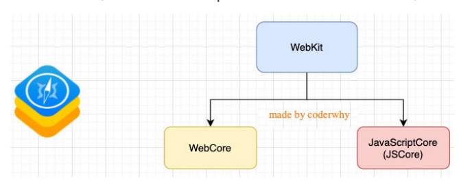

* 在小程序中编写的 JavaScript 代码就是被 JSCore 执行的；

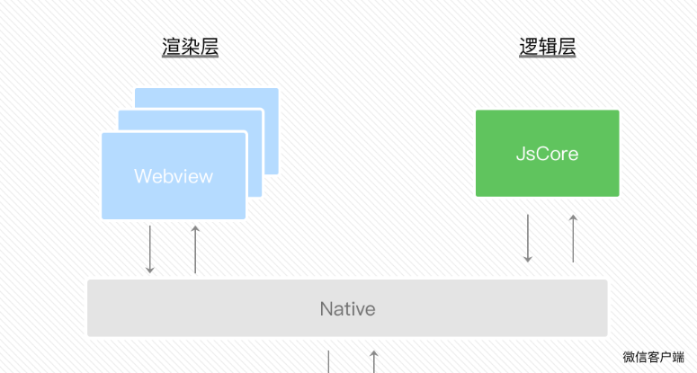

## V8引擎的原理

#### 官方对 V8 引擎的定义： 

* V8 是用 C ++ 编写的 Google 开源高性能 JavaScript 和 WebAssembly 引擎，它用于 Chrome 和 Node.js 等。 

* 它实现 ECMAScript 和 WebAssembly，并在 Windows 7 或更高版本，macOS 10.12+ 和使用 x64，IA-32，ARM 或 MIPS 处理器的 Linux 系统上运行。 

* V8 可以独立运行，也可以嵌入到任何 C ++ 应用程序中。

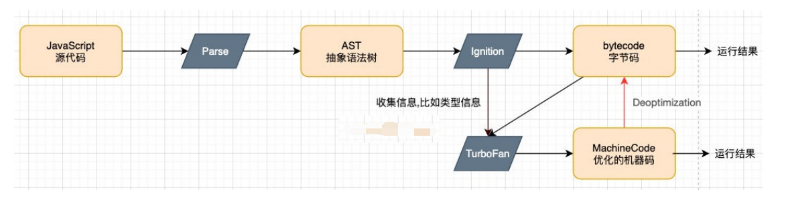

####  抽象语法树

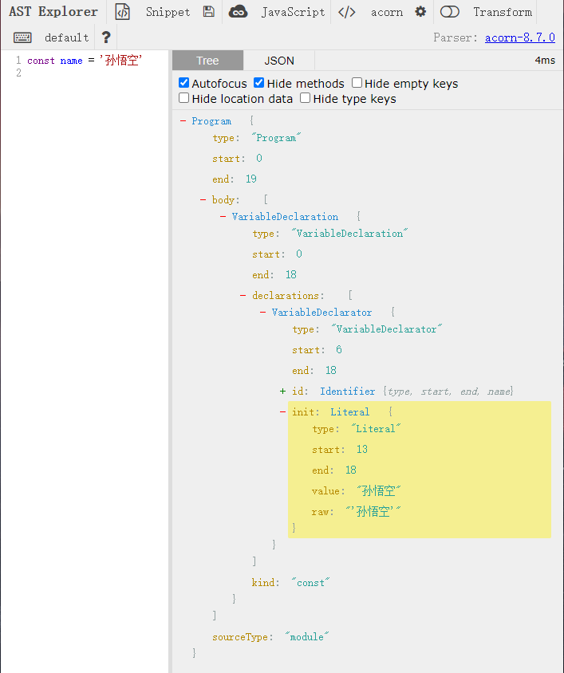

* https://astexplorer.net/

## V8引擎的架构

V8引擎本身的源码**非常复杂**，大概有超过**100w行C++代码**，通过了解它的架构，我们可以知道它是如何对JavaScript执行的： 

* **Parse8** 模块会将 JavaScript 代码转换成 AST（抽象语法树），这是因为解释器并不直接认识 JavaScript 代码； 

  * 如果函数没有被调用，那么是不会被转换成 AST 的； 
  * Parse 的 V8官方文档：https://v8.dev/blog/scanner 

* **Ignition** 是一个解释器，会将 AST 转换成 ByteCode（字节码） 
  * 同时会收集 TurboFan 优化所需要的信息（比如函数参数的类型信息，有了类型才能进行真实的运算）； 
  * 如果函数只调用一次，Ignition 会执行解释执行 ByteCode； 
  * Ignition 的 V8 官方文档：https://v8.dev/blog/ignition-interpreter 

* **TurboFan** 是一个编译器，可以将字节码编译为 CPU 可以直接执行的机器码； 
  * 如果一个函数被多次调用，那么就会被标记为**热点函数**，那么就会经过 **TurboFan 转换成优化的机器码，提高代码的执行性能**； 
  * 但是，**机器码实际上也会被还原为 ByteCode**，这是因为如果后续执行函数的过程中，**类型发生了变化（比如sum函数原来执行的是number类型，后来执行变成了string类型）**，之前优化的机器码并不能正确的处理运算，就会逆向的转换成字节码； 
  * TurboFan 的 V8 官方文档：https://v8.dev/blog/turbofan-jit

## V8引擎的官方解析图

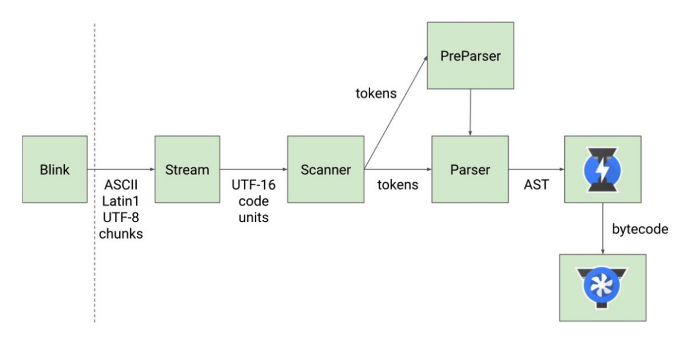

## V8执行的细节

#### JavaScript源码是如何被解析（Parse过程）的呢？

* Blink 将源码交给 V8 引擎，Stream 获取到源码并且进行编码转换； 

* Scanner 会进行词法分析（lexical analysis），词法分析会将代码转换成tokens； 

* 接下来 tokens 会被转换成 AST 树，经过 Parser 和 PreParser： 
  * Parser就是直接将 tokens 转成 AST 树架构； 
  * PreParser称之为预解析，为什么需要预解析呢？ 
    * 这是因为并不是所有的 JavaScript 代码，在一开始时就会被执行。那么对所有的 JavaScript 代码进行解析，必然会影响网页的运行效率； 
    * 所以 V8 引擎就实现了 Lazy Parsing（延迟解析）的方案，它的作用是将不必要的函数进行预解析，也就是只解析暂时需要的内容，而对函数的全量解析是在函数被调用时才会进行； 
    * 比如我们在一个函数 outer 内部定义了另外一个函数 inner，那么inner 函数就会进行预解析； 

* 生成 AST 树后，会被 Ignition 转成字节码（bytecode），之后的过程就是代码的执行过程。

## JavaScript 的执行过程

* 假如我们有下面一段代码，它在 JavaScript 中是如何被执行的呢？

  ```js
  var name = 'why';
  function foo(){
      var name = 'foo';
      console.log(name);
  }
  var num1 = 20;
  var num2 = 30;
  var result = num1 + num2;
  
  console.log(result);
  
  foo();
  ```

## 初始化全局对象

* js 引擎在**执行代码之前**，会在**堆内存中创建一个全局对象**：Global Object（G0）
  * 该对象**所有的作用域（scope）**都可以访问；
  * 里面会包含 **Date、Array、String、Number、setTimeout、setInterval **等等； 
  * 其中还有一个 **window** 属性指向自己；

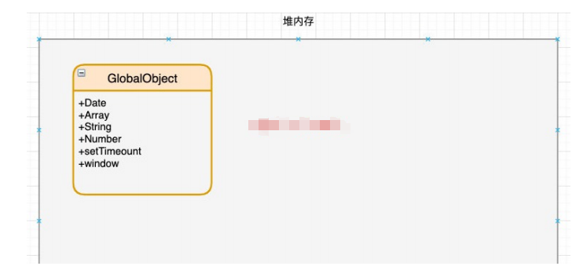

## 执行上下文栈（调用栈）

* js 引擎内部有一个**执行上下文栈（Execution Context Stack，简称ECS）**，它是用于执行**代码的调用栈**。 

* 那么现在它要执行谁呢？执行的是**全局的代码块**： 
  * 全局的代码块为了执行会构建一个 **Global Execution Context（GEC，全局执行上下文）**； 
  * GEC会 被放入到 ECS 中 执行； 

* **GEC 被放入到 ECS 中里面包含两部分内容：** 
  * **第一部分：**在代码执行前，在 parser 转成 AST 的过程中，会将全局定义的变量、函数等加入到 GlobalObject 中，但是并**不会赋值**； 
    * 这个过程也称之为变量的作用域提升（hoisting） 
  * **第二部分：**在代码执行中，对变量赋值，或者执行其他的函数；

## GEC 被放入到 ECS 中

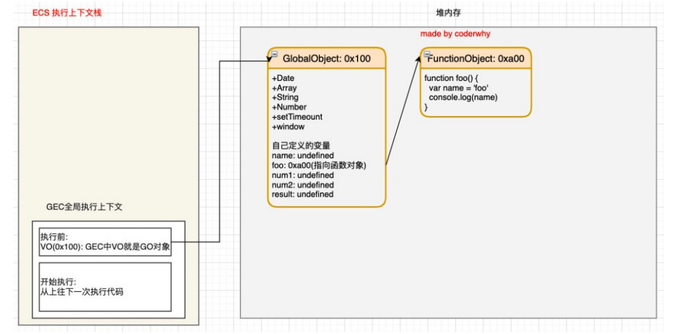

## GEC 开始执行代码

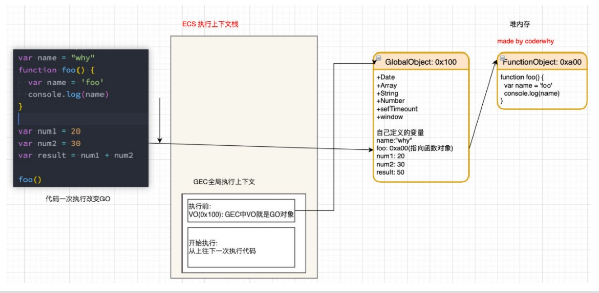

## 遇到函数如何执行？

* 在执行的过程中**执行到一个函数时**，就会根据**函数体**创建一个**函数执行上下文（Functional Execution Context，** **简称FEC）**，并且压入到**EC Stack**中。 

* FEC中包含三部分内容： 
  * 第一部分：在解析函数成为 AST 树结构时，会创建一个Activation Object（AO）： 
    * AO中包含形参、arguments、函数定义和指向函数对象、定义的变量； 
  * 第二部分：作用域链：由VO（在函数中就是AO对象）和父级VO组成，查找时会一层层查找； 
  * 第三部分：this绑定的值：这个我们后续会详细解析；

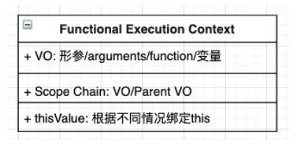

## FEC 被放入到 ECS 中

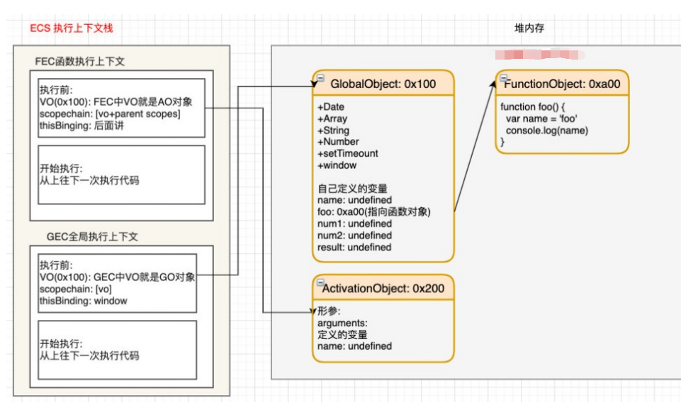

## FEC 开始执行代码

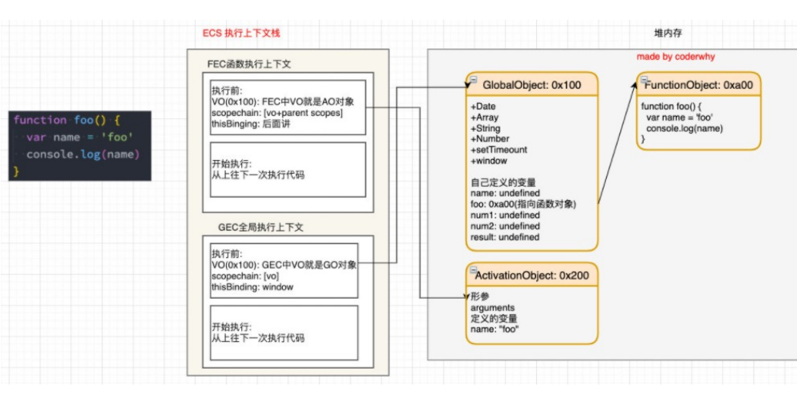

## 变量环境和记录

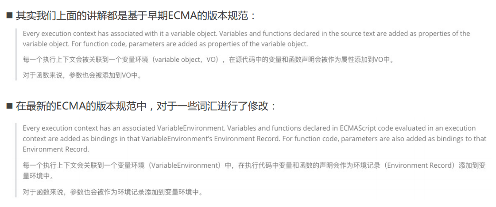

* 通过上面的变化我们可以知道，在最新的 ECMA 标准中，我们前面的变量对象 VO 已经有另外一个称呼了变量环境 VE。

## 作用域面试题

1. ```js
   function foo(){
     console.log(n);
     var n = 200;
     console.log(n);
   }
   
   var n = 100;
   foo();
   ```

2. ```js
   var n = 100;
   function foo1(){
     console.log(n);
   }
   function foo2(){
     var n = 200;
     console.log(n);
     foo1();
   }
   foo2();
   console.log(n);
   ```

3. ```js
   var a = 100;
   function foo(){
     console.log(a);
     return 
     var a = 100;
   }
   foo()
   ```

4. ```js
   function foo(){
     var a = b = 100; 
       // 转成下面两行代码
       // var a = 100;
       // b = 100;
   }
   foo();
   console.log(b);
   console.log(a);
   ```


