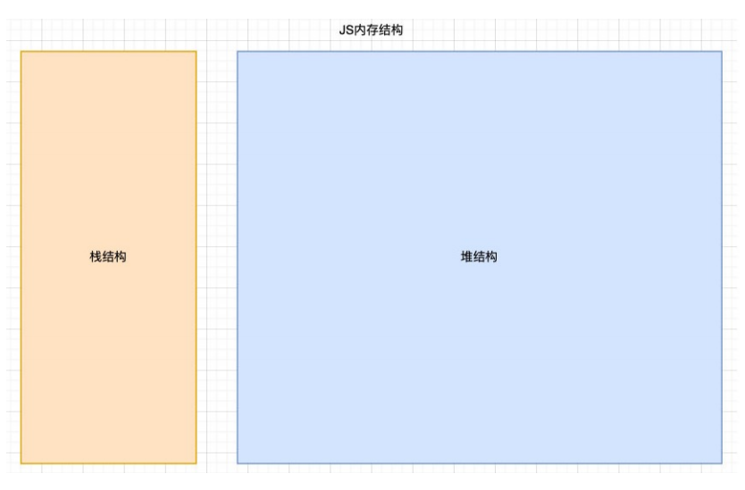
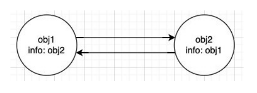
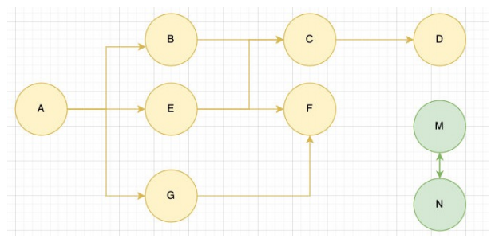

# JS的内存管理和闭包

## 认识内存管理

* 不管什么样的编程语言，在**代码的执行过程中都是需要给它分配内存**的，不同的是**某些编程语言**需要我们**自己手动的管理内存**，**某些编程语言**可以**自动帮助我们管理内存**： 

* 不管以什么样的方式来管理内存，**内存的管理都会有如下的生命周期**： 

  * 第一步：分配申请你需要的内存（申请）； 

  * 第二步：使用分配的内存（存放一些东西，比如对象等）； 

  * 第三步：不需要使用时，对其进行释放； 

* **不同的编程语言对于第一步和第三步会有不同的实现：** 

  * 手动管理内存：比如C、C++，包括早期的OC，都是需要手动来管理内存的申请和释放的（malloc和free函数）； 

  * 自动管理内存：比如Java、JavaScript、Python、Swift、Dart等，它们会自动帮助我们管理内存； 

* JavaScript 通常情况下是不需要手动来管理的。

## JS的内存管理

* JavaScript会在**定义变量时**为我们分配内存。 

* 但是内存分配方式是一样的吗？ 
  * JS 对于**基本数据类型内存的分配**会在执行时，直接在栈空间进行分配； 
  * JS 对于**复杂数据类型内存的分配**会在堆内存中开辟一块空间，并且将这块空间的指针返回值变量引用；



## JS的垃圾回收

* 因为**内存的大小是有限的**，所以**当内存不再需要的时候**，我们需要**对其进行释放**，以便腾出**更多的内存空间**。 
* 在**手动管理内存的语言**中，我们需要通过**一些方式自己来释放不再需要的内存，比如free函数**： 
  * 但是这种管理的方式其实**非常的低效**，影响我们**编写逻辑的代码的效率**； 
  * 并且这种方式**对开发者的要求也很高**，并且**一不小心就会产生内存泄露**； 
* 所以大部分**现代的编程语言都有自己的垃圾回收机制**： 
  * 垃圾回收的英文是**Garbage Collection**，简称**GC**； 
  * 对于**那些不再使用的对象**，我们都称之为是**垃圾**，它需要被**回收**，以释放更多的内存空间；
  * 而我们的语言运行环境，比如 Java 的运行环境 JVM，JavaScript 的运行环境 js 引擎都会内存**垃圾回收器**； 
  * **垃圾回收器**我们也会简称为 **GC**，所以在很多地方你看到 GC 其实指的是垃圾回收器；
* 但是这里又出现了另外一个很关键的问题：**GC 怎么知道哪些对象是不再使用的呢？**
  * 这里就要用到 **GC 的算法**了

## 常见的 GC 算法 

### 引用计数

* 当一个对象有一个引用指向它时，那么这个对象的引用就 +1，当一个对象的引用为 0 时，这个对象就可以被销毁掉； 
* 这个算法有一个很大的弊端就是会产生循环引用；



### 标记清除

* 这个算法是设置一个根对象（root object），垃圾回收器会定期从这个根开始，找所有从根开始有引用到的对象，对于哪些没有引用到的对象，就认为是不可用的对象； 

* 这个算法可以很好的解决循环引用的问题；



* JS 引擎比较广泛的采用的就是标记清除算法，当然类似于 V8 引擎为了进行更好的优化，它在算法的实现细节上也会结合一些其他的算法。

## JS 中函数是一等公民

* 在 JavaScript 中，函数是非常重要的，并且是一等公民： 

  * 那么就意味着函数的使用是非常灵活的； 

  * 函数可以作为另外一个函数的参数，也可以作为另外一个函数的返回值来使用；

* 高阶函数
  * 一个函数如果接受另外一个函数作为参数，或者该函数会返回另外一个函数作为返回值，那么这个函数就称之为是一个高阶函数。

### 函数 vs 方法

#### 函数（function）

* 独立的 function，我们称之为是一个函数。

```js
function foo(){
    
};
```

#### 方法（method）

* 当我们的一个函数属于某一个对象时，我们称这个函数是这个对象的方法。

```js
const obj = {
    foo:function(){
        
    };
};
obj.foo();
```


