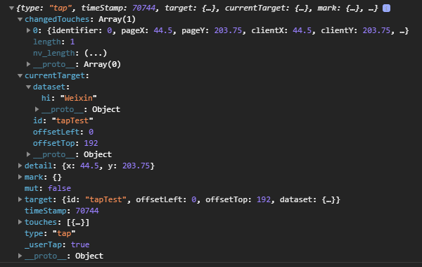

# 微信小程序中的事件

## 什么是事件？

- 事件是视图层到逻辑层的通讯方式。
- 事件可以将用户的行为反馈到逻辑层进行处理。
- 事件可以绑定在组件上，当达到触发事件，就会执行逻辑层中对应的事件处理函数。
- 事件对象可以携带额外信息，如 id, dataset, touches。

## 事件的使用方式

* 在组件中绑定一个事件处理函数。

  * 如 `bindtap` ，当用户点击该组件的时候，会在该页面对应的 Page 中找到相应的事件处理函数。

  ```html
  <view id="tapTest" data-hi="Weixin" bindtap="tapName"> Click me! </view>
  ```

* 在相应的 Page 定义中写上相应的事件处理函数，参数是 event 。

  ```js
  Page({
      tapName(event){
          console.log(event);
      }
  })
  ```

* 可以看到 log 出来的信息：

  

## 事件分类

事件分为冒泡事件和非冒泡事件：

1. 冒泡事件：当一个组件上的事件被触发后，该事件会向父节点传递。
2. 非冒泡事件：当一个组件上的事件被触发后，该事件不会向父节点传递。

### 普通事件绑定

事件绑定的写法类似于组件的属性，如：

```html
<view bindtap="handleTap">
    Click here!
</view>
```

如果用户点击这个 view ，则页面的 `handleTap` 会被调用。

事件绑定函数可以是一个数据绑定，如：

```html
<view bindtap="{{ handlerName }}">
    Click here!
</view>
```

此时，页面的 `this.data.handlerName` 必须是一个字符串，指定事件处理函数名；如果它是个空字符串，则这个绑定会失效（可以利用这个特性来暂时禁用一些事件）。

### 绑定并阻止事件冒泡

除 `bind` 外，也可以用 `catch` 来绑定事件。与 `bind` 不同， `catch` 会阻止事件向上冒泡。

例如在下边这个例子中，点击 inner view 会先后调用`handleTap3`和`handleTap2`(因为 tap 事件会冒泡到 middle view，而 middle view 阻止了 tap 事件冒泡，不再向父节点传递)，点击 middle view 会触发`handleTap2`，点击 outer view 会触发`handleTap1`。

```html
<view id="outer" bindtap="handleTap1">
  outer view
  <view id="middle" catchtap="handleTap2">
    middle view
    <view id="inner" bindtap="handleTap3">
      inner view
    </view>
  </view>
</view>
```


