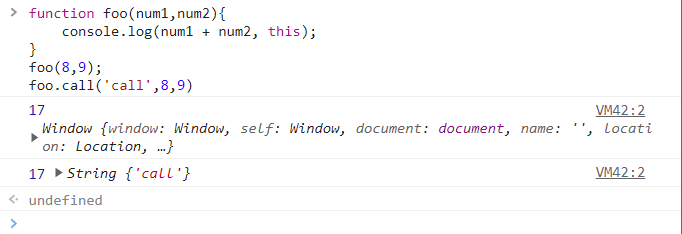
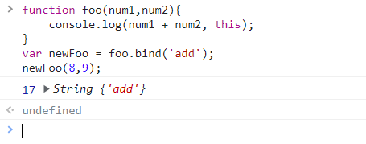

# call、apply、bind

## Function.prototype.call()

`call()` 方法使用一个指定的 `this` 值和单独给出的一个或多个参数来调用一个函数。

```js
function foo(num1,num2){
    console.log(num1 + num2, this);
}
foo(8,9);
foo.call('call',8,9)
```



## Function.prototype.apply()

`apply()` 方法调用一个具有给定 `this` 值的函数，以及以一个数组的形式提供的参数。

```js
function foo(num1,num2){
    console.log(num1 + num2, this);
}
foo(8,9);
foo.apply('call',[8,9])
```

## call vs apply

`call()` 方法的语法和作用与 `apply` 方法类似，只有一个区别，就是 `call()` 方法接受的是**一个参数列表**，而 `apply()` 方法接受的是**一个包含多个参数的数组**。

## bind

`bind()` 方法创建一个新的函数，在 `bind()` 被调用时，这个新函数的 `this` 被指定为 `bind()` 的第一个参数，而其余参数将作为新函数的参数，供调用时使用。

```js
function foo(num1,num2){
    console.log(num1 + num2, this);
}
var newFoo = foo.bind('add');
newFoo(8,9);
```




