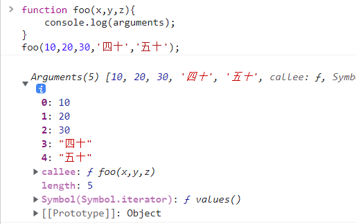
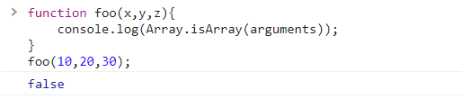
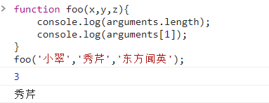
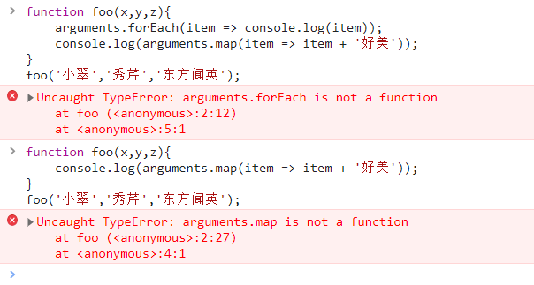
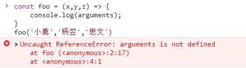
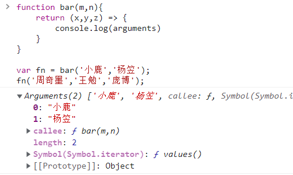

# JS函数式编程

## 实现 apply、call、bind

* 注意：实现是练习函数、this、调用关系，不会过度考虑一些边界情况

### apply

```js
Function.prototype.selfapply = function (thisArg, argArray) {
  var fn = this;
  thisArg = (thisArg === null || thisArg === undefined) ? window : Object(thisArg);
  thisArg.fn = fn;
  argArray = argArray || [];
  var result = thisArg.fn(...argArray);
  delete thisArg.fn;
  return result;
};
```

### call

```js
Function.prototype.selfcall = function (thisArg,...args) {
  var fn = this;
  thisArg = thisArg === null || thisArg === undefined ? window : Object(thisArg);
  thisArg.fn = fn;
  var result = thisArg.fn(...args);
  delete thisArg.fn;
  return result;
};
```

### bind

```js
Function.prototype.selfbind = function (thisArg,...args){
  var fn = this;
  thisArg = (thisArg === null || thisArg === undefined) ? window : Object(thisArg);

  function proxyFn(...args2){
    thisArg.fn = fn;
    var result = thisArg.fn(...args,...args2);
    delete thisArg.fn;
    return result;
  }
  return proxyFn;
}
```

## 认识 arguments

* **arguments 是一个对应于传递给函数的参数的类数组 (array-like) 对象。**

  ```js
  function foo(x,y,z){
      console.log(arguments);
  }
  foo(10,20,30,'四十','五十');
  ```



* **array-like 意味着它不是一个数组类型，而是一个对象类型：**

  * 长的像是一个数组，本质上是一个对象

  ```js
  function foo(x,y,z){
      console.log(Array.isArray(arguments));
  }
  foo(10,20,30);
  ```



* **但是它却拥有数组的一些特性，比如说 length，比如说可以通过 index 索引来访问；**

  ```js
  function foo(x,y,z){
      console.log(arguments.length);
      console.log(arguments[1]);
  }
  foo('小翠','秀芹','东方闻英');
  ```



* **但是它却没有数组的一些方法，比如 forEach、map 等；**

  ```js
  function foo(x,y,z){
  	arguments.forEach(item => console.log(item));
      console.log(arguments.map(item => item + '好美'));
  }
  foo('小翠','秀芹','东方闻英');
  ```



* **callee 获取当前 arguments 所在的函数**

  ```js
  function foo(x,y,z){
      console.log(arguments.callee);
  }
  foo(88,71,79);
  ```

## arguments 转成 array

### 转化方式一

```js
function foo(x,y,z){
    const length = arguments.length;
    const arr = [];
    for(let name of arguments){
        arr.push(name);
    }
   	console.log(arr);
}
foo('古力娜扎','迪丽热巴','杨幂');
```


### 转化方式二

```js
function foo(x,y,z){
    const arr1 = Array.prototype.slice.call(arguments);
    const arr2 = [].slice.call(arguments);
    console.log(arr1);
    console.log(arr2);
}
foo('刘亦菲','柳岩','王冰冰');
```

#### slice 近似实现

```js
Array.prototype.selfslice = function(start,end){
    const arr = this;
    const newArray = [];
    start = start || 0;
    end = end || arr.length;
    for(let i=start; i<end; i++){
        newArray.push(arr[i]);
    }
    return newArray;
}
```

### 转化方式三：ES6之后

```js
function foo(x,y,z){
	const arr1 = Array.from(arguments);
    const arr2 = [...arguments];
    console.log(arr1);
    console.log(arr2);
}
foo('关晓彤','胡冰卿','谭松韵');
```


## 箭头函数不绑定 arguments

* 箭头函数是不绑定 arguments 的，所以我们在箭头函数找那个使用 arguments 回去上层作用域查找：

  ```js
  const foo = (x,y,z) => {
      console.log(arguments);
  }
  foo('小鹿','杨笠','思文')
  ```

  

  ```js
  function bar(m,n){
      return (x,y,z) => {
          console.log(arguments)
      }
  }
  
  var fn = bar('小鹿','杨笠');
  fn('周奇墨','王勉','庞博');
  ```

  

## 理解 JavaScript 纯函数

* **函数式编程**中有一个非常重要的概念叫**纯函数**，JavaScript 符合**函数式编程的范式**，所以也**有纯函数的概念**；

* **纯函数的维基百科定义：** 

  * 在程序设计中，若一个函数符合以下条件，那么这个函数被称为纯函数： 

  * 此函数在相同的输入值时，需产生相同的输出。 

  * 函数的输出和输入值以外的其他隐藏信息或状态无关，也和由I/O设备产生的外部输出无关。 

  * 该函数不能有语义上可观察的函数副作用，诸如“触发事件”，使输出设备输出，或更改输出值以外物件的内容等。 

* **当然上面的定义会过于的晦涩，所以我简单总结一下：** 

  * 确定的输入，一定会产生确定的输出； 

  * 函数在执行过程中，不能产生副作用；

## 副作用的理解

* 什么是**副作用**？ 
  * **副作用（side effect）**本身是医学的一个概念，比如我们经常说吃什么药本来是为了治病，但可能会产生一些其他的副作用； 
  * 在计算机科学中，也引用了副作用的概念，表示**在执行一个函数**时，除了**返回函数值**之外，还对**调用函数产生了附加的影响**，比如**修改了全局变量，修改参数或者改变外部的存储**； 
* **纯函数在执行的过程中就是不能产生这样的副作用：** 
  * 副作用往往是产生**bug的 “温床”**。

## 纯函数的案例

*  **我们来看一个对数组操作的两个函数：** 

* slice：slice 截取数组时不会对原数组进行任何操作,而是生成一个新的数组； 

* splice：splice 截取数组, 会返回一个新的数组, 也会对原数组进行修改； 

* slice 就是一个纯函数，不会修改传入的参数；

```js
const names = ['李易峰','吴亦凡','吴磊','鹿晗','张艺兴'];

const newNames = names.slice(2,5);
console.log(newNames); // ['吴磊', '鹿晗', '张艺兴']
console.log(names); // ['李易峰', '吴亦凡', '吴磊', '鹿晗', '张艺兴']

const newNames2 = names.splice(0,2);
console.log(newNames2); //  ['李易峰', '吴亦凡']
console.log(names); // ['吴磊', '鹿晗', '张艺兴']
```

### 纯函数：

```js
function sum(num1,num2){
    return num1 + num2;
}
```

### 不纯的函数：

```js
let name = '李白';
function bar(){
    console.log('仰天大笑出门去，我辈岂是蓬蒿人');
    name = '杜甫';
}
bar();
// 不纯原因，修改了外界的变量
```

.

```js
function baz(info){
    info.age = 100;
}
const obj = {name:'王冰冰'，age:33};
baz(obj);
// 不纯原因，修改了传入的参数
```


## 纯函数的优势

* 为什么纯函数在函数式编程中非常重要呢？
  * 因为你可以安心的编写和使用；
  * 你在写的时候保证了函数的纯度，只是单纯实现自己的业务逻辑即可，不需要关心传入的内容是如何获得的或者依赖的外部变量是否已经发生了修改；
  * 你在用的时候，确定你的输入内容不会被任意篡改，确定的输入，一定会有确定的输出。

## JavaScript 柯里化

* **柯里化**也是属于**函数式编程**里面一个非常重要的概念。 

* 维基百科的解释：** 

  * 在计算机科学中，**柯里化**（英语：Currying），又译为**卡瑞化**或**加里化**； 

  * 是把接收**多个参数的函数**，变成**接受一个单一参数**（最初函数的第一个参数）的函数，并且**返回接受余下的参数**，而且**返回结果的新函数**的技术； 

  * 柯里化声称 “**如果你固定某些参数，你将得到接受余下参数的一个函数**”； 

* **维基百科的讲述非常的抽象，我们这里做一个总结：** 

  * 只**传递给函数一部分参数来调用它**，让**它返回一个函数去处理剩余的参数**； 

  * **这个过程就称之为柯里化**；

## 柯里化的结构

```js
// 未柯里化的函数
function add1(x,y,z){
    return x + y + z;
}
console.log(add1(10,20,30));

// 柯里化处理的函数
function add2(x){
    return function(y){
        return function(z){
            return x + y + z;
        }
    }
}
console.log(add2(10)(20)(30));

var add3 = x => y => z => {
    return x + y + z;
}
console.log(add3(10)(20)(30));
```

## 让函数的职责单一

* **为什么需要有柯里化呢？** 

  * 在函数式编程中，我们其实往往希望一个函数处理的问题尽可能的单一，而不是将一大堆的处理过程交给一个函数来处理； 

  * 那么我们是否就可以将每次传入的参数在单一的函数中进行处理，处理完后在下一个函数中再使用处理后的结果；

## 柯里化的复用

* 另外一个使用柯里化的场景是可以帮助我们可以**复用参数逻辑**；

  * makeAdder函数要求我们传入一个num（并且如果我们需要的话，可以在这里对num进行一些修改）； 

  * 在之后使用返回的函数时，我们不需要再继续传入num了；

```js
function makeAdder(num){
    return function(count){
        return num + count;
    }
}

var add5 = makeAdder(5);
add5(10);
add5(100);

var add10 = makeAdder(10);
add10(10);
add10(100);
```

## 打印日志的柯里化

* 这里我们在演示一个案例，需求是打印一些日志： 
  
* 日志包括时间、类型、信息； 
  
* 普通函数的实现方案如下：

  ```js
  function log(date,type,message){
    console.log(`[${date.getHours()}:${date.getMinutes()}][${type}][${message}]`)
  }
  log(new Date(),"DEBUG","修复问题");
  log(new Date(),"FEATURE","新功能");
  ```

* 柯里化函数的实现方案如下：

  ```js
  const log = date => type => message => {
    console.log(`[${date.getHours()}:${date.getMinutes()}][${type}]:[${message}]`);
  };
  
  const logNow = log(new Date());
  nowLog("DEBUG")('修复轮播图问题');
  
  const logNowDebug = log(new Date()("DEBUG"));
  logNowDebug("轮播图bug");
  logNowDebug("点击无效bug");
  ```

## 自动柯里化函数

```js
function hyCurrying(fn){
  function curried (...args){
    if(args.length >= fn.length){
      return fn.apply(this,args);
    }else{
      return function (...args2){
        return curried.apply(this,[...args,...args2])
      }
    }
  }
  return curried;
}

const currySum = hyCurrying(sum);
currySum(1)(2)(3).call(4,4);
```

.

```js
function hyCurrying(fn){
  let arr = [];
  function curried (...args){
    arr = arr.concat(args);
    if(arr.length >= fn.length){
      return fn.apply(this,arr);
    }else{
      return curried;
    }
  }
  return curried;
}

const currySum = hyCurrying(sum);
currySum(1)(2)(3).call(4,4);
```

## 理解组合函数

* **组合（Compose）函数**是在 JavaScript 开发过程中一种对**函数的使用技巧、模式**： 

* 比如我们现在需要对某一个数据进行函数的调用，执行两个函数fn1和fn2，这两个函数是依次执行的； 

* 那么如果每次我们都需要进行两个函数的调用，操作上就会显得重复； 

* 那么是否可以将这两个函数组合起来，自动依次调用呢？ 

* 这个过程就是对函数的组合，我们称之为 组合函数（Compose Function）；

```js
function compose(fn1,fn2){
    return function(x){
        return fn2(fn1(x));
    }
};
function double(num){
    return num * 2;
}
function square(num){
    return num ** 2;
}
const calcFn = compose(double,square);
console.log(calcFn(20))
```

## 实现组合函数

* 上面实现的 compose 函数比较简单，我们需要考虑更加复杂的情况：比如传入了更多的函数，在调用 compose 函数时，传入了更多的参数：

  ```js
  function compose(...fns){
      // 遍历所有的参数，如果不是函数，那么直接报错
      const length = fns.length;
      for(let i=0; i<lenght; i++){
          let fn = fns[i];
          if(typeof fn !== 'function'){
              throw new TypeError('Expected a function')
          }
      }
  }
  
  // 取出所有的函数一次调用
  return function(...args){
      // 先获取到第一次执行的结果
      let index = 0;
      let result = length ? fns[index].apply(this,args) : args;
      while(++index < length){
          result = fns[index].call(this,result);
      }
      return result;
  }
  ```

  .
  
  ```js
  function compose(...fns) {
    const fnsArr = [...fns];
    fnsArr.forEach((item) => {
      if (typeof item !== "function") {
        throw "expected a function";
      }
    });
    return function (...nums) {
      let result = fnsArr[0].apply(this, nums);
      if (fnsArr.length === 1) {
        return result;
      } else {
        for (let i = 1; i < fnsArr.length; i++) {
          result = fnsArr[i].call(this, result);
        }
      }
      return result;
    };
  }
  
  function fn1(num) {
    // console.log(this);
    return num * 2;
  }
  
  function fn2(num) {
    return num + 10;
  }
  
  const newfn = compose(fn1, fn2);
  console.log(newfn.call('0',9));
  ```
  
  


