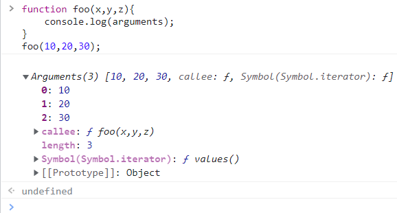
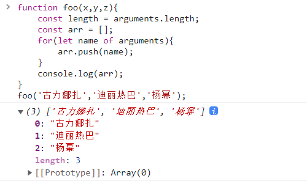
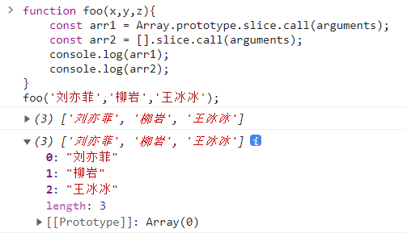
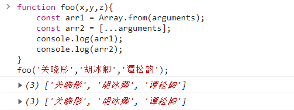

# JS函数式编程

## 实现 apply、call、bind

* 注意：实现是练习函数、this、调用关系，不会过度考虑一些边界情况

### apply

```js
Function.prototype.selfapply = function (thisArg, argArray) {
  var fn = this;
  thisArg = (thisArg === null || thisArg === undefined) ? window : Object(thisArg);
  thisArg.fn = fn;
  argArray = argArray || [];
  var result = thisArg.fn(...argArray);
  delete thisArg.fn;
  return result;
};
```

### call

```js
Function.prototype.selfcall = function (thisArg,...args) {
  var fn = this;
  thisArg = thisArg === null || thisArg === undefined ? window : Object(thisArg);
  thisArg.fn = fn;
  var result = thisArg.fn(...args);
  delete thisArg.fn;
  return result;
};
```

### bind

```js
Function.prototype.selfbind = function (thisArg,...args){
  var fn = this;
  thisArg = (thisArg === null || thisArg === undefined) ? window : Object(thisArg);

  function proxyFn(...args2){
    thisArg.fn = fn;
    var result = thisArg.fn(...args,...args2);
    delete thisArg.fn;
    return result;
  }
  return proxyFn;
}
```

## 认识 arguments

* **arguments 是一个对应于传递给函数的参数的类数组 (array-like) 对象。**

  ```js
  function foo(x,y,z){
      console.log(arguments);
  }
  foo(10,20,30);
  ```



* **array-like 意味着它不是一个数组类型，而是一个对象类型：**

  ```js
  function foo(x,y,z){
      console.log(Array.isArray(arguments));
  }
  foo(10,20,30);
  ```


* **但是它却拥有数组的一些特性，比如说 length，比如说可以通过 index 索引来访问；**

  ```js
  function foo(x,y,z){
      console.log(arguments.length);
      console.log(arguments[1]);
  }
  foo('小翠','秀芹','东方闻英');
  ```


* **但是它却没有数组的一些方法，比如 forEach、map 等；**

  ```js
  function foo(x,y,z){
  	arguments.forEach(item => console.log(item));
      console.log(arguments.map(item => item + '好美'));
  }
  foo('小翠','秀芹','东方闻英');
  ```


## arguments 转成 array

### 转化方式一

```js
function foo(x,y,z){
    const length = arguments.length;
    const arr = [];
    for(let name of arguments){
        arr.push(name);
    }
   	console.log(arr);
}
foo('古力娜扎','迪丽热巴','杨幂');
```



### 转化方式二

```js
function foo(x,y,z){
    const arr1 = Array.prototype.slice.call(arguments);
    const arr2 = [].slice.call(arguments);
    console.log(arr1);
    console.log(arr2);
}
foo('刘亦菲','柳岩','王冰冰');
```



### 转化方式三：ES6之后

```js
function foo(x,y,z){
	const arr1 = Array.from(arguments);
    const arr2 = [...arguments];
    console.log(arr1);
    console.log(arr2);
}
foo('关晓彤','胡冰卿','谭松韵');
```




