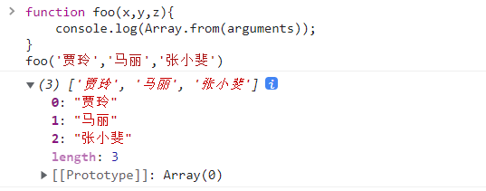

# Array.from()

`Array.from()` 方法从一个类似数组或可迭代对象创建一个新的，浅拷贝的数组实例。

## **语法**

```
Array.from(arrayLike[, mapFn[, thisArg]])
```

## **参数**

- `arrayLike`  想要转换成数组的伪数组对象或可迭代对象
- `mapFn` 如果指定了该参数，新数组中的每个元素都会执行该回调函数
- `thisArg` 可选参数，执行回调函数 `mapFn` 时 this 对象

## **返回值**

- 一个新的数组实例

## **描述**

`Array.from()` 可以通过以下方式来创建数组对象：

- 伪数组对象（拥有一个 length 属性和若干索引属性的任意对象）
- 可迭代对象（可以获取对象中的元素，如 Map 和 Set 等）


`Array.from()` 方法有一个可选参数 `mapFn`，让你可以在最后生成的数组上再执行一次 map 方法后再返回。也就是说`Array.from(obj, mapFn, thisArg)`就相当于`Array.from(obj).map(mapFn, thisArg)`, 除非创建的不是可用的中间数组。 这对一些数组的子类,如 `typed arrays` 来说很重要, 因为中间数组的值在调用 `map()` 时需要是适当的类型。

`from()` 的 `length` 属性为 1 ，即 `Array.from.length === 1`。

在 ES2015 中， Class 语法允许我们为内置类型（比如 Array）和自定义类新建子类（比如叫 SubArray）。这些子类也会继承父类的静态方法，比如 `SubArray.from()`，调用该方法后会返回子类 SubArray 的一个实例，而不是 Array 的实例。

## **示例**

### **从** **String** **生成数组**

```js
Array.from('foo');
// [ "f", "o", "o" ]
```

**将类数组的每一项乘以2**

```js
    const someNumbers = { '0': 10, '1': 15, length: 2 };
    const newArr = Array.from(someNumbers, value => value * 2);
    console.log(newArr); // [20, 30]
```

### 将函数中的 arguments 转成数组

```js
function foo(x,y,z){
    console.log(Array.from(arguments));
}
foo('贾玲','马丽','张小斐')
```



