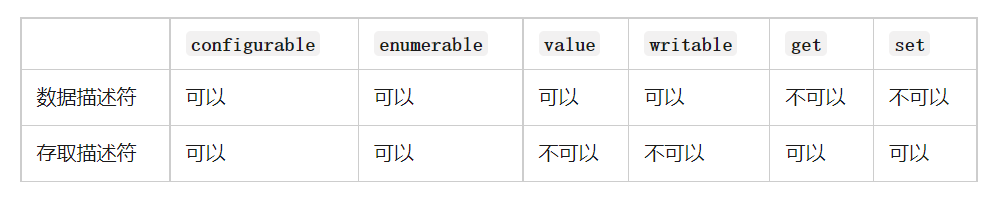

# 深入 JS 面向对象

## 面向对象是现实的抽象方式

* 对象是 JavaScript 中一个非常重要的概念，因为对象可以**将多个相关联的数据封装**到一起，更好的**描述一个事物**： 

  * 比如我们可以描述一辆车：Car，具有颜色（color）、速度（speed）、品牌（brand）、价格（price），行驶（travel）等等； 

  * 比如我们可以描述一个人：Person，具有姓名（name）、年龄（age）、身高（height），吃东西（eat）、跑步（run） 等等； 

* 用对象来描述事物，更有利于我们将现实的事物，抽离成代码中某个数据结构： 
  * 所以有一些编程语言就是纯面向对象的编程语言，比如 Java； 
  * 你在实现任何现实抽象时都需要先创建一个类，根据类再去创建对象；

## **JavaScript 的面向对象**

* JavaScript 其实支持多种编程范式的，包括**函数式编程和面向对象编程**： 
  * JavaScript 中的对象被设计成一组属性的无序集合，像是一个哈希表，有 key 和 value 组成； 
  * key 是一个标识符名称，value 可以是任意类型，也可以是其他对象或者函数类型； 
  * 如果值是一个函数，那么我们可以称之为是对象的方法；

* **如何创建一个对象呢？** 

* 早期使用创建对象的方式最多的是使用Object类，并且使用new关键字来创建一个对象： 
  * 这是因为早期很多JavaScript开发者是从Java过来的，它们也更习惯于Java中通过new的方式创建一个对象； 

* 后来很多开发者为了方便起见，都是直接通过字面量的形式来创建对象： 
  * 这种形式看起来更加的简洁，并且对象和属性之间的内聚性也更强，所以这种方式后来就流行了起来；

```js
const obj1 = new Object();
obj1.name = "刘亦菲";
obj1.age = "35";
boj1.height = 170;
obj1.eating = function(){
    console.log(this.name + '在吃东西');
}
```

.

```js
const obj2 = {
    obj1.name = "王冰冰";
    obj1.age = "32";
    boj1.height = 180;
    obj1.eating = function(){
        console.log(this.name + '在跑步');
}
```

## 对属性操作的控制

* 在前面我们的属性都是直接定义在对象内部，或者直接添加到对象内部的： 
  * 但是这样来做的时候我们就不能对这个属性进行一些限制：比如这个属性是否是可以通过delete删除的？这个属性是否在for-in遍历的时候被遍历出来呢？

* 如果我们想要对一个属性进行比较精准的操作控制，那么我们就可以使用属性描述符。 
  * 通过属性描述符可以精准的添加或修改对象的属性； 
  * 属性描述符需要使用 `Object.defineProperty` 来对属性进行添加或者修改；

## `Object.defineProperty`

* `Object.defineProperty()` 方法会直接在一个对象上定义一个新属性，或者修改一个对象的现有属性，并返回此对象。
  * `Object.defineProperty(obj, prop, descriptor)`

* 可接受三个参数：
  * `obj` 要定义属性的对象；
  * `prop` 要定义或修改的属性的名称或 Symbol;
  * `descriptor` 要定义或修改的属性描述符；

* 返回值： 
  * 被传递给函数的对象。

## 属性描述符分类

* 属性描述符的类型有两种： 
  * 数据属性（Data Properties）描述符（Descriptor）； 
  * 存取属性（Accessor 访问器 Properties）描述符（Descriptor）；



## 数据属性描述符

* **四个特性：**

* [[Configurable]]：表示属性是否可以通过 delete 删除属性，是否可以修改它的特性，或者是否可以将它修改为存取属性描述符； 
  * 当我们直接在一个对象上定义某个属性时，这个属性的[[Configurable]] 为 true； 
  * 当我们通过属性描述符定义一个属性时，这个属性的[[Configurable]] 默认为 false ； 

* [[Enumerable]]：表示属性是否可以通过 `for-in` 或者`Object.keys()` 返回该属性； 
  * 当我们直接在一个对象上定义某个属性时，这个属性的[[Enumerable]] 为 true； 
  * 当我们通过属性描述符定义一个属性时，这个属性的[[Enumerable]] 默认为 false； 

* [[Writable]]：表示是否可以修改属性的值； 
  * 当我们直接在一个对象上定义某个属性时，这个属性的[[Writable]] 为 true； 
  * 当我们通过属性描述符定义一个属性时，这个属性的[[Writable]] 默认为 false； 

*  [[value]]：属性的 value 值，读取属性时会返回该值，修改属性时，会对其进行修改； 
  * 默认情况下这个值是undefined；

```js
const obj = {
    name:"龙文章",
    age:35,
    height:180
}

delete obj.name;
console.log(obj);

for(let key in obj){
    console.log(key);
}

console.log(Object.keys(obj)); // ['name', 'age', 'height']

obj.name = '孟烦了';
console.log(obj);

// 属性描述符是一个对象
Object.defineProperty(obj,"address",{
    configurable: false,
    enumerable: false,
    writable: false,
    value: "湘西"
})
```

## 存取属性描述符

* **四个特性：**
* Configurable
* Enumberable
* get
  * 获取属性时会执行的函数，默认为 undefined。
* set
  * 设置属性时会执行的函数，默认为 undefined。


