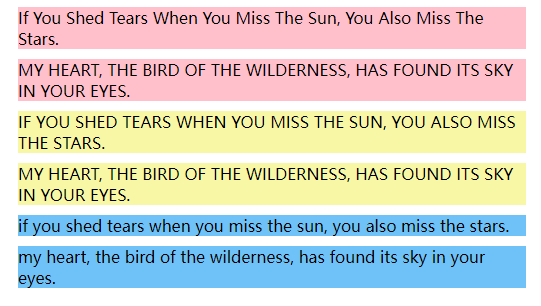

# text-transform

```css
text-transform: none;
text-transform: capitalize;
text-transform: uppercase;
text-transform: lowercase;
text-transform: full-width;
```

`capitalize`

* 将每个单词的首字母转换为大写。其他字符保持不变（它们保留元素文本中所写的原始大小写）。字母被定义为属于 Unicode 字母或数字一般类别的字符实验性的; 因此，单词开头的任何标点符号或符号都将被忽略。

`uppercase`

* 将所有字符转换为大写。

`lowercase`

* 将所有字符转换为小写。

`full-width`

* 强制在正方形内书写字符（主要是表意文字和拉丁文字）的关键字，允许它们在通常的东亚文字（如中文或日语）中对齐。

```html
<div class="div1">
  <div class="text">If you shed tears when you miss the sun, you also miss the stars.</div>
  <div class="text">MY HEART, THE BIRD OF THE WILDERNESS, HAS FOUND ITS SKY IN YOUR EYES.</div>
</div>
<div class="div2">
  <div class="text">If you shed tears when you miss the sun, you also miss the stars.</div>
  <div class="text">MY HEART, THE BIRD OF THE WILDERNESS, HAS FOUND ITS SKY IN YOUR EYES.</div>
</div>
<div class="div3">
  <div class="text">If you shed tears when you miss the sun, you also miss the stars.</div>
  <div class="text">MY HEART, THE BIRD OF THE WILDERNESS, HAS FOUND ITS SKY IN YOUR EYES.</div>
</div>
```

.

```css
.div1 .text {
  margin: 10px;
  text-transform: capitalize;
  background: pink;
}
.div2 .text {
  margin: 10px;
  text-transform: uppercase;
  background: rgb(247, 247, 165);
}
.div3 .text {
  margin: 10px;
  text-transform: lowercase;
  background: pink;
  background: #6fc2f7;
}
```



