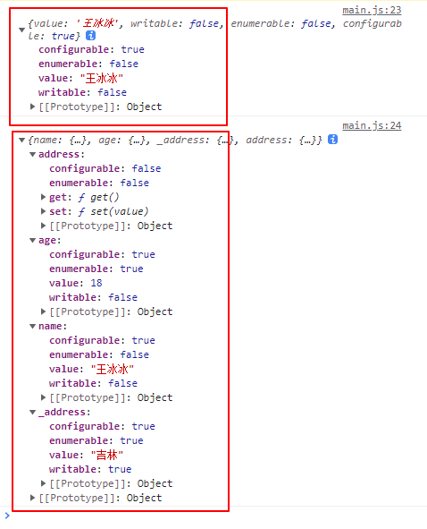

# 获取属性描述符

```js
const obj = {
  name: "王冰冰",
  age: 18,
  _address: "吉林"
};
Object.defineProperties(obj, {
  "name": {
    writable: false,
    enumerable: false
  },
  "age": {
    writable: false
  },
  "address": {
    set(value) {
      this._address = value;
    },
    get() {
      return this._address;
    }
  }
});
console.log(Object.getOwnPropertyDescriptor(obj, "name"));
console.log(Object.getOwnPropertyDescriptors(obj));
```



