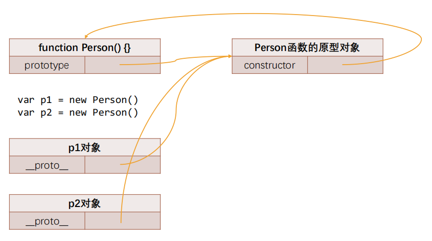
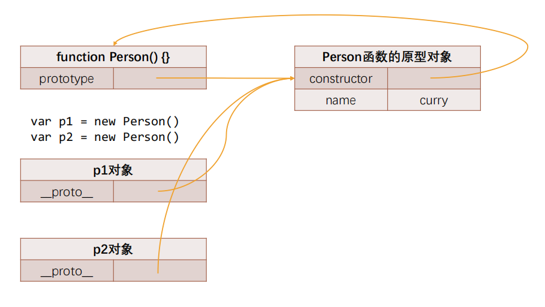
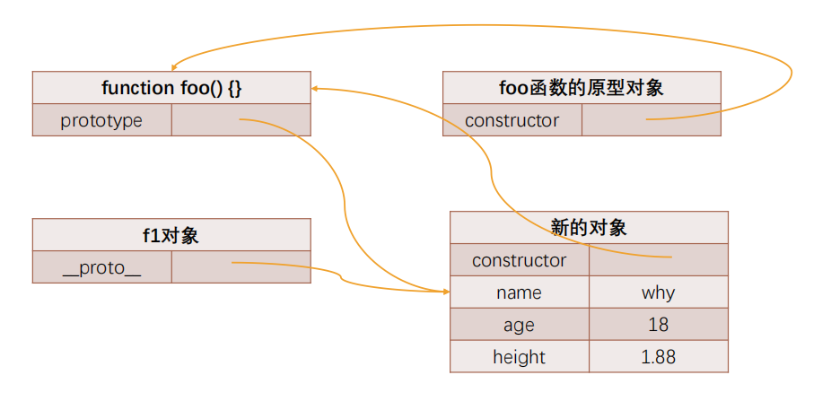
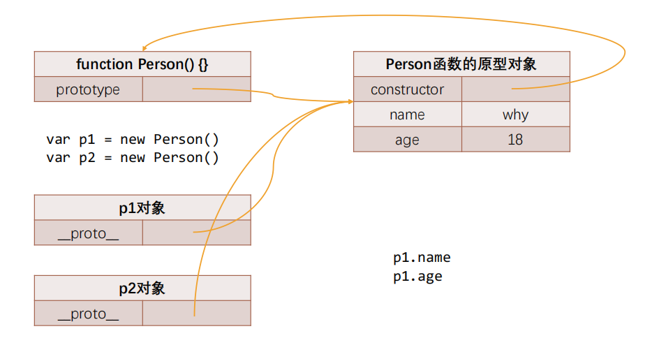

## 创建多个对象的方案

* 如果我们现在希望创建一系列的对象：比如 Person 对象 
  * 包括张三、李四、王五、李雷等等，他们的信息各不相同； 
  * 那么采用什么方式来创建比较好呢？

### 字面量创建的方式：

```js
const p1 = {
    name:'张三',
    age:18,
    address:'安徽'
}

const p2 = {
    name:'李四',
    age:19,
    address:'江苏'
}

const p1 = {
    name:'王五',
    age:20,
    address:'上海'
}
```

* 这种方式有一个很大的弊端：创建同样的对象时，需要编写大量重复的代码；

### 工厂模式

* 工厂模式其实是一种常见的设计模式
* 通常我们会有一个工厂方法，通过该工厂方法我们可以产生想要的对象；

```js
function createPerson(name, age, height, address){
    const p = new Object();
    p.name = name;
    p.age = age;
    p.height = height;
    p.address = address;
    
    p.eating = function(){
        console.log(this.name + '在吃东西~')；
    }
    
    p.running = function(){
        console.log(this.name + '在跑步~');
    }
    
    return p;
}

const p1 = createPerson('张三',18,1.88,"北京市");
const p2 = createPerson('李四',19,1.78,"苏州市");
const p3 = createPerson('王五',20,1.88,"北京市");
const p4 = createPerson('张子枫',21,1.60,"三门峡市");
```

### 构造函数

* 工厂方法创建对象有一个比较大的问题：我们在打印对象时，对象的类型都是 Object 类型 
  * 但是从某些角度来说，这些对象应该有一个他们共同的类型； 
  * 下面我们来看一下另外一种模式：构造函数的方式； 

* 我们先理解什么是构造函数？ 
  * 构造函数也称之为构造器（constructor），通常是我们在创建对象时会调用的函数； 
  * 在其他面向的编程语言里面，构造函数是存在于类中的一个方法，称之为构造方法； 
  * 但是JavaScript中的构造函数有点不太一样； 

* JavaScript 中的构造函数是怎么样的？ 
  * 构造函数也是一个普通的函数，从表现形式来说，和千千万万个普通的函数没有任何区别； 
  * 那么如果这么一个普通的函数被使用 new 操作符来调用了，那么这个函数就称之为是一个构造函数； 

* 那么被 new 调用有什么特殊的呢？

### new操作符调用的作用

* 如果一个函数被使用 new 操作符调用了，那么它会执行如下操作：

  * 在内存中创建一个新的对象（空对象）；
  * 这个对象内部的 [[prototype]] 属性会被赋值为该构造函数的 prototype 属性；
  * 构造函数内部的 this，会指向创建出来的新对象；
  * 执行函数的内部代码（函数体代码）；
  * 如果构造函数没有返回非空对象，则返回创建出来的新对象；

  ```js
  function Person(){
      
  }
  
  const p1 = new Person();
  
  console.log(p1); // Person {}
  ```

* 我们来通过构造函数实现一下：

  ```js
  function Person(name, age, height, address){
      this.name = name;
      this.age = age;
      this.height = height;
      this.address = address;
      
      this.eating = function(){
          console.log(this.name + "在吃东西~");
      }
      this.running = function(){
          console.log(this.name + "在跑步~");
      }
  }
  ```

* 这个构造函数可以确保我们的对象是有Person的类型的（实际是constructor的属性）； 

* 但是构造函数就没有缺点了吗？ 

  * 构造函数也是有缺点的，它在于我们需要为每个对象的函数去创建一个函数对象实例；

### 对象的原型

* JavaScript 当中每个对象都有一个特殊的内置属性 [[prototype]]，这个特殊的对象可以指向另外一个对象。
  * 这个属性可以称之为对象的原型（隐式原型）。
* 那么这个对象有什么用呢？
  * 当我们通过引用对象的属性 key 来获取一个 value 时，它会触发 [[Get]] 的操作；
  * 这个操作会首先检查该属性是否有对应的属性，如果有的话就使用它；
  * 如果对象中没有该属性，那么会访问对象 [[prototype]] 内置属性指向的对象上的属性；
* 那么如果通过字面量直接创建一个对象，这个对象也会有这样的属性吗？如果有，应该如何获取这个属性呢？
  * 答案是有的，只要是对象都会有这样的一个内置属性；
* 获取的方式有两种：
  * 方式一：通过对象的 `__proto__ `属性可以获取到（但是这个是早期浏览器自己添加的，存在一定的兼容性问题）；
  * 方式二：通过 `Object.getPrototypeOf` 方法可以获取到；

### 函数的原型 prototype

*  那么我们知道上面的东西对于我们的构造函数创建对象来说有什么用呢？ 
  * 它的意义是非常重大的，接下来我们继续来探讨； 

* 这里我们又要引入一个新的概念：所有的函数都有一个prototype的属性：

```js
function foo(){
    
}

// 所有的函数都有一个属性，名字是 prototype
console.log(foo.protoype);
```

* 是不是因为函数是一个对象，所以它有prototype的属性呢？ 
  * 不是的，因为它是一个函数，才有了这个特殊的属性； 
  * 而不是它是一个对象，所以有这个特殊的属性；

```js
const obj = {};
console.log(obj.prototype); // obj就没有这个属性
```

* 调用 new 关键字的时候，会在内存中创建一个新的对象（空对象），这个对象内部的 [[prototype]] 属性会被赋值为该构造函数的 prototype 属性。

  ```js
  function Person(){
      
  }
  const p1 = new Person();
  
  // 上面的操作相当于会进行如下的操作：
  p = {};
  p.__proto__ = Person.prototype;
  ```

* 那也就意味着我们通过 Person 构造函数创建出来的所有对象的 [[prototype]] 属性都指向 `Person.prototype`

  ```js
  function Person(){
      
  }
  
  const p1 = new Person();
  const p2 = new Person();
  const p3 = new Person();
  
  console.log(p1.__proto__ === p2.__proto__);
  console.log(p1.__proto__ === Person.prototype);
  ```

### 创建对象的内存表现



------



### 赋值为新的对象



### prototype 添加属性



### constructor 属性

* 事实上原型对象上面是有一个属性的：constructor

  * 默认情况下原型上都会添加一个属性叫做constructor，这个constructor指向当前的函数对象；

  ```js
  function Person(){
      
  }
  const p1 = new Person();
  console.log(Person.prototype.constructor);
  console.log(p1.__proto__.constructor);
  console.log(p1.__proto__.constructor.name); // Person
  console.log(Person.prototype.constructor === Person); // true
  ```

### 重写原型对象

* 如果我们需要在原型上添加过多的属性，通常我们会重写整个原型对象：

```js
function Person(){
    
}
Person.prototype = {
    name: "why",
    age:18,
    eating:function(){
        console.log(this.name + "在吃东西~");
    }
}
```

* 每创建一个函数, 就会同时创建它的 prototype 对象, 这个对象也会自动获取constructor 属性； 
  * 而这里相当于给 prototype 重新赋值了一个对象, 那么这个新对象的 constructor 属性, 会指向 Object 构造函数, 而不是 Person 构造函数了

### 原型对象的 constructor

* 如果希望 constructor 指向 Person，那么可以手动添加： 

  ```js
  Person.prototype.constructor = Person;
  ```

* 上面的方式虽然可以, 但是也会造成 constructor 的 [[Enumerable]] 特性被设置了 true. 
  * 默认情况下, 原生的 constructor 属性是不可枚举的. 
  * 如果希望解决这个问题, 就可以使用我们前面介绍的 `Object.defineProperty()` 函数了.

  ```js
  Object.defineProperty(Person.prototype,"constructor",{
      configurable:true,
      writable:true,
      enumerable:false,
      value:Person
  })
  ```

### 创建对象 – 构造函数和原型组合

* 在上一个构造函数的方式创建对象时，有一个弊端：会创建出重复的函数，比如 running、eating 这些函数 
  * 那么有没有办法让所有的对象去共享这些函数呢? 
  * 可以，将这些函数放到 `Person.prototype` 的对象上即可；

  ```js
  function Person(name, age, height, address){
      this.name = name;
      this.age = age;
      this.height = height;
      this.address = address;
  }
  Person.prototype.eating = function(){
      console.log(this.name + "在吃东西~");
  }
  Person.prototype.running = function(){
      console.log(this.name + "在跑步~");
  }
  
  const p1 = new Person("余罪",22,1.70,"泰阳市");
  const p2 = new Person("张一山",30,1.76,"北京市");
  
  p1.eating();
  p2.running();
  ```

  


