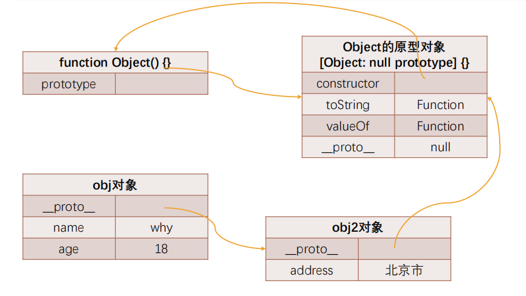
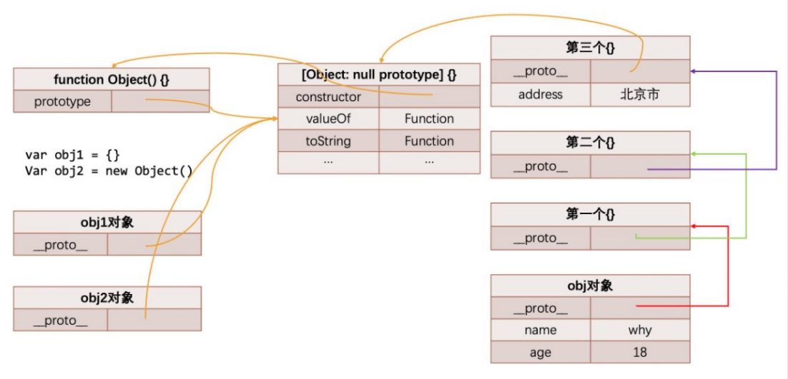
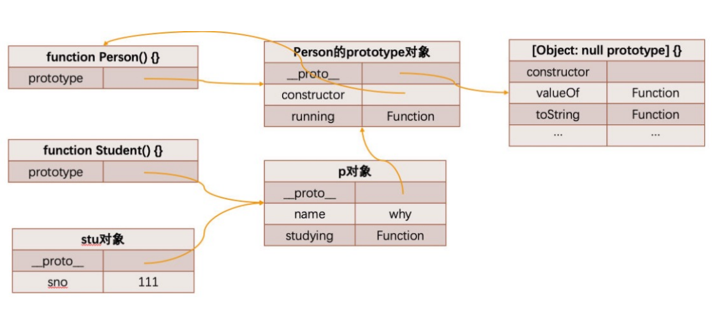
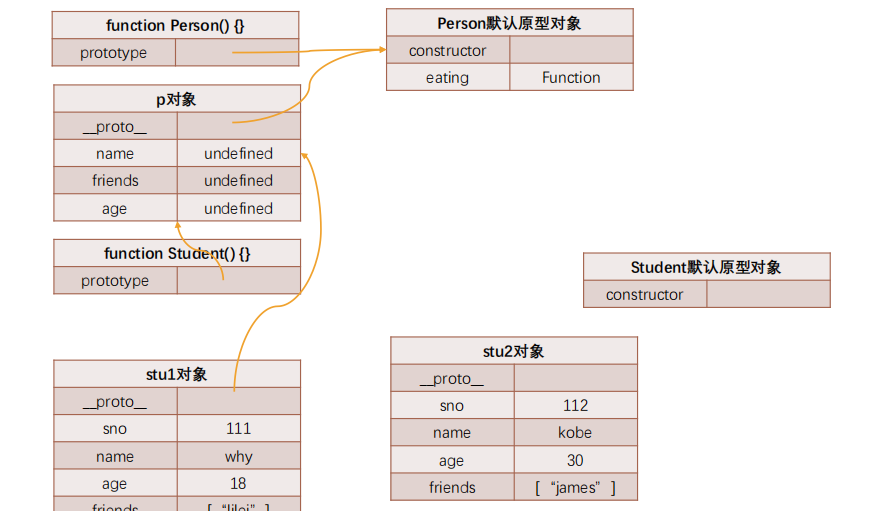

# 深入JS面向对象继承

## JavaScript 中的类和对象

* 当我们编写如下代码的时候，我们会如何来称呼这个 Person 呢？ 

  ```js
  function Person(){
      
  }
  const p1 = new Person();
  const p2 = new Person();
  ```

  * 在 JS 中 Person 应该被称之为是一个构造函数； 

  * 从很多面向对象语言过来的开发者，也习惯称之为类，因为类可以帮助我们创建出来对象p1、p2； 
  * 如果从面向对象的编程范式角度来看，Person 确实是可以称之为类的；

## 面向对象的特性 - 继承

* 面向对象有三大特性：封装、继承、多态 
  * 封装：我们前面将属性和方法封装到一个类中，可以称之为封装的过程； 
  * 继承：继承是面向对象中非常重要的，不仅仅可以减少重复代码的数量，也是多态前提（纯面向对象中）； 
  * 多态：不同的对象在执行时表现出不同的形态； 

* 那么继承是做什么呢？ 
  * 继承可以帮助我们将重复的代码和逻辑抽取到父类中，子类只需要直接继承过来使用即可。 

## JavaScript 原型链

* 从一个对象上获取属性，如果在当前对象中没有获取到就会去它的原型上面获取：

```js
const obj = {
    name:"why",
    age:18
}
obj.__proto__ = {};
obj.__proto__.__proto__ = {};
obj.__proto__.__proto__.__proto__ = {
    address:'北京市'
}
```


## Object 的原型

* 那么什么地方是原型链的尽头呢？比如第三个对象是否也是有原型 `__proto__` 属性呢？ 

  ```js
  console.log(obj.__proto__.__proto__.__proto__.__proto__) 
  ```

* 我们会发现它打印的是 [Object: null prototype] {} 
  * 事实上这个原型就是我们最顶层的原型了 
  * 从 Object 直接创建出来的对象的原型都是 [Object: null prototype] {}。 

*  [Object: null prototype] {} 原型有什么特殊吗？ 
  * 特殊一：该对象有原型属性，但是它的原型属性已经指向的是null，也就是已经是顶层原型了； 
  * 特殊二：该对象上有很多默认的属性和方法；



## 原型链关系的内存图




## Object 是所有类的父类

* 原型链最顶层的原型对象就是 Object 的原型对象。

## 通过原型链实现继承

* 如果我们现在需要实现继承，那么就可以利用原型链来实现了：
  * 目前 stu 的原型是 p 对象，而 p 对象的原型是 Person 默认的原型，里面包含 running 等函数； 
  * 注意：步骤 4 和步骤 5 不可以调整顺序，否则会有问题

```js
// 1.定义父类构造函数
function Person(){
    this.name = "卓墨";
}

// 2.父类原型上添加内容
Person.prototype.running = function(){
    console.log(this.name + "在跑步~");
};

// 3.定义子类构造函数
function Student(){
    this.sno = 111;
}

// 4.创建父类对象，并且作为子类的原型对象
const p = new Person();
Student.prototype = p;

// 5.在子类原型上添加内容
Student.prototype.studying = function(){
    console.log(this.name + "在学习~");
}
```

## 继承创建对象的内存图



## **原型链继承的弊端**

* 目前有一个很大的弊端：某些属性其实是保存在 p 对象上的； 
  * 第一，我们通过直接打印对象是看不到这个属性的； 

    

  * 第二，这个属性会被多个对象共享，如果这个对象是一个引用类型，那么就会造成问题； 

  ```js
  function Person(){
    this.name = "卓墨";
    this.friends = [];
  }
  
  Person.prototype.running = function(){
    console.log(this.name + "在跑步~");
  };
  
  function Student(){
    this.sno = 111;
  }
  
  const p = new Person();
  Student.prototype = p;
  
  Student.prototype.studying = function(){
    console.log(this.name + "在学习~");
  }
  
  const stu1 = new Student();
  const stu2 = new Student();
  stu1.friends.push('stu1的朋友'); // ['stu1的朋友']
  console.log(stu2.friends);
  ```

  * 第三，不能给 Person 传递参数，因为这个对象是一次性创建的（没办法定制化）；

## 借用构造函数继承

* 为了解决原型链继承中存在的问题，开发人员提供了一种新的技术: constructor stealing (有很多名称: 借用构造函数或者称之为经典继承或者称之为伪造对象)：
  * steal 是偷窃、剽窃的意思，但是这里可以翻译成借用；
* 借用继承的做法非常简单：在子类型构造函数的内部调用父类型构造函数.
  * 因为函数可以在任意的时刻被调用；
  * 因此通过`apply()`和`call()`方法也可以在新创建的对象上执行构造函数；

```js
function Student(name,friends,sno){
    Person.call(this,name,friends);
    this.sno = sno;
}
Student.prototype = Person.prototype;
```



## 原型式继承函数

* 原型式继承的渊源 
  * 这种模式要从道格拉斯·克罗克福德（Douglas Crockford，著名的前端大师，JSON的创立者）在2006年写的一篇文章说起: Prototypal Inheritance in JavaScript (在 JS 中使用原型式继承) 
  * 在这篇文章中，它介绍了一种继承方法，而且这种继承方法不是通过构造函数来实现的. 
  * 为了理解这种方式，我们先再次回顾一下JavaScript想实现继承的目的：重复利用另外一个对象的属性和方法. 

* 最终的目的：student 对象的原型指向了 person 对象；

```js
function object(obj){
    function Func(){};
    function.prototype = obj;
    return new Func();
}
```

.

```js
function object(obj){
    const newObj = {};
    Object.setPrototypeOf(newObj, obj);
    return newObj;
}
```

.

```js
const student = Object.create(person,{
    address: {
        value: "北京市",
        enumerable: true
    }
})
```

## 寄生式继承函数

* 寄生式 (Parasitic) 继承 

  * 寄生式 (Parasitic) 继承是与原型式继承紧密相关的一种思想, 并且同样由道格拉斯·克罗克福德(Douglas  Crockford)提出和推广的； 

  * 寄生式继承的思路是结合原型类继承和工厂模式的一种方式； 

  * 即创建一个封装继承过程的函数, 该函数在内部以某种方式来增强对象，最后再将这个对象返回；

```js
function object(obj){
    function Func(){};
    Func.prototype = obj;
    return new Func();
}
```

.

```js
function createStudent(person){
    const newObj = object(person);
    newObj.studying = function(){
        console.log(this.name + "studying");
    }
    return newObj;
}
```

## 寄生组合式继承

* 现在我们来回顾一下之前提出的比较理想的组合继承 
  * 组合继承是比较理想的继承方式, 但是存在两个问题: 
  * 问题一: 构造函数会被调用两次: 一次在创建子类型原型对象的时候, 一次在创建子类型实例的时候. 
  * 问题二: 父类型中的属性会有两份: 一份在原型对象中, 一份在子类型实例中. 

* 事实上, 我们现在可以利用寄生式继承将这两个问题给解决掉. 
  * 你需要先明确一点: 当我们在子类型的构造函数中调用父类型.call(this, 参数)这个函数的时候, 就会将父类型中的属性和方法复制一份到了子类型中. 所以父类型本身里面的内容, 我们不再需要. 
  * 这个时候, 我们还需要获取到一份父类型的原型对象中的属性和方法. 

* **能不能直接让子类型的原型对象 = 父类型的原型对象呢?** 
  * 不要这么做, 因为这么做意味着以后修改了子类型原型对象的某个引用类型的时候, 父类型原生对象的引用类型也会被修改. 
  * 我们使用前面的寄生式思想就可以了.

```js
// 定义 Object 函数
function object(o){
    function F(){};
    F.prototype = o;
    return new F();
}

// 定义寄生式核心函数
function inheritPrototype(subType, superType){
    subType.prototype = object(superType.prototype);
    subType.prototype.constructor = subType;
}

inheritPrototype(Student, Person);
```


