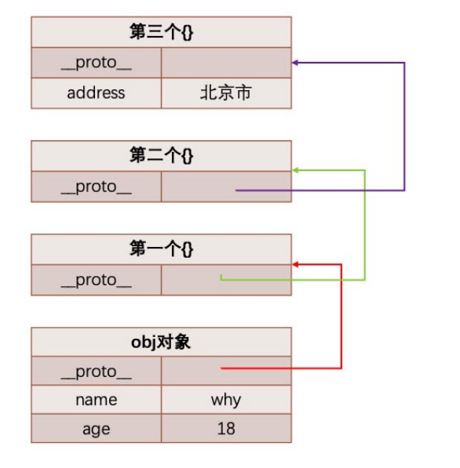

# 深入JS面向对象继承

## JavaScript 中的类和对象

* 当我们编写如下代码的时候，我们会如何来称呼这个 Person 呢？ 

  ```js
  function Person(){
      
  }
  const p1 = new Person();
  const p2 = new Person();
  ```

  * 在 JS 中 Person 应该被称之为是一个构造函数； 

  * 从很多面向对象语言过来的开发者，也习惯称之为类，因为类可以帮助我们创建出来对象p1、p2； 
  * 如果从面向对象的编程范式角度来看，Person 确实是可以称之为类的；

## 面向对象的特性 - 继承

* 面向对象有三大特性：封装、继承、多态 
  * 封装：我们前面将属性和方法封装到一个类中，可以称之为封装的过程； 
  * 继承：继承是面向对象中非常重要的，不仅仅可以减少重复代码的数量，也是多态前提（纯面向对象中）； 
  * 多态：不同的对象在执行时表现出不同的形态； 

* 那么继承是做什么呢？ 
  * 继承可以帮助我们将重复的代码和逻辑抽取到父类中，子类只需要直接继承过来使用即可。 

## JavaScript 原型链

* 从一个对象上获取属性，如果在当前对象中没有获取到就会去它的原型上面获取：

```js
const obj = {
    name:"why",
    age:18
}
obj.__proto__ = {};
obj.__proto__.__proto__ = {};
obj.__proto__.__proto__.__proto__ = {
    address:'北京市'
}
```



## Object 的原型

* 那么什么地方是原型链的尽头呢？比如第三个对象是否也是有原型 `__proto__` 属性呢？ 

  ```js
  console.log(obj.__proto__.__proto__.__proto__.__proto__) 
  ```

* 我们会发现它打印的是 [Object: null prototype] {} 
  * 事实上这个原型就是我们最顶层的原型了 
  * 从 Object 直接创建出来的对象的原型都是 [Object: null prototype] {}。 

*  [Object: null prototype] {} 原型有什么特殊吗？ 
  * 特殊一：该对象有原型属性，但是它的原型属性已经指向的是null，也就是已经是顶层原型了； 
  * 特殊二：该对象上有很多默认的属性和方法；


