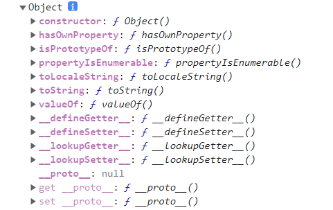

# 如何访问和修改对象的原型

## Object.getPrototypeOf()

* 返回指定对象的原型（内部 `[[Prototype]]` 属性的值）。

  ```js
  const obj = {};
  console.log(Object.getPrototypeOf(obj));
  ```



## Object.setPrototypeOf()

* 设置一个指定的对象的原型（即，内部 `[[Prototype]]` 属性）到另一个对象或 `null`。

```js
Object.setPrototypeOf(obj,prototype);
```

* `obj` 要设置其原型的对象
* `prototype` 该对象的新原型（一个对象或 `null`）

## Object.create()

* 创建一个新对象，使用现有的对象来作为新创建对象的原型（prototype）。

```js
const person = {
    isHuman: false,
    printIntroduction: function(){
        console.log(`My name is ${this.name}. Am I human ? ${this.isHuman}`);
    }
}

const me = Object.create(person);

me.name = 'Jackie Chan';
me.isHuman = true;
me.printIntroduction();

console.log(me);
```


