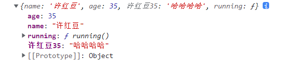
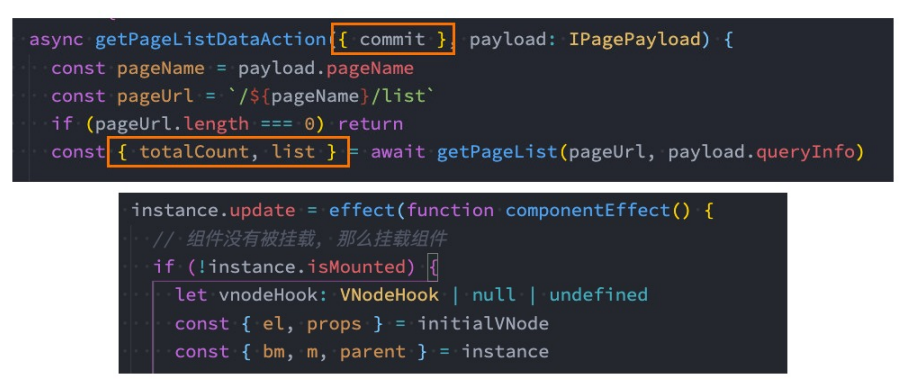
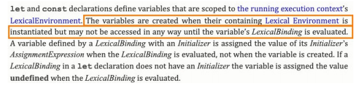
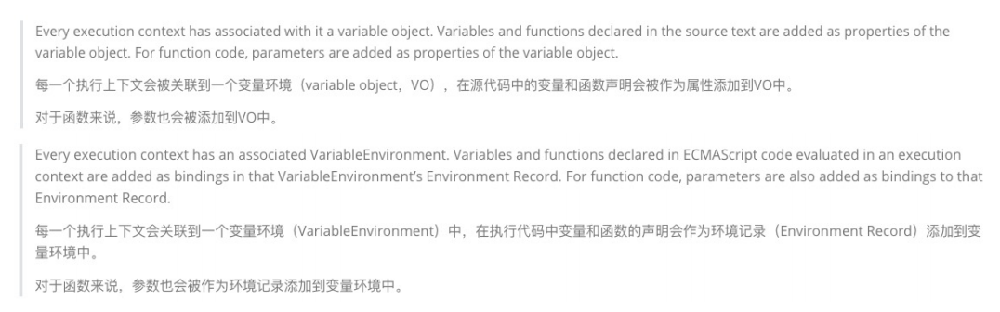
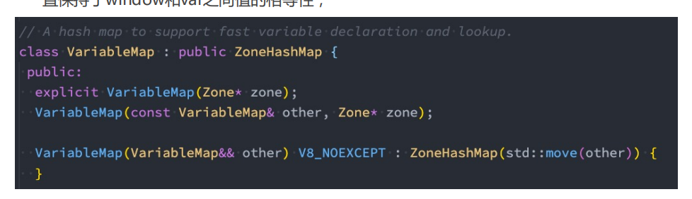
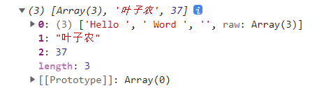

# ES6知识补充

## 字面量的增强

* ES6中对 **对象字面量** 进行了增强，称之为 Enhanced object literals（增强对象字面量）。 

* 字面量的增强主要包括下面几部分： 
  * 属性的简写：**Property Shorthand** 

  * 方法的简写：**Method Shorthand** 
  * 计算属性名：**Computed Property Names**

```js
const name = '许红豆';
const age = 35;

// 属性的简写
const obj1 = {
    name,
    age,
    
    // 方法的简写
    running(){
        console.log('在跑步~');
    },
    // 计算属性名
    [name + age]:'哈哈哈哈'
}

console.log(obj1);
```



## 解构Destructuring

* ES6中新增了一个从数组或对象中方便获取数据的方法，称之为解构Destructuring。
* 我们可以划分为：数组的解构和对象的解构。
* 数组的解构：
  * 基本解构过程
  * 顺序解构
  * 解构出数组
  * 默认值

```js
const names = ['张起灵','吴邪','王胖子','阿宁'];
const [item1,item2,item3,item4] = names;
console.log(item1,item2,item3,item4); // 张起灵 吴邪 王胖子 阿宁

// 解构后面的元素
const [,,itema,itemb] = names;
console.log(itema,itemb); // 王胖子 阿宁

// 结构出一个元素，后面的元素放到一个新数组中
const [itemz,...newItems] = names;
console.log(itemz); // 张起灵
console.log(newItems); // ['吴邪', '王胖子', '阿宁']

// 解构的默认值
const [name1,name2,name3,name4,name5 = '丁元英'] = names;
console.log(name4,name5); // 阿宁 丁元英
```

* 对象的解构：
  * 基本解构过程
  * 任意顺序
  * 重命名
  * 默认值

```js
const p1 = {
  name: "丁元英",
  age: "35",
  height: 180
};

const {name, age, height} = p1;
console.log(name, age, height); // 丁元英 35 180

const {name} = p1;
console.log(name); // 丁元英

const {name:newName} = p1;
console.log(newName); // 丁元英

const {age, height, name} = p1;
console.log(name, age, height); // 丁元英 35 180

const {age, height, name, address = "北京市"} = p1;
console.log(name, age, height, address); // 丁元英 35 180 北京市
```

## 解构的应用场景

* 解构目前在开发中使用是非常多的： 

  * 比如在开发中拿到一个变量时，自动对其进行解构使用； 

  * 比如对函数的参数进行解构；



## let/const 基本使用

* 在 ES5 中我们声明变量都是使用的 var 关键字，从 ES6 开始新增了两个关键字可以声明变量：let、const 

  * let、const 在其他编程语言中都是有的，所以也并不是新鲜的关键字； 

  * 但是 let、const 确确实实给 JavaScript 带来一些不一样的东西； 

* let 关键字： 

  * 从直观的角度来说，let 和 var 是没有太大的区别的，都是用于声明一个变量 

* const关键字： 

  * const 关键字是 constant 的单词的缩写，表示常量、衡量的意思； 

  * 它表示保存的数据一旦被赋值，就不能被修改； 

  * 但是如果赋值的是引用类型，那么可以通过引用找到对应的对象，修改对象的内容； 

* 注意：另外 let、const 不允许重复声明变量；

## let/const 作用域提升

* let、const 和 var 的另一个重要区别是作用域提升：

  * 使用 var 声明的变量是会进行作用域提升的；
  * 但是如果是使用 let 声明的变量，在声明之前访问会报错；

  ```js
  console.log(foo); // Uncaught ReferenceError: Cannot access 'foo' before initialization
  let foo = "foo";
  ```

* 那么是不是意味着 foo 变量只有在代码执行阶段才会创建的呢？

  * 事实上并不是这样的，我们可以看一下 ECMA262 对 let 和 const 的描述；
  * 这些变量会被创建在包含他们的词法环境被实例化时，但是是不可以访问它们的，直到词法绑定被赋值；

  

## let/const 有没有作用域提升呢？

* 从上面我们可以看出，在执行上下文的词法环境创建出来的时候，变量事实上已经被创建了，只是这个变量是不能被访问的。
  * 那么变量已经有了，但是不能被访问，是不是一种作用域的提升呢？
* 事实上维基百科并没有对作用域提升有严格的概念解释，那么我们自己从字面量上理解；
  * **作用域提升**：在声明变量的作用域中，如果这个变量可以在声明之前被访问，那么我们可以称之为作用域提升；
  * 在这里，它虽然被创建出来了，但是不能被访问，我认为不能称之为作用域提升；
* 所以我的观点是 let、const 没有进行作用域提升，但是会在解析阶段被创建出来。

## Window 对象添加属性

* 我们知道，在全局通过 var 来声明一个变量，事实上会在 window 上添加一个属性： 
  * 但是 let、const 是不会给 window 上添加任何属性的。 

* 那么我们可能会想这个变量是保存在哪里呢？ 

* 我们先回顾一下最新的 ECMA 标准中对执行上下文的描述



## 变量被保存到 VariableMap 中

* 也就是说我们声明的变量和环境记录是被添加到变量环境中的： 

  * 但是标准有没有规定这个对象是 window 对象或者其他对象呢？ 

  * 其实并没有，那么 JS 引擎在解析的时候，其实会有自己的实现； 

  * 比如 v8 中其实是通过 VariableMap 的一个 hashmap 来实现它们的存储的。 

  * 那么 window 对象呢？而 window 对象是早期的 GO 对象，在最新的实现中其实是浏览器添加的全局对象，并且一直保持了 window 和 var 之间值的相等性；



## var的块级作用域

* ES5中放到一个代码中定义的变量，外面是可以访问的：

```js
// var 没有块级作用域
{
    var foo = 'foo';
}
console.log(foo); // 'foo'
```

## let / const 的块级作用域

* 在 ES6 中新增了块级作用域，并且通过 let、const、function、class 声明的标识符是具备块级作用域的限制的：

```js
{
    let foo = "foo";
    function bat(){
        console.log("bar");
    }
    class Person {}
}

console.log(foo) // Uncaught ReferenceError: foo is not defined
bar() // 可以访问
var p = new Person() // Uncaught ReferenceError: bar is not defined
```

* 但是我们会发现函数拥有块级作用域，但是外面依然是可以访问的：
  * 这是因为引擎会对函数的声明进行特殊的处理，允许像 var 那样进行提升；

## if、switch、for 块级代码

```js
// if 语句的代码就是块级作用域
if(true){
    var foo = "foo";
    let bar = "bar";
}
console.log(foo); // foo
console.log(bar); // Uncaught ReferenceError: bar is not defined

// ----------------------------

// switch 语句的代码也是块级作用域
const color = "red";
switch (color){
  case "red":
    var foo = "foo";
    let bar = "bar";
}

console.log(foo); // foo
console.log(bar); // Uncaught ReferenceError: bar is not defined

// -------------------------------
<button>按钮1</button>
<button>按钮2</button>
<button>按钮3</button>
<button>按钮4</button>
// --------------------------------
const btns = document.getElementsByTagName("button");

for (var i = 0; i < btns.length; i++) {
  btns[i].onclick = function () {
    console.log(`按钮${i + 1}被点击了`);
  };
}

// 问题：无论点击那个按钮，都显示按钮5被点击了

// ES5解决方案
for(var x = 0; x < btns.length; x++){
  (function (n){
    btns[n].onclick = function (){
      console.log(`按钮${n + 1}被点击了`);
    }
  }(x))
}

// ES6解决方案
for (let y = 0; y < btns.length; y++) {
  btns[y].onclick = function () {
    console.log(`按钮${y + 1}被点击了`);
  };
}
```

##  var、let、const 的选择

* 那么在开发中，我们到底应该选择使用哪一种方式来定义我们的变量呢？
* 对于 var 的使用：
  * 我们需要明白一个事实，var 所表现出来的特殊性：比如作用域提升、window 全局对象、没有块级作用域等都是一些历史遗留问题；
  * 是 JavaScript 在设计之初的一种语言缺陷；
* 对于let、const：
  * 对于 let 和 const 来说，是目前开发中推荐使用的；
  * 我们会推荐优先使用 const，这样可以保证数据的安全性不会被随意的篡改；
  * 只有当我们明确知道一个变量后续会需要被重新赋值时，这个时候再使用let；
  * 这种在很多其他语言里面也都是一种约定俗成的规范，我们也尽量遵守这种规范；

## 字符串模板基本使用

* 在 ES6 之前，如果我们想要将字符串和一些动态的变量（标识符）拼接到一起，是非常麻烦和丑陋的（ugly）。
* ES6允许我们使用字符串模板来嵌入JS的变量或者表达式来进行拼接：
  * 首先，我们会使用 `` 符号来编写字符串，称之为模板字符串；
  * 其次，在模板字符串中，我们可以通过 ${expression} 来嵌入动态的内容； 

```js
const name = "叶子农";
const age = 37;
const height = 178;

const name2 = "老九";
const age2 = 42;
const height2 = 180;

console.log(`我的名字是${name}, 年龄是${age}, 身高是${height}`);
console.log(`我是成年人吗？${age >= 18 ? "是" : "否"}`);

function foo(age1, age2) {
  return age1 + age2;
}

console.log(`我俩加一块都${foo(age,age2)}岁了`);
```

## 标签模板字符串使用

* 普通的 JS 函数

```js
function foo(...args){
    console.log(args);
}
foo("Hello World"); // ['Hello World']
```

* 如果我们使用标签模板字符串，并且在调用的时候插入其他的变量：
  * 模板字符串被拆分了；
  * 第一个元素是数组，是被模块字符串拆分的字符串组合；
  * 后面的元素是一个个模块字符串传入的内容；

```js
const name = "叶子农";
const age = 37;
foo`Hello ${name} Word ${age}`;
```



## 函数的默认参数

* 如果有下面的需求：
  * 传入了参数，那么使用传入的参数；
  * 没有传入参数，那么使用一个默认值；

```js
function sum(m, n) {
  m = m || "m";
  n = n || "n";
  console.log(m, n);
}

sum(); // m n

// 缺点：书写麻烦，阅读性差，还有bug
sum(0, ""); // m n

//ES5 优化方案
function sum2(m, n) {
  m = m === undefined ? "m" : m;
  n = n === undefined ? "n" : n;
  console.log(m, n);
}

sum2(); // m n
sum2(0, ""); // 0 ''

// ES6 方案
function sum3(m = "m", n = "n") {
  console.log(m, n);
}

sum3(); // m n
sum3(0, ""); // 0 ''
```

## 函数默认值的补充

* 默认值也可以和解构一起来使用：

```js
// 写法一：
function foo({name,age} = {name:"why",age:18}){
    console.log(name,age);
}

// 写法二:
function foo({name = "why", age = 18} = {}){
    console.log(name,age);
}
```

* 另外参数的默认值我们通常会将其放到最后（在很多语言中，如果不放到最后其实会报错的）： 
  * 但是 JavaScript 允许不将其放到最后，但是意味着还是会按照顺序来匹配； 
* 另外默认值会改变函数的 length 的个数，默认值以及后面的参数都不计算在 length 之内了。

```js
function bar(x, y, z) {}
console.log(bar.length); // 3

function baz(a = "a", b, c) {};
console.log(baz.length); // 0

function bay(a, b = 'b', c) {};
console.log(bay.length); // 1
```

## 函数的剩余参数

* ES6 中引用了rest parameter，可以将不定数量的参数放入到一个数组中：
  * 如果最后一个参数是 ... 为前缀的，那么它会将剩余的参数放到该参数中，并且作为一个数组；

```js
function foo(m,n,...args){
    console.log(m,n);
    console.log(args);
}
```

* 那么剩余参数和 arguments 有什么区别呢？
  * 剩余参数只包含那些没有对应形参的实参，而 arguments 对象包含了传给函数的所有实参；
  * arguments 对象不是一个真正的数组，而 rest 参数是一个真正的数组，可以进行数组的所有操作；
  * arguments 是早期的 ECMAScript 中为了方便去获取所有的参数提供的一个数据结构，而 rest 参数是 ES6 中提供并且希望以此来替代 arguments 的；
* 剩余参数必须放到最后一个位置，否则会报错。

## 展开语法

* 展开语法(Spread syntax)：
  * 可以在函数调用/数组构造时，将数组表达式或者 string 在语法层面展开；
  * 还可以在构造字面量对象时, 将对象表达式按 key-value 的方式展开；
* 展开语法的场景：
  * 在函数调用时使用；
  * 在数组构造时使用；
  * 在构建对象字面量时，也可以使用展开运算符，这个是 ES2018（ES9）中添加的新特性；
* 注意：展开运算符其实是一种浅拷贝；

```js
// 1. 函数调用时
const names = ["叶子农", "戴梦岩"];
const name = "方迪";

function foo(x, y) {
  console.log(x, y);
}

foo(...names); // 叶子农 戴梦岩
foo(...name); // 方 迪

// 2. 构造数组时
const newNames = [...names,...name];
console.log(newNames); // ['叶子农', '戴梦岩', '方', '迪']

// 3. 构建对象字面量时
const info = {
  name: "叶子农",
  age: 37
};
const p1 = {
  ...info,
  address: "柏林"
};
console.log(p1);

// 4. 展开运算符其实是一种浅拷贝
const info = {
  name: "叶子农",
  age: 37,
  friend: {
    name: "戴梦岩",
    age: 28
  }
};
const p1 = {
  ...info,
  address: "柏林"
};
console.log(info.friend.name); // 戴梦岩 
p1.friend.name = "芮小丹";
console.log(info.friend.name); // 芮小丹
```

## 数值的表示

* 在 ES6 中规范了二进制和八进制的写法
* 另外在ES2021新增特性：数字过长时，可以使用_作为连接符

```js
const num1 = 100; // 十进制

// b --> binary
const num2 = 0b100; // 二进制

// o --> octal
const num3 = 0o100; // 八进制

// x --> hexadecimal
const num4 = 0x100; // 八进制

console.log(num1, num2, num3, num4); // 100 4 64 256

// 大的数值连接符(ES2021 - ES12)
const num = 9_982_000_000_000;
console.log(num); // 9982000000000
```

## Symbol 的基本使用

* Symbol 是什么呢？Symbol 是 ES6 中新增的一个基本数据类型，翻译为符号。
* 那么为什么需要 Symbol 呢？
  * 在 ES6 之前，对象的属性名都是字符串形式，那么很容易造成属性名的冲突；
  * 比如原来有一个对象，我们希望在其中添加一个新的属性和值，但是我们在不确定它原来内部有什么内容的情况下，很容易造成冲突，从而覆盖掉它内部的某个属性；
* Symbol 就是为了解决上面的问题，用来生成一个独一无二的值。
  * Symbol 值是通过 Symbol 函数来生成的，生成后可以作为属性名；
  * 也就是在 ES6 中，对象的属性名可以使用字符串，也可以使用 Symbol 值；
* Symbol 即使多次创建值，它们也是不同的：Symbol 函数执行后每次创建出来的值都是独一无二的；
* 我们也可以在创建 Symbol 值的时候传入一个描述 description：这个是ES2019（ES10）新增的特性；

## Symbol 作为属性名

* 我们通常会使用 Symbol 在对象中表示唯一的属性名：

```js
const s1 = Symbol("abc");
const s2 = Symbol("cba");

const obj = {};

// 1. 写法一：属性名赋值
obj[s1] = "abc";
obj[s2] = "cba";

// 2. 写法二：Object.defineProperty
Object.defineProperty(obj, s1, {
    enumerable: true,
    configurable: true,
    writable: true,
    value: "abc"
})

// 3. 写法三：定义字面量时直接使用
const info = {
    [s1]: "abc",
    [s2]: "def"
}

console.log(info[s1],info[s2]); // abc def

// 注意：不能通过点 . 语法获取
console.log(info.s1); // undefined

// 4. 使用 Symbol 作为 key(属性名)，在遍历/Object.keys 等中是获取不到这些 Symbol 值的
// 需要 Object.getOwnPropertySymbols 来获取所有 Symbol 的 key

console.log(Object.keys(info)); // []

console.log(Object.getOwnPropertyNames(obj)); // []

info.info = 'info';
for(const key in info){
    console.log(key); // info
}

console.log(Object.getOwnPropertySymbols(info)); // [Symbol(abc), Symbol(cba)]

const symbolKeys = Object.getOwnPropertySymbols(info);
for(const key of symbolKeys){
    console.log(info[key]);
}
```

## 相同值的 Symbol

* Symbol 的目的是创建一个独一无二的值，那如果我们现在就是想创建相同的Symbol 应该怎么做呢？
  * 可以使用 Symbol.for 方法；
  * 并且可以通过 Symbol.keyFor 方法来获取对应的 key；

```js
const s1 = Symbol.for("abc");
const s2 = Symbol.for("abc");

console.log(s1 === s2); // true

const key = Symbol.keyFor(s1);
console.log(key); // abc
```

## Set 的基本使用

* 在 ES6 之前，我们存储数据的结构主要有两种：数组、对象。
  * 在 ES6 中新增了另外两种数据结构：Set、Map，以及它们的另外形式 WeakSet、WeakMap。
* Set 是一个新增的数据结构，可以用来保存数据，类似于数组，但是和数组的区别是元素不能重复。
  * 创建 Se t我们需要通过 Set 构造函数（暂时没有字面量创建的方式）：
  * 我们可以发现 Set 中存放的元素是不会重复的，那么 Set 有一个非常常用的功能就是给数组去重。

```js
const set1 = new Set();
set1.add(10);
set1.add(15);
set1.add(20);
console.log(set1); // Set(3) {10, 15, 20}

const set2 = new Set([25, 30, 35, 40, 45]);
console.log(set2); // Set(5) {25, 30, 35, 40, 45}

// 数组去重

const arr = [1,3,2,1,2,3,3];
const set = new Set(arr);
const newArray1 = [...set];
const newArray2 = Array.from(set);
console.log(newArray1, newArray2); // [1, 3, 2] [1, 3, 2]
```

## Set 的常见方法

* Set 常见的属性：
  * `size`：返回 Set 中元素的个数；
* Set 常用的方法：
  * `add(value)`：添加某个元素，返回 Set 对象本身；
  * `delete(value)`：从 set 中删除和这个值相等的元素，返回 boolean 类型；
  * `has(value)`：判断 set 中是否存在某个元素，返回 boolean 类型；
  * `clear()`：清空 set 中所有的元素，没有返回值；
  * `forEach(callback, [, thisArg])`：通过 forEach 遍历 set；
* 另外 Set 是支持 for of 的遍历的。

```js
const set1 = new Set();
set1.add(10);
set1.add(15);
set1.add(20);

console.log(set1.size); // 3

set1.delete(10);
console.log(set1); // Set(2) {15, 20}

console.log(set1.has(10)); // false
console.log(set1.has(15)); // true

set1.forEach((item) => {
  console.log(item); // 15 20
});

for(const num of set1){
  console.log(num); // 15 20
}

set1.clear();
console.log(set1); // Set(0) {}
```

## WeakSet 使用

* 和 Set 类似的另外一个数据结构称之为 WeakSet，也是内部元素不能重复的数据结构。 

* **那么和 Set 有什么区别呢？** 
  * 区别一：WeakSet 中只能存放对象类型，不能存放基本数据类型； 
  * 区别二：WeakSet 对元素的引用是弱引用，如果没有其他引用对某个对象进行引用，那么GC可以对该对象进行回收；

```js
const wset = new WeakSet();
const names = ['刘培强','刘启', '韩子昂'];
const p = {
    name:'韩朵朵',
    age:24
}
wset.add(names);
wset.add(p);
console.log(wset); // WeakSet {{…}, Array(3)}
wset.add(1000); // Uncaught TypeError: Invalid value used in weak set at WeakSet.add (<anonymous>)
```

* WeakSet 常见的方法： 
  * `add(value)`：添加某个元素，返回 WeakSet 对象本身； 
  * `delete(value)`：从 WeakSet 中删除和这个值相等的元素，返回boolean 类型； 
  * `has(value)`：判断 WeakSet 中是否存在某个元素，返回 boolean 类型；

```js
wset.delete(p);
console.log(wset.has(p));; // false
console.log(wset.has(names));; // true
```

* 注意：WeakSet 不能遍历
  * 因为 WeakSet 只是对对象的弱引用，如果我们遍历获取到其中的元素，那么有可能造成对象不能正常的销毁。
  * 所以存储到 WeakSet 中的对象是没办法获取的；
* 那么这个东西有什么用呢？
  * 事实上这个问题并不好回答，我们来使用一个Stack Overflow上的答案；

```js
const pwset = new WeakSet();
class Person {
    constructor(){
        pwset.add(this);
    }
    running(){
        if(!pwset.has(this)) throw new Error("不能通过其他对象调用 running 方法");
        console.log("running", this);
    }
}

const p1 = new Person();
p1.running();
p1.running.call({}); // Uncaught Error: 不能通过其他对象调用 running 方法
```

## Map 的基本使用

* 另外一个新增的数据结构是 Map，用于存储映射关系。 

* 但是我们可能会想，在之前我们可以使用对象来存储映射关系，他们有什么区别呢？ 
  * 事实上我们对象存储映射关系只能用字符串（ES6 新增了 Symbol）作为属性名（key）； 
  * 某些情况下我们可能希望通过其他类型作为 key，比如对象，这个时候会自动将对象转成字符串来作为 key； 

* 那么我们就可以使用 Map

* Map 常见的属性： 

  * size：返回 Map 中元素的个数； 

* Map 常见的方法： 

  * `set(key, value)`：在 Map 中添加 key、value，并且返回整个Map 对象； 

  * `get(key)`：根据 key 获取 Map 中的 value； 

  * `has(key)`：判断是否包括某一个 key，返回 Boolean 类型； 

  * `delete(key)`：根据 key 删除一个键值对，返回 Boolean 类型； 

  * `clear()`：清空所有的元素； 

  * `forEach(callback, [, thisArg])`：通过 forEach 遍历 Map； 

* Map 也可以通过 for of 进行遍历。

```js
const obj1 = {name:"why"};
const obj2 = {age:18};

const map = new Map();

const map2 = new Map([
    [obj1,'aaa'],
    [obj2,'bbb']
])

// set
map.set(obj1, "abc");
map.set(obj2, "cba");

// size
console.log(map.size); // 2

// get
console.log(map.get(obj1)); // abc
console.log(map.get(obj2)); // cba

// forEach
map.forEach((item)=>{
    console.log(item); // abc cba
})

// for of
for(const item of map){
    console.log(item);
} 
for(const item of map){
    console.log(item[0],item[1]);
} 
// {name: 'why'} 'abc' 
// {age: 18} 'cba'
for (const [key, value] of map) {
  console.log(key, value);
}

// has
console.log(map.has(obj1)); // true

// delete
map.delete(obj1);
console.log(map.has(obj1)); // false
```

## WeakMap 的使用

* 和 Map 类型的另外一个数据结构称之为 WeakMap，也是以键值对的形式存在的。
* 那么和 Map 有什么区别呢？
  * 区别一：WeakMap 的 key 只能使用对象，不接受其他的类型作为 key；
  * 区别二：WeakMap 的 key 对对象的引用是弱引用，如果没有其他地方引用这个对象，那么 GC 可以回收该对象；

```js
const weakMap = new WeakMap();

weakMap.set({},'abc');
weakMap.set(1,'bcd'); // Uncaught TypeError: Invalid value used as weak map key
```

* WeakMap 常见的方法有四个：
  * `set(key, value)`：在 Map 中添加 key、value，并且返回整个Map 对象；
  * `get(key)`：根据 key 获取 Map 中的 value；
  * `has(key)`：判断是否包括某一个 key，返回 Boolean 类型；
  * `delete(key)`：根据 key 删除一个键值对，返回 Boolean 类型；

* 注意：WeakMap 也是不能遍历的
  * 因为没有 forEach 方法，也不支持通过 for of 的方式进行遍历；
* 那么我们的 WeakMap 有什么作用呢？

```js
const obj1 = {
  name: "叶子农",
  age: 37
};

function obj1NameFn1() {
  console.log("obj1NameFn1被执行");
}

function obj1NameFn2() {
  console.log("obj1NameFn2被执行");
}

function obj1AgeFn1() {
  console.log("obj1AgeFn1被执行");
}

function obj1AgeFn2() {
  console.log("obj1AgeFn2被执行");
}

const obj2 = {
  name: "戴梦岩"
};

function obj2NameFn1() {
  console.log("obj2NameFn1被执行");
}

function obj2NameFn2() {
  console.log("obj2NameFn2被执行");
}
// 1. 创建 weakMap
const weakMap = new WeakMap();

// 2.收集依赖结构
// 2.1.对 obj1 收集的数据结构
const obj1Map = new Map();
obj1Map.set("name", [obj1NameFn1, obj1NameFn2])
obj1Map.set("age", [obj1AgeFn1, obj1AgeFn2]);
weakMap.set(obj1, obj1Map)

// 2.2.对obj2收集的数据结构
const obj2Map = new Map();
obj2Map.set("name", [obj2NameFn1, obj2NameFn2]);
weakMap.set(obj2, obj2Map);

// 3. 如果 obj1.name 发生了改变
// Proxy / Object.defineProperty
obj1.name = "方迪";
const targetMap = weakMap.get(obj1);
const fns = targetMap.get("name");
fns.forEach(item => item());
```


