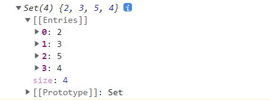

# Set 和 Map 数据结构

## Set

### 基本用法

* ES6 提供了新的数据结构 Set。它类似于数组，但是成员的值都是唯一的，没有重复的值。

* `Set`本身是一个构造函数，用来生成 Set 数据结构。

```js
const s = new Set();

[2,3,5,4,5,2,2].forEach(x => s.add(x));

for(let i of s){
  console.log(i);
}
// 2,3,5,4
console.log(s);
```



* 上面代码通过`add()`方法向 Set 结构加入成员，结果表明 Set 结构不会添加重复的值。

* `Set`函数可以接受一个数组作为参数，用来初始化。

```js
const set = new Set([1, 1, 2, 2, 3, 4]);
console.log([...set]); // [1, 2, 3, 4]
```

* 上面代码也展示了一种去除数组重复成员的方法。

```js
// 去除数组的重复成员
[...new Set(array)]

const arr = [1,2,8,7,5,6,8,7,1,2,7,6];
console.log([...new Set(arr)]); // [1, 2, 8, 7, 5, 6]
```

* 上面的方法也可以用于，去除字符串里面的重复字符。

```js
console.log([...new Set('ababbc')].join('')); // abc

console.log([...new Set('ababbc')]); // ['a', 'b', 'c']

console.log(new Set('ababbc')); // Set(3) {'a', 'b', 'c'}
```

### 操作方法

Set 实例的方法分为两大类：操作方法（用于操作数据）和遍历方法（用于遍历成员）。下面先介绍四个操作方法。

- `Set.prototype.add(value)`：添加某个值，返回 Set 结构本身。
- `Set.prototype.delete(value)`：删除某个值，返回一个布尔值，表示删除是否成功。
- `Set.prototype.has(value)`：返回一个布尔值，表示该值是否为`Set`的成员。
- `Set.prototype.clear()`：清除所有成员，没有返回值。

上面这些属性和方法的实例如下。

```js
const names = new Set();
names.add('叶子农').add('戴梦岩').add('戴梦岩');

console.log(names.size); // 2

console.log(names.has('叶子农')); // true
console.log(names.has('戴梦岩')); // true
console.log(names.has('方迪')); // false

console.log(names.delete('戴梦岩')); // true
console.log(names.has('戴梦岩')); // false
```

* `Array.from` 方法可以将 Set 结构转为数组。

```js
const items = new Set([1, 2, 3, 4, 5]);
const array = Array.from(items);
console.log(array); // [1, 2, 3, 4, 5]
```

* 这就提供了去除数组重复成员的另一种方法。

```js
function dedupe(array) {
  return Array.from(new Set(array));
}
console.log(dedupe([1, 1, 2, 2, 3])) // [1, 2, 3]
```


