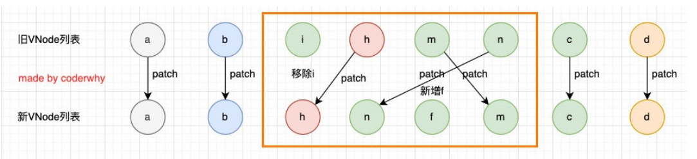

# Vue3_02_模板语法

* React 的开发模式：
  * React 使用的 jsx，所以对应的代码都是编写的类似于 js 的一种语法；
    * 之后通过 Babel 将 jsx 编译成 React.createElement 函数调用；
* Vue 也支持 jsx 的开发模式：
  * 但是大多数情况下，使用基于 HTML 的模板语法；
  * 在模板中，允许开发者以声明式的方式将 DOM 和底层组件实例的数据绑定在一起；
  * 在底层的实现中，Vue 将模板编译成虚拟 DOM 渲染函数；
    

## 绑定class

* 对象语法：我们可以传给 :class 一个对象，以动态地切换 class。
* 数组语法：我们可以把一个数组传给 :class ，以应用一个 class 列表。

```html
<style>
  .red {
    color: red;
  }

  .green {
    color: green;
  }

  .active {
    font-size: 35px;
  }
</style>

<div id="app"></div>

<template id="vue_template">
  <!-- 1.普通地绑定方式 -->
  <h2 :class="className">君不见黄河之水天上来，奔流到海不复回。</h2>
  <!-- 2.对象绑定 -->
  <h2 :class="{green:isGreen,active:true}">君不见高堂明镜悲白发，朝如青丝暮成雪。</h2>
  <!-- 3.绑定对象 -->
  <h2 :class="classObj">人生得意须尽欢，莫使金樽空对月。</h2>
  <!-- 4.从methods中获取 -->
  <h2 :class="getClassObj()">天生我材必有用，千金散尽还复来。</h2>
  <!-- 数组语法 -->
  <h2 :class="['abc',isGreen ? 'green' : 'red']">烹羊宰牛且为乐，会须一饮三百杯。</h2>
</template>

<script src="https://unpkg.com/vue@3"></script>
<script>
  const why = {
    template: "#vue_template",
    data() {
      return {
        className: "red",
        isGreen: true,
        classObj: {
          green: true,
          active: false
        }
      };
    },
    methods:{
      getClassObj(){
        return {
          green: false,
          active: true
        }
      }
    }
  };
  const app = Vue.createApp(why);
  app.mount("#app");
</script>
```

## 绑定style

* 可以利用 `v-bind:style` 来绑定一些 CSS 内联样式
  * 使用场景：某些样式我们需要根据数据动态来决定，比如某段文字的颜色、大小等等。
* CSS property 可以用驼峰式 (camelCase) 或短横线分隔 (kebab-case，用引号括起来) 来命名；

### 对象语法：

```html
<template id="my-app">
	<!-- 1.基本使用：传入一个对象，并且对象内容都是确定的 -->
    <div :style="{color:'red', fontSize:'30px', 'background-color':'blue'}">
        {{message}}
    </div>
    <!--- 2.变量数据：传入一个对象，值会来自于 data -->
	<div :style="{color:'red', fontSize:size + 'px', 'background-color':'blue'}">
    	{{message}}
    </div>
    <!-- 3.对象数据：直接在 data 中定义好对象在这里使用 -->
    <div :style="styleObj">
        {{message}}
    </div>
</template>
```

### 数组语法：

* :style 的数组语法可以将多个样式对象应用到同一个元素上

```html
<template id="my-app">
	<div :style="[styleObj1, styleObj2]">
        {{message}}
    </div>
</template>
```

## 动态绑定属性

* 在某些情况下，我们属性的名称可能也不是固定的：
  * 前端我们无论绑定 src、href、class、style，属性名称都是固定的；
  * 如果属性名称不是固定的，我们可以使用 `:[属性名]=“值”` 的格式来定义；
  * 这种绑定的方式，我们称之为动态绑定属性；

```html
<template id="my-app">
	<!-- 属性的名称是动态的 -->
    <div :[name]="value">{{message}}</div>
</template>
```

## 绑定一个对象

* 如果我们希望将一个对象的所有属性，绑定到元素上的所有属性，应该怎么做呢？
  * 非常简单，我们可以直接使用 v-bind 绑定一个 对象；
* 案例：info 对象会被拆解成 div 的各个属性

```html
<template id="my-app">
	<div v-bind="info">{{message}}</div>
</template>
```

## v-on 绑定事件

* 如果我们希望一个元素绑定多个事件，这个时候可以传入一个对象：

```html
<!-- 绑定对象 -->
<button v-on="{click: btnClick, mousemove: mouseMove}">
    特殊按钮
</button>
```

## template 元素

* 因为 v-if 是一个指令，所以必须将其添加到一个元素上：
  * 但是如果我们希望切换的是多个元素呢？
  * 此时我们渲染div，但是我们并不希望 div 这种元素被渲染；
  * 这个时候，我们可以选择使用 template；
* template 元素可以当做不可见的包裹元素，并且在 v-if 上使用，但是最终 template 不会被渲染出来：
  * 有点类似于小程序中的 block

```html
<template id="my-app">
    <template  v-if="showHa">
        <h2>哈哈哈哈</h2>
        <h2>哈哈哈哈</h2>
        <h2>哈哈哈哈</h2>
    </template>
    <template v-else>
        <h2>呵呵呵呵</h2>
        <h2>呵呵呵呵</h2>
        <h2>呵呵呵呵</h2>
    </template>
	<button @click="toggle">切换</button>
</template>
```

## v-for

### 遍历对象

* v-for 支持遍历对象，并且支持有一二三个参数：
  * 一个参数： `value in object`
  * 二个参数： `(value, key) in object`
  * 三个参数：`(value, key, index) in object`

```html
<ul>
    <li v-for="(value,key,index) in obj">{{value}} * {{key}} * {{index}}</li>
</ul>
```

### 遍历数字

```html
<ul>
    <li v-for="num in 10">{{num}}</li>
</ul>
```

## v-for 中的 key 是什么作用？

* 在使用 v-for 进行列表渲染时，我们通常会给元素或者组件绑定一个 key 属性。
* 这个 key 属性有什么作用呢？
  * key 属性主要用在 Vue 的虚拟 DOM 算法，在新旧 nodes 对比时辨识VNodes；
  * 如果不使用 key，Vue 会使用一种最大限度减少动态元素并且尽可能的尝试就地修改/复用相同类型元素的算法；
  * 而使用 key 时，它会基于 key 的变化重新排列元素顺序，并且会移除/销毁 key 不存在的元素；

## 认识 VNode

* VNode 的全称是 Virtual Node，也就是虚拟节点；
* 事实上，无论是组件还是元素，它们最终在 Vue 中表示出来的都是一个个 VNode；
* VNode 的本质是一个 JavaScript 的对象；

```html
<div class="title" style="font-size: 30px; color: red;">哈哈哈</div>
```

```js
const vnode = {
    type:"div",
	props: {
    	class:"title",
    	style: {
    		"font-size": "30px",
    		color:"red"
		}
	},
	children:"哈哈哈"
};
```


## 虚拟 DOM

* 如果我们不只是一个简单的 div，而是有一大堆的元素，那么它们应该会形成一个 VNode Tree：

```html
<div>
    <p>
        <i>哈哈哈哈</i>
        <i>哈哈哈哈</i>
    </p>
    <span>嘻嘻嘻嘻</span>
    <strong>呵呵呵呵</strong>
</div>
```


## 插入 F 的案例

* 点击按钮，在中间插入一个 f

```html
<template id="my-app">
	<ul>
        <li v-for="item in letters">{{item}}</li>
    </ul>
    <button @click="insertF">
        insert f
    </button>
</template>

<script>
    const App = {
        template: "my-app",
        data(){
            return {
                letters: ['a','b','c','d']
            }
        },
        methods: {
            insertF(){
                this.letters.splice(2, 0, 'f');
            }
        }
    }
    Vue.createApp(App).mount('#app');
</script>
```

* 我们可以确定的是，这次更新对于ul和button是不需要进行更新，需
  要更新的是我们li的列表：
  * 在 Vue 中，对于相同父元素的子元素节点并不会重新渲染整个列
    表；
  * 因为对于列表中 a、b、c、d 它们都是没有变化的；
  * 在操作真实DOM的时候，我们只需要在中间插入一个 f 的 li 即可；
* 那么 Vue 中对于列表的更新究竟是如何操作的呢？
  * Vue 事实上对于有 key 和没有 key 会调用两个不同的方法；
  * 有 key，那么就使用 patchKeyedChildren 方法；
  * 没有key，那么就使用 patchUnkeyedChildren 方法；

## Vue 源码对于 key 的判断

```js
// fast path
if (patchFlag > 0) {
    if (patchFlag & PatchFlags.KEYED_FRAGMENT) {
        // this could be either fully-keyed or mixed (some keyed some not)
        // presence of patchFlag means children are guaranteed to be arrays
        patchKeyedChildren(
            c1 as VNode[],
            c2 as VNodeArrayChildren,
                container,
                anchor,
                parentComponent,
                parentSuspense,
                isSVG,
                slotScopeIds,
                optimized
        )
        return
    } else if (patchFlag & PatchFlags.UNKEYED_FRAGMENT) {
        // unkeyed
        patchUnkeyedChildren(
            c1 as VNode[],
            c2 as VNodeArrayChildren,
                container,
                anchor,
                parentComponent,
                parentSuspense,
                isSVG,
                slotScopeIds,
                optimized
        )
        return
    }
}
```

## 没有 key 的操作（源码）

```js
c1 = c1 || EMPTY_ARR
c2 = c2 || EMPTY_ARR
const oldLength = c1.length
const newLength = c2.length
const commonLength = Math.min(oldLength, newLength)
let i
for (i = 0; i < commonLength; i++) {
    const nextChild = (c2[i] = optimized
                       ? cloneIfMounted(c2[i] as VNode)
                       : normalizeVNode(c2[i]))
    patch(
        c1[i],
        nextChild,
        container,
        null,
        parentComponent,
        parentSuspense,
        isSVG,
        slotScopeIds,
        optimized
    )
}
if (oldLength > newLength) {
    // remove old
    unmountChildren(
        c1,
        parentComponent,
        parentSuspense,
        true,
        false,
        commonLength
    )
} else {
    // mount new
    mountChildren(
        c2,
        container,
        anchor,
        parentComponent,
        parentSuspense,
        isSVG,
        slotScopeIds,
        optimized,
        commonLength
    )
}
```

## 没有 key 的过程如下


* 我们会发现上面的 diff 算法效率并不高：
  * c 和 d 来说它们事实上并不需要有任何的改动；
  * 但是因为我们的 c 被 f 所使用了，所有后续所有的内容都要一次进行改动，并且最后进行新增；


## 有 key 的 diff 算法如下

* 第一步的操作是从头开始进行遍历、比较：
  * a 和 b 是一致的会继续进行比较；
  * c 和 f 因为 key 不一致，所以就会 break 跳出循环；


* 第二步的操作是从尾部开始进行遍历、比较：


* 第三步是如果旧节点遍历完毕，但是依然有新的节点，那么就新增节点：


* 第四步是如果新的节点遍历完毕，但是依然有旧的节点，那么就移除就节点：


* 第五步是最特色的情况，中间还有很多未知的或者乱序的节点：



* 所以我们可以发现，Vue 在进行 diff 算法的时候，会尽量利用我们的 key 来进行优化操作：
  * 在没有 key 的时候我们的效率是非常低效的；
  * 在进行插入或者重置顺序的时候，保持相同的 key 可以让 diff 算法更加的高效；

## 计算属性的 setter 和 getter

* 计算属性在大多数情况下，只需要一个 getter 方法即可，所以我们会将计算属性直接写成一个函数。
* 但是，如果我们确实想设置计算属性的值呢？
  * 这个时候我们也可以给计算属性设置一个 setter 的方法;

```js
computed:{
    fullName:{
        get(){
            return this.firstName + ' ' + this.lastName;
        },
        set(value){
            const names = value.split(' ');
            this.firstName = names[0];
            this.lastName = names[1];
        }
    }
}
```

## 源码如何对 setter 和 getter 处理呢？


## 认识侦听器 watch

* 什么是侦听器呢？
  * 开发中我们在 data 返回的对象中定义了数据，这个数据通过插值语法等方式绑定到 template 中；
  * 当数据变化时，template 会自动进行更新来显示最新的数据；
  * 但是在某些情况下，我们希望在代码逻辑中监听某个数据的变化，这个时候就需要用侦听器 watch 来完成了；

* 侦听器的用法如下：
  * 选项：`watch`
  * 类型：`{ [key: string]: string | Function | Object | Array}`

## 侦听器案例

* 比如现在我们希望用户在 input 中输入一个问题；
* 每当用户输入了最新的内容，我们就获取到最新的内容，并且使用该问题去服务器查询答案；
* 那么，我们就需要实时的去获取最新的数据变化；

```html
<template id="my-app">
	<label for="question">
    	请输入问题：
        <input type="text" id="question" v-model="question">
    </label>
</template>
```

```js
watch:{
    question(newValue, oldValue){
        console.log(newValue);
        this.getAnwser(newValue);
    }
},
methods:{
    getAnwser(question){
        console.log(`${question}的问题答案是哈哈哈哈`);
    }
}
```

## 侦听器 watch 的配置选项

* 我们先来看一个例子：
  * 当我们点击按钮的时候会修改 info.name 的值；
  * 这个时候我们使用 watch 来侦听 info，可以侦听到吗？答案是不可以。
* 这是因为默认情况下，watch 只是在侦听 info 的引用变化，对于内部属性的变化是不会做出响应的：
  * 这个时候我们可以使用一个选项 deep 进行更深层的侦听；
* 还有另外一个属性，是希望一开始的就会立即执行一次：
  * 这个时候我们使用 immediate 选项；
  * 这个时候无论后面数据是否有变化，侦听的函数都会先执行一次；

```js
watch: {
    info: {
        handler(newValue, oldValue){
            console.log(newValue, oldValue);
        },
        deep: true,
        immediate: true
    },
    'info.name': function(newValue, oldValue){
        console.log(newValue, oldValue);
    }
}
```

## v-model 的原理

* v-model 背后有两个操作：
  * v-bind 绑定 value 属性的值；
  * v-on 绑定 input 事件监听到函数中，函数会获取最新的值赋值到绑定的属性中；

```html
<input v-model="searchText" />
```

* 等价于：

```js
<input :value="searchText" @input="searchText = $event.target.value" />
```

## v-model 绑定 textarea

```html
<div>
	<textarea v-model="article" cols="30" rows="10"></textarea>
    <h2>
        article当前的值时：{{article}}
    </h2>
</div>
```

## v-model 绑定 checkbox

* 单个勾选框：
  * v-model 即为布尔值
  * 此时 input 的 value 并不影响 v-model 的值

```html
<div>
    <label>
    	<input type="checkbox" v-model="isAgree" />同意协议
    </label>
</div>
```

* 多个复选框：
  * 当是多个复选框时，因为可以选中多个，所以对应的 data 中属性是一个数组。
  * 当选中某一个时，就会将 input 的 value 添加到数组中。

```html
<div>
    <label>
      <input type="checkbox" value="basketball" v-model="hobbies">篮球
    </label>
    <label>
      <input type="checkbox" value="football" v-model="hobbies">足球
    </label>
    <label>
      <input type="checkbox" value="tennis" v-model="hobbies">网球
    </label>
    <h2>
        hobbies 当前的值时：{{hobbies}}
    </h2>
</div>
```

## v-model 绑定 radio

```html
<div>
	<label>
    	<input type="radio" v-model="gender" value="male">男
    </label>
    <label>
    	<input type="radio" v-model="gender" value="female">女
    </label>
    <h2>
        gender当前的值是：{{gender}}
    </h2>
</div>
```

## v-model 绑定 select

* 单选：只能选中一个值
  * v-model 绑定的是一个值；
  * 当我们选中 option 中的一个时，会将它对应的 value 复制到 fruit 中

```html
<div>
    <select v-model="fruit">
        <option value="apple">苹果</option>
        <option value="orange">橘子</option>
        <option value="banana">香蕉</option>
    </select>
    <h2>
        fruit当前的值是：{{fruit}}
    </h2>
</div>
```

* 多选：可以选中多个值
  * v-model 绑定的是一个数组；
  * 当选中多个值时，就会将选中的 option 对应的 value 添加到数组 fruit 中；

```html
<div>
    <select v-model="fruit" multiple size="3">
        <option value="apple">苹果</option>
        <option value="orange">橘子</option>
        <option value="banana">香蕉</option>
    </select>
    <h2>
        fruit当前的值是：{{fruit}}
    </h2>
</div>
```

## v-model 修饰符 - lazy

* 默认情况下，v-model 在进行双向绑定时，绑定的是 input 事件，那么会在每次内容输入后就将最新的值和绑定的属性进行同步；
* 如果我们在 v-model 后跟上 lazy 修饰符，那么会将绑定的事件切换为 change 事件，只有在提交时（比如回车）才会触发；

```html
<template id="my-app">
	<input type="text" v-model.lazy="message">
    <h2>{{message}}</h2>
</template>
```


